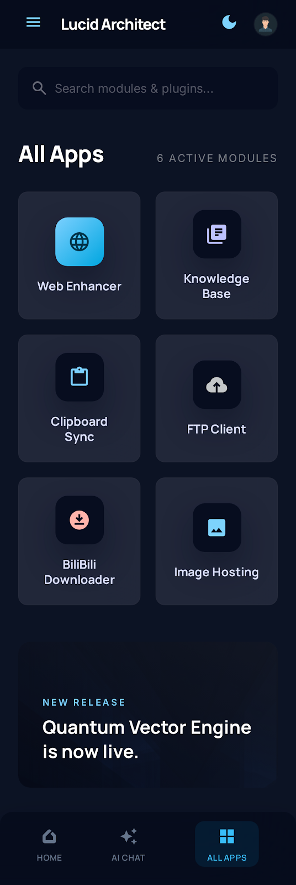
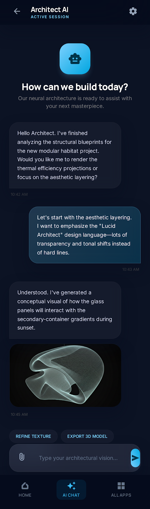
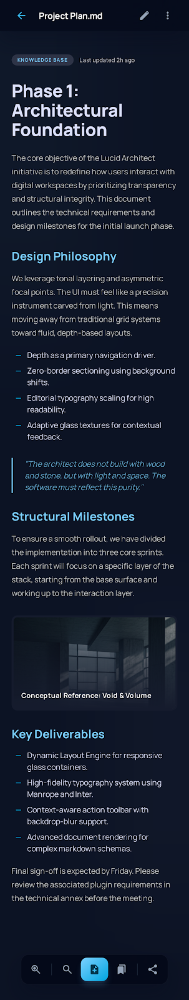
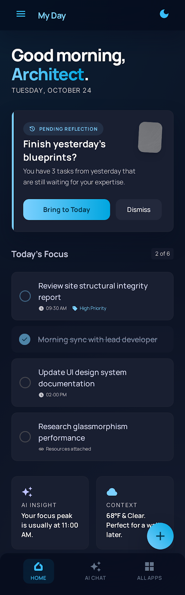

# GuYanTools

一个本地优先、可扩展的桌面工作台，整合工具启动、Todo、知识库、终端、SSH、FTP/SFTP、AI 问答、网页增强、插件和多设备能力。

[](https://www.electronjs.org/)
[](https://vuejs.org/)
[](https://www.rust-lang.org/)
[](https://pnpm.io/)

GuYanTools 面向偏技术、偏效率的桌面用户：你可以把常用工作流放进一个持久化工作区里，而不是在终端、服务器文件传输、待办、笔记、AI 对话、网页工具和临时脚本之间反复切换。项目当前以 Windows 桌面端为主要目标，同时保留 Rust 核心和 Flutter 移动端的跨平台边界。



## 功能概览

| 模块 | 能力 |
| --- | --- |
| 首页工作台 | 自定义分组、小组件、背景、图标、打开动作和底部标签页，适合沉淀个人工具入口。 |
| Todo | 支持“我的一天”、列表、步骤、提醒、截止日期、重复任务和任务详情管理。 |
| 知识库 | 本地 Library / Space / Folder / Page 架构，支持 Markdown、画布页面、附件、资产、搜索、导入和 AI 预留。 |
| 终端与 SSH | 基于 Rust PTY 和 xterm.js 的多会话终端，支持 SSH Profile、密钥、指纹、主题和窗口分离。 |
| FTP/SFTP | 支持 SFTP、FTP、FTPS、双栏浏览、传输队列、断点续传、目录同步、远程编辑、Jump Host、FXP 和 Explorer 协同。 |
| AI 工作区 | 基于 Vercel AI SDK 的多 Provider 问答规划与实现路径，预留网页搜索、知识库问答、Canvas、深度研究和 Agent。 |
| WebView 增强 | 内置网页工具入口、白名单/黑名单、安全提示和脚本注入能力。 |
| 插件平台 | 规划并逐步落地页面、命令、菜单、快捷键、后台任务和受限/可信双轨运行时。 |
| 多设备能力 | 已有多设备剪贴板文档与实现基础；应用级同步中心正在按 WebDAV 优先、本地优先的路线推进。 |
| 快速启动 | 类似 uTools 的快捷启动面板，用于搜索应用、文件和应用内部功能。 |

## 界面预览

| AI 问答 | 知识库 | Todo |
| --- | --- | --- |
|  |  |  |

## 技术架构

```text
GuYanTools
├── desktop/              Electron Forge + Vite + Vue 3 + TypeScript + Pinia + SCSS
├── multi_platform_core/  Rust + SQLite + napi-rs, 提供终端、SSH、FTP、知识库等核心能力
├── mobile/               Flutter 实验客户端，复用未来跨端核心能力
├── sync_server/          自托管同步后端方向，当前为进行中的服务端骨架
├── docs/                 正式需求、架构、计划和验证文档
└── stitch/               页面视觉参考和截图
```

桌面端 renderer 不直接访问 Node、Electron、数据库或文件系统；跨进程能力通过 `desktop/src/contracts/`、`desktop/src/preload.ts` 和主进程 IPC 暴露。Rust 核心负责 SQLite、PTY、SSH、FTP/SFTP、模型和服务层，并通过 napi-rs 提供给 Electron。

## 快速开始

### 环境要求

- Node.js 与 pnpm 10.33.0
- Rust stable toolchain
- Windows 桌面构建需要可用的 MSVC / Visual Studio Build Tools
- Flutter 仅在开发 `mobile/` 时需要

### 安装依赖

```bash
pnpm install
```

### 启动桌面端

```bash
pnpm run desktop:start
```

该命令会先构建 debug 版 Rust N-API 原生模块，再启动 Electron Forge 开发环境。

### 常用验证命令

```bash
# 桌面端 lint
pnpm --dir desktop run lint

# 桌面端构建
pnpm --dir desktop run build:app

# Rust 核心测试
cargo test --manifest-path multi_platform_core/Cargo.toml

# 原生模块 release 构建
pnpm run native:build
```

移动端相关命令：

```bash
cd mobile
flutter analyze
flutter test
```

## 文档入口

- [Documentation Index](docs/README.md)
- [产品定位](PRODUCT.md)
- [设计系统](DESIGN.md)
- [桌面端设计系统契约](docs/desktop/DESIGN_SYSTEM.md)
- [知识库用户指南](docs/desktop/KnowledgeBase/user-guide.md)
- [知识库开发文档](docs/desktop/KnowledgeBase/development-plan.md)
- [FTP/SFTP 需求与实现回写](docs/ftp-client-requirement.md)
- [终端需求](docs/desktop/Terminal/requirements.md)
- [AI 问答与 Agent 预留开发计划](docs/superpowers/plans/2026-06-07-ai-chat-vercel-ai-sdk-development-plan.md)
- [应用级同步中心实施计划](docs/superpowers/plans/2026-06-15-application-sync-center-implementation-plan.md)

## 开发约定

- 新增 renderer 可调用能力时，优先维护 typed contract、preload API 和 main IPC。
- UI 优先复用 `desktop/src/windows/main/components/ui/` 与 `--ui-*` 语义 token。
- Rust 数据模型变更需要同步 migration、model、service、binding 和 TypeScript declaration。
- 不在 renderer 中直接访问 Node/Electron/数据库。
- 不把 `mobile/` 当作 pnpm workspace 包处理。

## 项目状态

GuYanTools 仍处于快速迭代阶段。桌面端是当前主线；Rust core 已承担主要本地能力；Flutter 客户端、应用级同步中心和自托管同步后端属于持续推进或实验中的方向。README 只保留仓库首页所需的信息，模块级细节以 `docs/` 下正式文档为准。

## 贡献

欢迎通过 issue 或 pull request 反馈问题、补充文档或改进实现。提交前请根据改动范围运行最小但足够的验证命令，并保持改动小、可审查、可回滚。

提交信息遵循仓库中的 commitlint 配置，推荐使用：

```bash
pnpm run commit
```

## 许可

本项目使用 [MIT License](LICENSE)。
