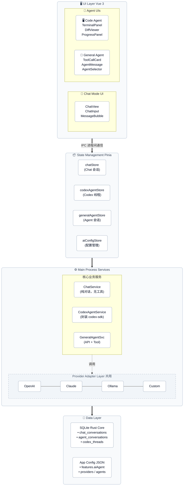
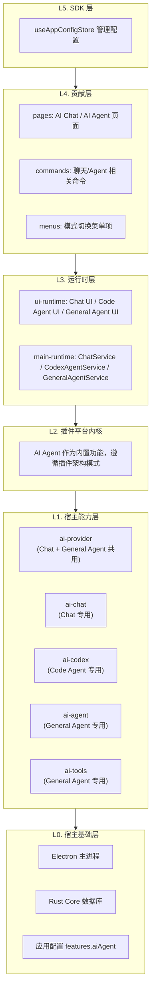
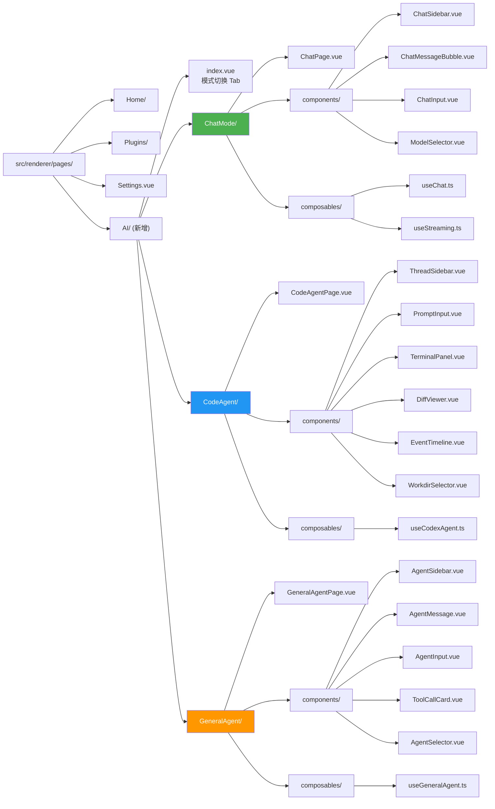
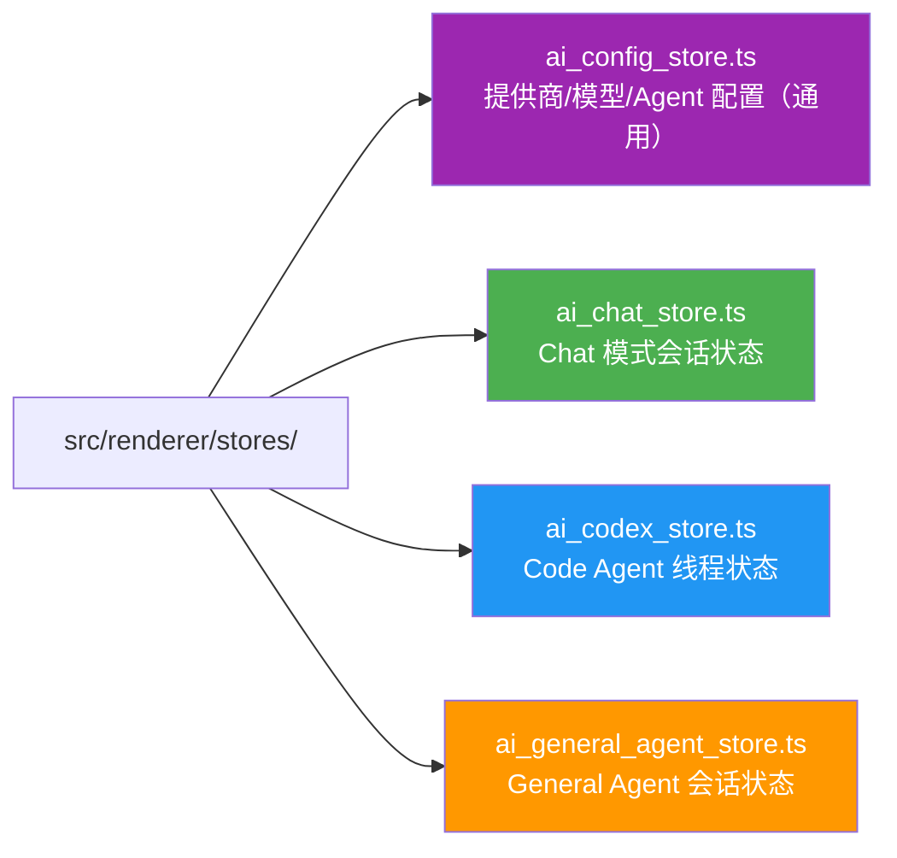

# 桌面端 AI Agent/Chat 架构设计文档 v2.0

## 1. 概述

### 1.1 背景
GuYanTools 桌面端需要集成 AI Agent/Chat 功能。本文档定义了清晰的**模式分离架构**：

- **Chat 模式**：纯对话模式，支持多提供商、多模型，无工具执行
- **Agent 模式**：
  - **Code Agent (Codex)**：基于 `@openai/codex-sdk`，核心逻辑由 SDK 完成，应用层高度自定义 UI
  - **General Agent**：基于标准 API + 自定义 Tool 系统，灵活的 Agent 配置

### 1.2 设计原则
1. **模式分离**：Chat 与 Agent 的数据模型、服务层、UI 完全独立
2. **Codex 委托**：Code Agent 的核心逻辑100%由 `@openai/codex-sdk` 完成，不重复造轮子
3. **统一抽象**：提供商适配器层为 Chat 和 General Agent 共用
4. **遵循分层**：遵循现有插件架构 L0-L5 分层模型

### 1.3 技术约束
- Electron 37 + Vue 3 + TypeScript + Pinia
- 插件架构 L0-L5 分层模型
- 配置存储在 `features.aiAgent` 节点

---

## 2. 系统架构

### 2.1 三模式整体架构图



### 2.2 架构分层（遵循插件架构）



---

## 3. 数据模型设计

### 3.1 配置模型

```typescript
// src/shared/ai_agent_config.ts

/** AI 提供商类型 */
export type AIProviderType = 'openai' | 'claude' | 'ollama' | 'custom';

/** AI 交互模式 */
export type AIMode = 'chat' | 'code-agent' | 'general-agent';

/** AI 提供商配置 */
export interface AIProviderConfig {
  id: string;
  type: AIProviderType;
  name: string;
  baseUrl: string;
  apiKey: string;
  enabled: boolean;
  models: AIModelConfig[];
  extra?: Record<string, unknown>;
}

/** 模型配置 */
export interface AIModelConfig {
  id: string;
  name: string;
  maxTokens?: number;
  supportsFunctionCalling?: boolean;
  supportsVision?: boolean;
  supportsStreaming?: boolean;
  isDefault?: boolean;
}

/** General Agent 配置 */
export interface GeneralAgentConfig {
  id: string;
  name: string;
  systemPrompt: string;
  providerId: string;
  modelId: string;
  temperature?: number;
  maxTokens?: number;
  enabledTools?: string[];
  isDefault?: boolean;
}

/** Codex Agent 配置 */
export interface CodexAgentConfig {
  /** 是否启用 */
  enabled: boolean;
  /** OPENAI_API_KEY（由用户在设置中配置） */
  apiKey?: string;
  /** 自定义 API Base URL */
  baseUrl?: string;
  /** CLI 配置覆盖 */
  cliConfig?: Record<string, unknown>;
  /** 默认工作目录（上次使用的目录） */
  lastWorkingDirectory?: string;
}

/** 顶层配置（存储在 features.aiAgent） */
export interface AIAgentFeatureConfig {
  /** 提供商列表（Chat + General Agent 共用） */
  providers: AIProviderConfig[];
  /** General Agent 列表 */
  agents: GeneralAgentConfig[];
  /** 默认提供商 ID */
  defaultProviderId?: string;
  /** 默认 General Agent ID */
  defaultAgentId?: string;
  /** Codex Agent 配置 */
  codex: CodexAgentConfig;
  /** 上次使用的模式 */
  lastActiveMode?: AIMode;
}
```

### 3.2 Chat 模式数据模型

```typescript
// src/shared/ai_chat_types.ts

export type MessageRole = 'user' | 'assistant' | 'system';

/** Chat 消息（纯文本，无工具调用） */
export interface ChatMessage {
  id: string;
  conversationId: string;
  role: MessageRole;
  content: string;
  timestamp: number;
  tokens?: { prompt: number; completion: number; total: number };
  metadata?: Record<string, unknown>;
}

/** Chat 会话 */
export interface ChatConversation {
  id: string;
  title: string;
  providerId: string;
  modelId: string;
  systemPrompt?: string;
  createdAt: number;
  updatedAt: number;
  messageCount: number;
  totalTokens: number;
  isPinned: boolean;
  tags?: string[];
}
```

### 3.3 Code Agent (Codex) 数据模型

```typescript
// src/shared/ai_codex_types.ts

/** Codex 线程记录（持久化到本地） */
export interface CodexThreadRecord {
  /** 本地标识 */
  id: string;
  /** Codex SDK 线程 ID（用于 resumeThread） */
  sdkThreadId?: string;
  /** 工作目录 */
  workingDirectory: string;
  /** 标题（从首条 prompt 自动生成） */
  title: string;
  /** 创建时间 */
  createdAt: number;
  /** 更新时间 */
  updatedAt: number;
}

/** Codex 事件类型（从 runStreamed 事件映射） */
export type CodexEventType =
  | 'text'           // 文本输出
  | 'tool_call'      // 工具调用（文件操作、命令执行等）
  | 'file_change'    // 文件变更
  | 'command_output' // 终端命令输出
  | 'turn_complete'  // 轮次完成
  | 'error';         // 错误

/** Codex UI 事件（主进程 → 渲染进程） */
export interface CodexUIEvent {
  threadId: string;
  type: CodexEventType;
  data: unknown;
  timestamp: number;
}

/** Codex 轮次记录 */
export interface CodexTurnRecord {
  id: string;
  threadId: string;
  prompt: string;
  response?: string;
  events: CodexUIEvent[];
  usage?: { promptTokens: number; completionTokens: number };
  timestamp: number;
}
```

### 3.4 General Agent 数据模型

```typescript
// src/shared/ai_agent_types.ts

export type AgentMessageRole = 'user' | 'assistant' | 'system' | 'tool';

/** 工具调用 */
export interface ToolCall {
  id: string;
  name: string;
  arguments: string;
  result?: string;
  status: 'pending' | 'running' | 'completed' | 'error';
  error?: string;
}

/** Agent 消息（含工具调用） */
export interface AgentMessage {
  id: string;
  conversationId: string;
  role: AgentMessageRole;
  content: string;
  toolCalls?: ToolCall[];
  timestamp: number;
  tokens?: { prompt: number; completion: number; total: number };
}

/** Agent 会话 */
export interface AgentConversation {
  id: string;
  title: string;
  agentId: string;
  providerId: string;
  modelId: string;
  createdAt: number;
  updatedAt: number;
  messageCount: number;
}
```

---

## 4. 核心组件设计

### 4.1 Provider Adapter Layer（Chat + General Agent 共用）

```typescript
// src/main/services/ai/providers/base_provider.ts

export interface IAIProvider {
  readonly type: string;
  validateConfig(config: AIProviderConfig): Promise<boolean>;

  /** 流式聊天（Chat 模式 + General Agent 共用） */
  streamChat(
    messages: Array<{ role: string; content: string }>,
    model: AIModelConfig,
    options?: StreamChatOptions
  ): AsyncIterable<StreamChunk>;

  /** 非流式聊天 */
  chat(
    messages: Array<{ role: string; content: string }>,
    model: AIModelConfig,
    options?: ChatOptions
  ): Promise<ChatResponse>;

  /** 获取模型列表 */
  listModels(): Promise<AIModelConfig[]>;
}

export interface StreamChunk {
  content?: string;
  toolCalls?: ToolCall[];
  finishReason?: 'stop' | 'length' | 'tool_calls';
  usage?: { promptTokens: number; completionTokens: number; totalTokens: number };
}
```

> **注意**：Codex Agent **不使用** Provider Adapter Layer。
> Codex 的所有 AI 交互由 `@openai/codex-sdk` 内部完成。

### 4.2 ChatService（Chat 模式专用）

```typescript
// src/main/services/ai/chat_service.ts

export class ChatService {
  constructor(
    private providerRegistry: ProviderRegistry,
    private db: JsDatabase
  ) {}

  /** 发送消息（流式），无工具调用 */
  async *sendMessage(
    conversationId: string,
    content: string
  ): AsyncIterable<{ type: 'content' | 'done'; content?: string }> {
    const conversation = await this.getConversation(conversationId);
    const provider = this.providerRegistry.get(conversation.providerId);
    const model = this.getModel(conversation.providerId, conversation.modelId);
    const messages = await this.buildMessages(conversationId);

    messages.push({ role: 'user', content });
    await this.saveMessage({ conversationId, role: 'user', content });

    let assistantContent = '';
    for await (const chunk of provider.streamChat(messages, model, {
      temperature: 0.7,
      maxTokens: 4096,
      // 注意：Chat 模式不传 tools 参数
    })) {
      if (chunk.content) {
        assistantContent += chunk.content;
        yield { type: 'content', content: chunk.content };
      }
    }

    await this.saveMessage({ conversationId, role: 'assistant', content: assistantContent });
    yield { type: 'done' };
  }
}
```

### 4.3 CodexAgentService（Code Agent 专用）

这是 Code Agent 的核心服务。**所有 AI 逻辑由 `@openai/codex-sdk` 完成**，
应用层仅负责实例管理和事件转发。

```typescript
// src/main/services/ai/codex_agent_service.ts

import { Codex } from "@openai/codex-sdk";
import type { WebContents } from "electron";

export class CodexAgentService {
  private codex: Codex | null = null;
  private activeThreads = new Map<string, any>(); // Thread instances

  /** 初始化 Codex 实例 */
  async initialize(config: CodexAgentConfig): Promise<void> {
    if (!config.enabled) return;

    this.codex = new Codex({
      // Electron 主进程必须显式传递环境变量
      env: {
        PATH: process.env.PATH || "",
        HOME: process.env.HOME || process.env.USERPROFILE || "",
        OPENAI_API_KEY: config.apiKey || "",
      },
      // 自定义 API 地址
      ...(config.baseUrl ? { baseUrl: config.baseUrl } : {}),
      // CLI 配置覆盖
      config: config.cliConfig,
    });
  }

  /** 检查 Codex 是否可用 */
  isAvailable(): boolean {
    return this.codex !== null;
  }

  /** 创建新线程 */
  startThread(workingDirectory: string, skipGitCheck = false): string {
    if (!this.codex) throw new Error("Codex not initialized");
    const thread = this.codex.startThread({
      workingDirectory,
      skipGitRepoCheck: skipGitCheck,
    });
    const threadId = crypto.randomUUID();
    this.activeThreads.set(threadId, thread);
    return threadId;
  }

  /** 恢复已有线程 */
  resumeThread(sdkThreadId: string): string {
    if (!this.codex) throw new Error("Codex not initialized");
    const thread = this.codex.resumeThread(sdkThreadId);
    const threadId = crypto.randomUUID();
    this.activeThreads.set(threadId, thread);
    return threadId;
  }

  /** 流式执行 prompt，事件推送到渲染进程 */
  async runStreamed(
    threadId: string,
    prompt: string | Array<{ type: string; text?: string; path?: string }>,
    webContents: WebContents
  ): Promise<void> {
    const thread = this.activeThreads.get(threadId);
    if (!thread) throw new Error("Thread not found");

    try {
      const { events } = await thread.runStreamed(prompt);
      for await (const event of events) {
        // 直接将 SDK 事件转发到渲染进程
        webContents.send("codex:event", {
          threadId,
          type: event.type,
          data: event,
          timestamp: Date.now(),
        });
      }
      webContents.send("codex:complete", { threadId });
    } catch (error) {
      webContents.send("codex:error", {
        threadId,
        error: error instanceof Error ? error.message : "Unknown error",
      });
    }
  }

  /** 同步执行（用于简单场景） */
  async run(threadId: string, prompt: string): Promise<any> {
    const thread = this.activeThreads.get(threadId);
    if (!thread) throw new Error("Thread not found");
    return await thread.run(prompt);
  }

  /** 关闭线程 */
  closeThread(threadId: string): void {
    this.activeThreads.delete(threadId);
  }

  /** 销毁所有资源 */
  destroy(): void {
    this.activeThreads.clear();
    this.codex = null;
  }
}
```

### 4.4 GeneralAgentService（General Agent 专用）

```typescript
// src/main/services/ai/general_agent_service.ts

export class GeneralAgentService {
  constructor(
    private providerRegistry: ProviderRegistry,
    private toolService: ToolService,
    private db: JsDatabase
  ) {}

  /** 发送消息（含工具调用循环） */
  async *sendMessage(
    conversationId: string,
    content: string
  ): AsyncIterable<AgentStreamEvent> {
    const conversation = await this.getConversation(conversationId);
    const agent = await this.getAgent(conversation.agentId);
    const provider = this.providerRegistry.get(conversation.providerId);
    const model = this.getModel(conversation.providerId, conversation.modelId);

    const messages = await this.buildMessages(conversationId, agent.systemPrompt);
    messages.push({ role: 'user', content });
    await this.saveMessage({ conversationId, role: 'user', content });

    // 工具定义
    const tools = agent.enabledTools
      ? this.toolService.getToolDefinitions(agent.enabledTools)
      : undefined;

    // 工具调用循环
    let done = false;
    while (!done) {
      let assistantContent = '';
      let toolCalls: ToolCall[] = [];

      for await (const chunk of provider.streamChat(messages, model, { tools })) {
        if (chunk.content) {
          assistantContent += chunk.content;
          yield { type: 'content', content: chunk.content };
        }
        if (chunk.toolCalls) {
          toolCalls = chunk.toolCalls;
          yield { type: 'tool_calls', toolCalls };
        }
        if (chunk.finishReason === 'tool_calls' && toolCalls.length > 0) {
          // 执行工具并将结果追加到 messages
          for (const tc of toolCalls) {
            yield { type: 'tool_start', toolCall: tc };
            try {
              const result = await this.toolService.executeTool(tc.name, JSON.parse(tc.arguments));
              tc.result = result;
              tc.status = 'completed';
              yield { type: 'tool_result', toolCall: tc };
            } catch (error) {
              tc.status = 'error';
              tc.error = error instanceof Error ? error.message : 'Unknown error';
              yield { type: 'tool_error', toolCall: tc };
            }
          }
          // 将工具结果添加到 messages，继续循环
          messages.push({ role: 'assistant', content: assistantContent, tool_calls: toolCalls });
          for (const tc of toolCalls) {
            messages.push({ role: 'tool', tool_call_id: tc.id, content: tc.result || tc.error || '' });
          }
          break; // 跳出内层 for 循环，继续外层 while 循环
        }
        if (chunk.finishReason === 'stop') {
          done = true;
        }
      }

      if (done) {
        await this.saveMessage({ conversationId, role: 'assistant', content: assistantContent, toolCalls });
        yield { type: 'done' };
      }
    }
  }
}
```

### 4.5 ToolService（General Agent 专用）

```typescript
// src/main/services/ai/tool_service.ts

export interface ToolDefinition {
  name: string;
  description: string;
  parameters: Record<string, unknown>;
  execute: (params: Record<string, unknown>) => Promise<string>;
}

export class ToolService {
  private tools = new Map<string, ToolDefinition>();

  constructor() {
    this.registerBuiltInTools();
  }

  private registerBuiltInTools(): void {
    this.register({
      name: 'read_file',
      description: '读取文件内容',
      parameters: {
        type: 'object',
        properties: { path: { type: 'string', description: '文件路径' } },
        required: ['path'],
      },
      execute: async (params) => {
        const fs = await import('fs/promises');
        return await fs.readFile(params.path as string, 'utf-8');
      },
    });

    this.register({
      name: 'write_file',
      description: '写入文件内容',
      parameters: {
        type: 'object',
        properties: {
          path: { type: 'string', description: '文件路径' },
          content: { type: 'string', description: '文件内容' },
        },
        required: ['path', 'content'],
      },
      execute: async (params) => {
        const fs = await import('fs/promises');
        await fs.writeFile(params.path as string, params.content as string);
        return 'File written successfully';
      },
    });

    this.register({
      name: 'execute_command',
      description: '执行系统命令',
      parameters: {
        type: 'object',
        properties: { command: { type: 'string', description: '命令' } },
        required: ['command'],
      },
      execute: async (params) => {
        const { exec } = await import('child_process');
        return new Promise((resolve, reject) => {
          exec(params.command as string, { timeout: 30000 }, (error, stdout, stderr) => {
            if (error) reject(error);
            else resolve(stdout || stderr);
          });
        });
      },
    });
  }

  register(tool: ToolDefinition): void { this.tools.set(tool.name, tool); }

  getToolDefinitions(names?: string[]): ToolDefinition[] {
    if (!names) return Array.from(this.tools.values());
    return names.map(n => this.tools.get(n)).filter((t): t is ToolDefinition => !!t);
  }

  async executeTool(name: string, params: Record<string, unknown>): Promise<string> {
    const tool = this.tools.get(name);
    if (!tool) throw new Error(`Tool not found: ${name}`);
    return await tool.execute(params);
  }
}
```

---

## 5. UI 设计

### 5.1 页面与组件结构



### 5.2 模式切换入口

```vue
<!-- src/renderer/pages/AI/index.vue -->
<template>
  <div class="ai-page">
    <!-- 模式切换 Tab -->
    <div class="mode-tabs">
      <button :class="{ active: mode === 'chat' }" @click="mode = 'chat'">
        💬 Chat
      </button>
      <button :class="{ active: mode === 'code-agent' }" @click="mode = 'code-agent'">
        🖥️ Code Agent
      </button>
      <button :class="{ active: mode === 'general-agent' }" @click="mode = 'general-agent'">
        🤖 General Agent
      </button>
    </div>

    <!-- 模式内容 -->
    <ChatPage v-if="mode === 'chat'" />
    <CodeAgentPage v-else-if="mode === 'code-agent'" />
    <GeneralAgentPage v-else-if="mode === 'general-agent'" />
  </div>
</template>
```

### 5.3 Code Agent UI 特点（与 Chat 的核心差异）

Code Agent 的 UI 是**高度自定义的终端/IDE 风格**，而非传统聊天气泡：

| UI 元素     | 展示方式                           |
| ----------- | ---------------------------------- |
| 用户提示    | 命令行风格输入区域                 |
| AI 推理文本 | 终端滚动输出                       |
| 工具调用    | 可折叠的执行过程卡片               |
| 文件变更    | 语法高亮的 diff 视图               |
| 命令执行    | 模拟终端面板（黑色背景、等宽字体） |
| 进度状态    | 进度条 + 当前步骤描述              |
| 完成统计    | Token 用量、执行时间               |

---

## 6. IPC 通信设计

### 6.1 Chat 模式 IPC

```typescript
// 频道命名约定：ai:chat:*
ipcMain.handle('ai:chat:create-conversation', ...);
ipcMain.handle('ai:chat:list-conversations', ...);
ipcMain.handle('ai:chat:get-messages', ...);
ipcMain.on('ai:chat:stream', ...);       // 流式，使用 webContents.send
ipcMain.on('ai:chat:stop-stream', ...);
```

### 6.2 Code Agent (Codex) IPC

```typescript
// 频道命名约定：ai:codex:*
ipcMain.handle('ai:codex:check-available', ...);
ipcMain.handle('ai:codex:start-thread', async (_, workingDir: string) => { ... });
ipcMain.handle('ai:codex:resume-thread', async (_, sdkThreadId: string) => { ... });
ipcMain.on('ai:codex:run-streamed', ...);  // 事件推送：codex:event, codex:complete, codex:error
ipcMain.handle('ai:codex:close-thread', ...);
```

### 6.3 General Agent IPC

```typescript
// 频道命名约定：ai:agent:*
ipcMain.handle('ai:agent:create-conversation', ...);
ipcMain.handle('ai:agent:list-conversations', ...);
ipcMain.handle('ai:agent:get-messages', ...);
ipcMain.on('ai:agent:stream', ...);       // 事件推送含工具调用
ipcMain.on('ai:agent:stop-stream', ...);
```

### 6.4 通用配置 IPC

```typescript
// 频道命名约定：ai:config:*
ipcMain.handle('ai:config:list-providers', ...);
ipcMain.handle('ai:config:add-provider', ...);
ipcMain.handle('ai:config:test-provider', ...);
ipcMain.handle('ai:config:list-agents', ...);
ipcMain.handle('ai:config:add-agent', ...);
```

### 6.5 Preload Bridge

```typescript
// src/preload.ts — 新增 AI 相关 API

contextBridge.exposeInMainWorld('aiApi', {
  // ── Chat 模式 ──
  chat: {
    createConversation: (providerId, modelId) => ipcRenderer.invoke('ai:chat:create-conversation', providerId, modelId),
    listConversations: () => ipcRenderer.invoke('ai:chat:list-conversations'),
    getMessages: (conversationId) => ipcRenderer.invoke('ai:chat:get-messages', conversationId),
    stream: (conversationId, content) => ipcRenderer.send('ai:chat:stream', conversationId, content),
    stopStream: () => ipcRenderer.send('ai:chat:stop-stream'),
    onStreamChunk: (cb) => { /* listener setup */ },
    onStreamEnd: (cb) => { /* listener setup */ },
    onStreamError: (cb) => { /* listener setup */ },
  },

  // ── Code Agent (Codex) ──
  codex: {
    checkAvailable: () => ipcRenderer.invoke('ai:codex:check-available'),
    startThread: (workingDir) => ipcRenderer.invoke('ai:codex:start-thread', workingDir),
    resumeThread: (sdkThreadId) => ipcRenderer.invoke('ai:codex:resume-thread', sdkThreadId),
    runStreamed: (threadId, prompt) => ipcRenderer.send('ai:codex:run-streamed', threadId, prompt),
    closeThread: (threadId) => ipcRenderer.invoke('ai:codex:close-thread', threadId),
    onEvent: (cb) => { /* codex:event listener */ },
    onComplete: (cb) => { /* codex:complete listener */ },
    onError: (cb) => { /* codex:error listener */ },
  },

  // ── General Agent ──
  agent: {
    createConversation: (agentId) => ipcRenderer.invoke('ai:agent:create-conversation', agentId),
    listConversations: () => ipcRenderer.invoke('ai:agent:list-conversations'),
    getMessages: (conversationId) => ipcRenderer.invoke('ai:agent:get-messages', conversationId),
    stream: (conversationId, content) => ipcRenderer.send('ai:agent:stream', conversationId, content),
    stopStream: () => ipcRenderer.send('ai:agent:stop-stream'),
    onStreamChunk: (cb) => { /* listener setup */ },
    onStreamEnd: (cb) => { /* listener setup */ },
    onStreamError: (cb) => { /* listener setup */ },
  },

  // ── 配置管理 ──
  config: {
    listProviders: () => ipcRenderer.invoke('ai:config:list-providers'),
    addProvider: (provider) => ipcRenderer.invoke('ai:config:add-provider', provider),
    updateProvider: (id, patch) => ipcRenderer.invoke('ai:config:update-provider', id, patch),
    deleteProvider: (id) => ipcRenderer.invoke('ai:config:delete-provider', id),
    testProvider: (id) => ipcRenderer.invoke('ai:config:test-provider', id),
    listAgents: () => ipcRenderer.invoke('ai:config:list-agents'),
    addAgent: (agent) => ipcRenderer.invoke('ai:config:add-agent', agent),
    updateAgent: (id, patch) => ipcRenderer.invoke('ai:config:update-agent', id, patch),
    deleteAgent: (id) => ipcRenderer.invoke('ai:config:delete-agent', id),
  },
});
```

---

## 7. 状态管理（Pinia）

### 7.1 Store 分离



各 Store 职责清晰，互不耦合。详见 `ai-agent-requirements.md` 中的功能需求。

---

## 8. 数据库 Schema

```sql
-- ── Chat 模式 ──
CREATE TABLE IF NOT EXISTS chat_conversations (
  id TEXT PRIMARY KEY,
  title TEXT NOT NULL,
  provider_id TEXT NOT NULL,
  model_id TEXT NOT NULL,
  system_prompt TEXT,
  created_at INTEGER NOT NULL,
  updated_at INTEGER NOT NULL,
  message_count INTEGER DEFAULT 0,
  total_tokens INTEGER DEFAULT 0,
  is_pinned INTEGER DEFAULT 0,
  tags TEXT
);

CREATE TABLE IF NOT EXISTS chat_messages (
  id TEXT PRIMARY KEY,
  conversation_id TEXT NOT NULL REFERENCES chat_conversations(id) ON DELETE CASCADE,
  role TEXT NOT NULL,
  content TEXT NOT NULL,
  timestamp INTEGER NOT NULL,
  prompt_tokens INTEGER,
  completion_tokens INTEGER,
  total_tokens INTEGER
);

-- ── Code Agent (Codex) ──
CREATE TABLE IF NOT EXISTS codex_threads (
  id TEXT PRIMARY KEY,
  sdk_thread_id TEXT,
  working_directory TEXT NOT NULL,
  title TEXT NOT NULL,
  created_at INTEGER NOT NULL,
  updated_at INTEGER NOT NULL
);

CREATE TABLE IF NOT EXISTS codex_turns (
  id TEXT PRIMARY KEY,
  thread_id TEXT NOT NULL REFERENCES codex_threads(id) ON DELETE CASCADE,
  prompt TEXT NOT NULL,
  response TEXT,
  events TEXT,  -- JSON array of CodexUIEvent
  prompt_tokens INTEGER,
  completion_tokens INTEGER,
  timestamp INTEGER NOT NULL
);

-- ── General Agent ──
CREATE TABLE IF NOT EXISTS agent_conversations (
  id TEXT PRIMARY KEY,
  title TEXT NOT NULL,
  agent_id TEXT NOT NULL,
  provider_id TEXT NOT NULL,
  model_id TEXT NOT NULL,
  created_at INTEGER NOT NULL,
  updated_at INTEGER NOT NULL,
  message_count INTEGER DEFAULT 0
);

CREATE TABLE IF NOT EXISTS agent_messages (
  id TEXT PRIMARY KEY,
  conversation_id TEXT NOT NULL REFERENCES agent_conversations(id) ON DELETE CASCADE,
  role TEXT NOT NULL,
  content TEXT NOT NULL,
  tool_calls TEXT,  -- JSON array of ToolCall
  timestamp INTEGER NOT NULL,
  prompt_tokens INTEGER,
  completion_tokens INTEGER,
  total_tokens INTEGER
);

-- 索引
CREATE INDEX idx_chat_msg_conv ON chat_messages(conversation_id);
CREATE INDEX idx_codex_turns_thread ON codex_turns(thread_id);
CREATE INDEX idx_agent_msg_conv ON agent_messages(conversation_id);
```

---

## 9. 依赖管理

| 依赖                | 用途              | 使用模式             |
| ------------------- | ----------------- | -------------------- |
| `@openai/codex-sdk` | Codex Agent 集成  | Code Agent 专用      |
| `openai`            | OpenAI API 客户端 | Chat + General Agent |
| `@anthropic-ai/sdk` | Claude API 客户端 | Chat + General Agent |
| `marked`            | Markdown 渲染     | 通用                 |
| `highlight.js`      | 代码高亮          | 通用                 |
| `katex`             | 数学公式渲染      | Chat 模式            |

---

## 10. 实施计划

### Phase 1: 基础架构（1-2 周）
- [ ] 定义所有 TypeScript 类型（共享层）
- [ ] 实现 Provider Adapter Layer（OpenAI Provider）
- [ ] 实现 ProviderRegistry
- [ ] 扩展数据库 Schema（三套表）
- [ ] 实现基础 IPC 通信框架

### Phase 2: Chat 模式（2 周）
- [ ] 实现 ChatService
- [ ] 实现 Chat 模式 UI（会话列表、消息气泡、输入框）
- [ ] 实现流式响应处理
- [ ] 实现 Markdown 渲染和代码高亮
- [ ] 实现 aiChatStore

### Phase 3: Code Agent（2-3 周）
- [ ] 集成 `@openai/codex-sdk`
- [ ] 实现 CodexAgentService
- [ ] 实现 Code Agent UI（终端面板、事件时间线、Diff 查看器）
- [ ] 实现工作目录选择和线程管理
- [ ] 实现 aiCodexStore

### Phase 4: General Agent（2-3 周）
- [ ] 实现 ToolService 和内置工具
- [ ] 实现 GeneralAgentService（含工具调用循环）
- [ ] 实现 General Agent UI（工具卡片、Agent 选择器）
- [ ] 实现 aiGeneralAgentStore

### Phase 5: 设置与 Polish（1-2 周）
- [ ] 实现设置页面（提供商管理、Agent 配置、Codex 配置）
- [ ] 实现 Claude Provider 和 Ollama Provider
- [ ] 模式切换和数据持久化
- [ ] 错误处理和性能优化

---

## 11. 验收标准

（详见 `ai-agent-requirements.md` 第 6 节）

---

## 12. 安全考虑

### 12.1 API Key 安全
- API Key 仅存储在主进程，不通过 IPC 暴露给渲染进程
- 配置文件加密存储（可选）

### 12.2 工具执行安全
- General Agent 的工具执行在主进程中
- 文件操作限制在用户目录
- 命令执行设置超时（timeout: 30s）
- 敏感操作可配置用户确认

### 12.3 Codex 安全
- Codex SDK 内置沙箱机制
- 默认要求工作目录为 Git 仓库
- 用户可通过 `skipGitRepoCheck` 显式跳过

---

## 13. 未来扩展

- 多模态支持（图片/音频/视频输入）
- Agent 分享和市场
- 知识库集成（RAG）
- 第三方工具插件
- MCP（Model Context Protocol）集成

---

## 附录

### A. 相关文档
- [需求文档](./ai-agent-requirements.md)
- [Codex SDK 技术调研](./codex-sdk-research.md)
- [插件架构设计](./PLUGIN_ARCHITECTURE_PLAN.md)

### B. 参考资料
- [OpenAI Codex SDK - GitHub](https://github.com/openai/codex/tree/main/sdk/typescript)
- [OpenAI API Docs](https://platform.openai.com/docs)
- [Anthropic Claude API](https://docs.anthropic.com/claude/reference)

### C. 更新日志
| 版本 | 日期       | 变更说明                                                                                               |
| ---- | ---------- | ------------------------------------------------------------------------------------------------------ |
| 2.0  | 2026-03-19 | 重构：明确 Chat/Agent 模式分离，Agent 分为 Code Agent 和 General Agent 两大类，修正 Codex SDK API 使用 |
| 1.0  | 2026-03-19 | 初始版本                                                                                               |
