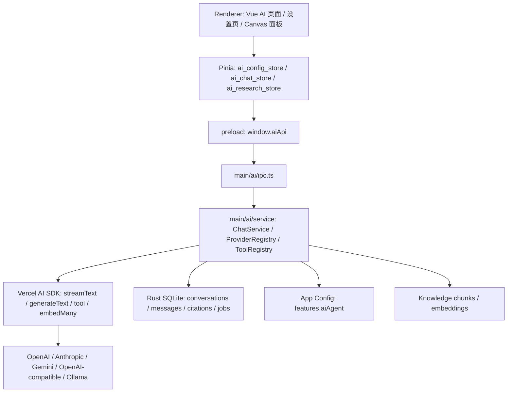

# GuYanTools AI 问答与 Agent 预留版本规划

> 版本：0.1
> 日期：2026-06-07
> 状态：实施前规划
> 决策：AI 问答直接使用 Vercel AI SDK；Agent 功能先预留事件、工具和数据边界，后续版本实现。

## 1. 目标与边界

### 1.1 本规划要解决的问题

当前目标是把 AI 能力集成到 GuYanTools 桌面端，先交付稳定可用的 AI 问答，再逐步扩展到网页搜索、知识库问答、Canvas、深度研究和 Agent。

首版不做完整自主 Agent。首版只要求：

- 用户可以配置不同 AI Provider 和模型。
- 用户可以创建对话、发送消息、收到流式回复。
- API Key 不暴露到 renderer。
- 底层直接使用 Vercel AI SDK 统一模型接入。
- 数据结构、事件协议、工具注册和权限模型为 Agent 留好扩展点。

### 1.2 与现有文档的关系

本规划继承以下既有约束：

- `docs/desktop/AgentFunc/plans/ai-agent-requirements.md` 已将 AI 能力拆成 Chat、Code Agent、General Agent。
- `docs/desktop/AgentFunc/plans/ai-agent-architecture.md` 已要求 Chat 和 Agent 模式分离、Provider 层共用、配置落在 `features.aiAgent`。
- `docs/desktop/KnowledgeBase/ai-integration.md` 已要求 AI 默认关闭、用户明确触发、回答带引用、AI 不静默覆盖用户内容。
- `multi_platform_core/migrations/021_add_knowledge.sql` 已预留 `knowledge_ai_chunks` 和 `knowledge_embeddings`。

本规划对既有方案的调整是：Provider Adapter 不再手写各厂商 HTTP 协议作为主路径，而是以 Vercel AI SDK 为主接入层；应用仍保留自己的 IPC、会话、权限、引用、审计和 UI 事件协议。

## 2. 技术清单

### 2.1 必选运行时技术

| 技术 | 用途 | 首次引入版本 | 说明 |
| --- | --- | --- | --- |
| Vercel AI SDK `ai` | `streamText`、`generateText`、`tool`、`stepCountIs`、`embedMany`、`createProviderRegistry` | V1.0 | AI 问答和后续 Agent 的主 SDK |
| `@ai-sdk/openai` | OpenAI 官方模型、Responses/Chat/Embedding 能力 | V1.0 | 支持 OpenAI 和可控 `providerOptions.openai` |
| `@ai-sdk/anthropic` | Claude 模型接入 | V1.0 | 用于 Claude Sonnet/Opus 等模型 |
| `@ai-sdk/google` | Gemini 模型接入 | V1.0 | 用于 Gemini 文本、视觉、thinking 配置 |
| `@ai-sdk/openai-compatible` | OpenAI-compatible API、Ollama、LM Studio、OpenRouter、国产兼容网关 | V1.0 | 统一自定义 baseURL 接入 |
| `@ai-sdk/vue` | Vue 聊天 UI 辅助能力 | V1.0 | 若与 Electron IPC 流不匹配，只使用其类型/状态模式，不强行套 HTTP `/api/chat` |
| `zod` | 工具输入 schema、结构化输出 schema | V1.0 | AI SDK 工具定义常用 schema 方案 |
| Web `ReadableStream` / `AbortController` | 流式输出、停止生成、超时取消 | V1.0 | 在 Electron 主进程 AI service 中使用 |
| Electron IPC | renderer 与主进程 AI service 通信 | V1.0 | 不从 renderer 直连模型服务 |
| Pinia setup store | AI 配置、会话列表、当前流状态 | V1.0 | 延续桌面端现有状态风格 |
| SQLite / Rust core migration | 会话、消息、引用、研究任务、AI 操作日志持久化 | V1.0 起 | 配置仍走 `features.aiAgent` |
| Markdown renderer | 回复渲染、代码块、数学公式 | V1.0 | 复用 `marked`、`katex`、`mathjax` 等现有依赖 |

### 2.2 可选或后续技术

| 技术 | 用途 | 首次引入版本 | 是否首版必需 |
| --- | --- | --- | --- |
| Vercel AI Gateway / `@ai-sdk/gateway` | 单 Key 访问多 Provider、fallback、统一路由 | V1.2 | 否，首版以用户 BYOK 为主 |
| AI SDK `createMCPClient` | MCP 工具接入 | V2.0 | 否 |
| AI SDK `generateObject` / `Output` | 标题生成、标签建议、结构化研究计划 | V1.1 | 部分使用 |
| AI SDK `embedMany` | 知识库 chunk embedding | V1.1 | 否 |
| AI SDK `cosineSimilarity` | 小规模本地向量相似度计算 | V1.1 | 可用作无 sqlite-vec 前的过渡 |
| sqlite-vec | SQLite 内向量检索 | V1.2 | 可选，数据量大后再引入 |
| LanceDB | 大规模本地向量库 | V2.0+ | 可选 |
| OpenTelemetry / AI SDK telemetry | 调用链、工具调用、成本观测 | V1.2 | 否 |
| Codex SDK | Code Agent | V2.0 | 否，Code Agent 独立于 Chat Provider 层 |

### 2.3 依赖安装建议

首个实现 PR 应在 `desktop/package.json` 增加：

```bash
pnpm --dir desktop add ai @ai-sdk/openai @ai-sdk/anthropic @ai-sdk/google @ai-sdk/openai-compatible @ai-sdk/vue zod
```

如果 V1.2 决定使用 Vercel AI Gateway，再增加：

```bash
pnpm --dir desktop add @ai-sdk/gateway
```

不建议在 V1.0 同时引入 LangChain、LlamaIndex、Mastra、LangGraph。原因是首版目标是桌面端 AI 问答，不是完整 Agent 编排；Vercel AI SDK 已经覆盖多模型、流式、工具调用和后续 Agent loop 的核心需求。

## 3. 总体架构

### 3.1 分层



### 3.2 主进程服务目录建议

```text
desktop/src/main/ai/
├── ipc.ts
├── chat_service.ts
├── provider_registry.ts
├── provider_config.ts
├── stream_events.ts
├── title_service.ts
├── tools/
│   ├── tool_registry.ts
│   ├── web_search_tool.ts
│   ├── knowledge_search_tool.ts
│   ├── canvas_patch_tool.ts
│   └── approvals.ts
└── research/
    ├── research_job_service.ts
    └── research_pipeline.ts
```

### 3.3 Renderer 目录建议

```text
desktop/src/windows/main/pages/AI/
├── AiChatPage.vue
├── AiSettingsPanel.vue
├── AiConversationList.vue
├── AiMessageList.vue
├── AiMessageItem.vue
├── AiComposer.vue
├── AiCitationList.vue
├── AiToolCallCard.vue
├── AiCanvasPanel.vue
└── AiResearchPanel.vue

desktop/src/windows/main/stores/
├── ai_config_store.ts
├── ai_chat_store.ts
└── ai_research_store.ts
```

### 3.4 Provider 接入策略

应用层保存的是 GuYanTools 自己的 Provider 配置；运行时转换成 AI SDK Provider。

```ts
type AiProviderKind =
  | 'openai'
  | 'anthropic'
  | 'google'
  | 'openai-compatible'
  | 'ollama'
  | 'vercel-gateway';
```

映射规则：

- `openai` -> `createOpenAI({ apiKey, baseURL, compatibility: 'strict' })`
- `anthropic` -> `createAnthropic({ apiKey, baseURL })`
- `google` -> `createGoogleGenerativeAI({ apiKey, baseURL })`
- `openai-compatible` -> `createOpenAICompatible({ name, apiKey, baseURL })`
- `ollama` -> `createOpenAICompatible({ name: 'ollama', baseURL: 'http://localhost:11434/v1' })`
- `vercel-gateway` -> Vercel AI Gateway string model 或 gateway provider

`createProviderRegistry` 用于把这些 Provider 注册成统一模型 ID：

```ts
registry.languageModel('openai:gpt-5.5')
registry.languageModel('anthropic:claude-sonnet-4.6')
registry.languageModel('google:gemini-2.5-pro')
registry.languageModel('ollama:qwen3:14b')
registry.languageModel('custom:deepseek-chat')
```

### 3.5 统一流式事件

AI SDK 的 `streamText().fullStream` 或等价 stream parts 不直接透传给 renderer，而是转成稳定的应用事件：

```ts
export type AiStreamEvent =
  | { type: 'run-start'; runId: string; conversationId: string; messageId: string }
  | { type: 'text-delta'; messageId: string; delta: string }
  | { type: 'reasoning-delta'; messageId: string; delta: string }
  | { type: 'tool-call-start'; toolCallId: string; toolName: string; inputPreview?: string }
  | { type: 'tool-call-delta'; toolCallId: string; delta: string }
  | { type: 'tool-call-result'; toolCallId: string; outputPreview: string; isError?: boolean }
  | { type: 'citation'; messageId: string; citation: AiCitation }
  | { type: 'usage'; messageId: string; usage: AiTokenUsage }
  | { type: 'run-aborted'; runId: string }
  | { type: 'run-error'; runId: string; message: string; retryable: boolean }
  | { type: 'run-finish'; runId: string; finishReason: string };
```

好处：

- 后续从 Chat 扩展到 Agent 时 UI 不需要重写。
- 各 Provider 的差异在主进程内消化。
- 可以统一记录 usage、引用、工具调用和审计日志。

## 4. 数据模型

### 4.1 `features.aiAgent` 配置

`desktop/src/contracts/app_config.ts` 当前已有 `features.aiAgent: Record<string, unknown>`。V1.0 应将它升级为强类型：

```ts
export interface AiAgentFeatureConfig {
  enabled: boolean;
  defaultMode: 'chat' | 'general-agent' | 'code-agent';
  providers: AiProviderConfig[];
  defaultChatModelId?: string;
  chat: AiChatSettings;
  agent: AiAgentReservedSettings;
  research: AiResearchSettings;
}

export interface AiProviderConfig {
  id: string;
  kind: AiProviderKind;
  name: string;
  baseUrl?: string;
  apiKeyRef?: string;
  enabled: boolean;
  models: AiModelConfig[];
  createdAt: number;
  updatedAt: number;
}

export interface AiModelConfig {
  id: string;
  displayName: string;
  providerModelId: string;
  capabilities: AiModelCapabilities;
  contextWindow?: number;
  maxOutputTokens?: number;
  defaultTemperature?: number;
}
```

API Key 处理：

- renderer 只看到 `hasApiKey: boolean` 和 masked label。
- 主进程读取和写入密钥。
- V1.0 可以先跟随应用配置文件落盘，但 IPC 不返回明文。
- V1.1 起应迁移到系统 keychain 或本地加密存储，`apiKeyRef` 只保存引用。

### 4.2 SQLite 表

V1.0 增加：

```sql
CREATE TABLE IF NOT EXISTS ai_chat_conversations (
  id TEXT PRIMARY KEY,
  title TEXT NOT NULL,
  provider_id TEXT NOT NULL,
  model_id TEXT NOT NULL,
  system_prompt TEXT,
  pinned INTEGER NOT NULL DEFAULT 0,
  archived INTEGER NOT NULL DEFAULT 0,
  created_at TEXT NOT NULL DEFAULT (datetime('now')),
  updated_at TEXT NOT NULL DEFAULT (datetime('now'))
);

CREATE TABLE IF NOT EXISTS ai_chat_messages (
  id TEXT PRIMARY KEY,
  conversation_id TEXT NOT NULL,
  role TEXT NOT NULL,
  content TEXT NOT NULL,
  status TEXT NOT NULL DEFAULT 'complete',
  parent_message_id TEXT,
  model_id TEXT,
  provider_id TEXT,
  token_usage_json TEXT,
  metadata_json TEXT,
  created_at TEXT NOT NULL DEFAULT (datetime('now')),
  updated_at TEXT NOT NULL DEFAULT (datetime('now')),
  FOREIGN KEY (conversation_id) REFERENCES ai_chat_conversations(id) ON DELETE CASCADE
);

CREATE TABLE IF NOT EXISTS ai_message_citations (
  id TEXT PRIMARY KEY,
  message_id TEXT NOT NULL,
  source_type TEXT NOT NULL,
  title TEXT NOT NULL,
  url TEXT,
  source_id TEXT,
  quote TEXT,
  metadata_json TEXT,
  created_at TEXT NOT NULL DEFAULT (datetime('now')),
  FOREIGN KEY (message_id) REFERENCES ai_chat_messages(id) ON DELETE CASCADE
);
```

V1.2 增加：

```sql
CREATE TABLE IF NOT EXISTS ai_research_jobs (
  id TEXT PRIMARY KEY,
  conversation_id TEXT,
  status TEXT NOT NULL,
  topic TEXT NOT NULL,
  plan_json TEXT,
  report_message_id TEXT,
  error_message TEXT,
  created_at TEXT NOT NULL DEFAULT (datetime('now')),
  updated_at TEXT NOT NULL DEFAULT (datetime('now'))
);

CREATE TABLE IF NOT EXISTS ai_tool_invocations (
  id TEXT PRIMARY KEY,
  run_id TEXT NOT NULL,
  message_id TEXT,
  tool_name TEXT NOT NULL,
  input_json TEXT NOT NULL,
  output_json TEXT,
  status TEXT NOT NULL,
  approval_status TEXT,
  created_at TEXT NOT NULL DEFAULT (datetime('now')),
  finished_at TEXT
);
```

V2.0 增加：

```sql
CREATE TABLE IF NOT EXISTS ai_agents (
  id TEXT PRIMARY KEY,
  name TEXT NOT NULL,
  description TEXT,
  system_prompt TEXT NOT NULL,
  provider_id TEXT NOT NULL,
  model_id TEXT NOT NULL,
  enabled_tools_json TEXT NOT NULL,
  safety_policy_json TEXT NOT NULL,
  created_at TEXT NOT NULL DEFAULT (datetime('now')),
  updated_at TEXT NOT NULL DEFAULT (datetime('now'))
);

CREATE TABLE IF NOT EXISTS ai_agent_runs (
  id TEXT PRIMARY KEY,
  agent_id TEXT NOT NULL,
  conversation_id TEXT,
  status TEXT NOT NULL,
  goal TEXT NOT NULL,
  step_count INTEGER NOT NULL DEFAULT 0,
  summary TEXT,
  created_at TEXT NOT NULL DEFAULT (datetime('now')),
  updated_at TEXT NOT NULL DEFAULT (datetime('now'))
);
```

## 5. 版本路线

### V1.0：基础 AI 问答

目标：完成可用的多模型 AI 聊天，不实现网页搜索、知识库问答和 Agent 自动工具循环。

#### V1.0 功能范围

1. AI 设置入口
   - 在 Settings 增加 AI 配置区。
   - 支持新增、编辑、删除、启用/禁用 Provider。
   - 支持 Provider 类型：OpenAI、Anthropic、Google、OpenAI-compatible、Ollama。
   - 每个 Provider 可配置 base URL、API Key、模型列表。
   - API Key 输入后不从 IPC 明文返回。
   - 支持连接测试：使用 `generateText` 发起最小请求，或用模型列表接口验证。

2. 模型管理
   - 模型手动录入为主。
   - 每个模型必须配置能力标记：
     - `streaming`
     - `vision`
     - `toolCalling`
     - `structuredOutput`
     - `reasoning`
     - `embedding`
     - `nativeWebSearch`
     - `maxContextTokens`
   - 默认模型设置。
   - 对不支持的功能在 UI 中置灰。

3. Chat 页面
   - 新增 AI Chat 页面路由。
   - 左侧会话列表：新建、删除、重命名、置顶、搜索。
   - 中间消息流：user / assistant / error / loading。
   - 底部输入框：发送、换行、停止生成。
   - 支持模型切换。
   - 支持系统提示词和温度、最大输出 tokens。

4. 流式回复
   - 主进程调用 AI SDK `streamText`。
   - renderer 通过 IPC subscription 或事件通道接收 `AiStreamEvent`。
   - 支持 AbortController 停止生成。
   - 生成中断后保存 partial message，状态为 `aborted`。
   - 网络错误保存 error message，可重试。

5. 消息渲染
   - Markdown。
   - 代码块。
   - 复制消息。
   - 复制代码。
   - 数学公式。
   - usage 展示。

6. 自动标题
   - 第一轮对话完成后用 `generateObject` 或 `generateText` 生成短标题。
   - 标题生成失败不影响聊天。

#### V1.0 技术方案

1. AI SDK ProviderRegistry

```ts
import { createProviderRegistry } from 'ai';
import { createOpenAI } from '@ai-sdk/openai';
import { createAnthropic } from '@ai-sdk/anthropic';
import { createGoogleGenerativeAI } from '@ai-sdk/google';
import { createOpenAICompatible } from '@ai-sdk/openai-compatible';

export function createAiSdkRegistry(config: AiAgentFeatureConfig) {
  const providers = Object.fromEntries(config.providers
    .filter((provider) => provider.enabled)
    .map((provider) => [provider.id, createAiSdkProvider(provider)]));

  return createProviderRegistry(providers);
}
```

2. ChatService

```ts
const result = streamText({
  model: registry.languageModel(`${providerId}:${providerModelId}`),
  system: systemPrompt,
  messages,
  temperature,
  maxOutputTokens,
  abortSignal,
  providerOptions,
  onFinish: async ({ response, usage, finishReason }) => {
    await saveAssistantMessage(response.messages, usage, finishReason);
  },
});

for await (const part of result.fullStream) {
  yield mapAiSdkPartToAppEvent(part);
}
```

3. IPC

```ts
ai:get-config
ai:update-config
ai:test-provider
ai:list-conversations
ai:create-conversation
ai:update-conversation
ai:delete-conversation
ai:list-messages
ai:send-message
ai:stop-run
ai:regenerate-message
```

4. 状态管理

```ts
ai_config_store.ts
  - config
  - maskedProviders
  - loadConfig()
  - saveProvider()
  - testProvider()

ai_chat_store.ts
  - conversations
  - activeConversationId
  - messagesByConversation
  - activeRun
  - sendMessage()
  - stopRun()
  - applyStreamEvent()
```

#### V1.0 验收标准

- 能配置 OpenAI-compatible Provider 并完成连接测试。
- 能配置 Ollama `http://localhost:11434/v1` 并发送消息。
- 能创建会话并收到流式回复。
- 停止生成后不会继续追加消息。
- 重新打开应用后会话和消息仍存在。
- renderer 无法读取明文 API Key。
- `pnpm --dir desktop run lint`
- `pnpm --dir desktop exec tsc --noEmit -p tsconfig.json`
- `pnpm --dir desktop run build:app`
- `cargo test --manifest-path multi_platform_core/Cargo.toml`

### V1.1：网页搜索、引用与知识库问答

目标：把 AI 问答从纯聊天扩展到可引用来源的问答，支持网页搜索和当前空间知识库问答。

#### V1.1 功能范围

1. 网页搜索模式
   - 输入框增加搜索开关：关闭 / 自动 / 强制搜索。
   - 支持搜索结果引用展示。
   - 支持搜索错误展示，不让错误伪装成普通回答。
   - 支持 domain allowlist/blocklist。

2. 搜索实现策略
   - 优先使用 Provider 原生搜索能力：
     - OpenAI：provider-defined web search 或 Responses 能力通过 AI SDK provider options / raw chunk 扩展。
     - Anthropic：provider-defined web search，必要时通过 `providerOptions.anthropic` 或 raw chunks 读取引用。
     - Gemini：Google Search grounding，通过 provider metadata 提取 `groundingMetadata`。
   - 对没有原生搜索的 Provider 使用应用自建 `webSearch` 工具。
   - 自建搜索工具首期可接：
     - Tavily
     - Brave Search
     - Serper
     - SearxNG
     - 自定义 HTTP search endpoint
   - 搜索工具只返回标题、URL、摘要、时间、来源，不把不可控 HTML 直接交给模型。

3. 引用数据模型
   - 将网页引用和知识库引用统一成 `AiCitation`。
   - 回复中可显示来源脚注。
   - 消息详情中显示“搜索了哪些关键词 / 使用了哪些文档”。

4. 知识库问答
   - 复用 `knowledge_ai_chunks`。
   - 初期支持 keyword/FTS 检索；embedding 可选。
   - 当前空间问答必须显示引用页面、块或附件。
   - 不允许 AI 回答“来自知识库”的内容却没有引用。

5. Embedding
   - 使用 AI SDK `embedMany` 对 chunk 生成 embedding。
   - 写入既有 `knowledge_embeddings`。
   - 先支持 OpenAI embedding 和 OpenAI-compatible embedding。
   - 向量检索初期可使用 Rust 读取 blob + cosine similarity；数据量变大后再迁移 sqlite-vec。

#### V1.1 技术方案

1. 工具定义

```ts
import { tool, stepCountIs, streamText } from 'ai';
import { z } from 'zod';

const webSearchTool = tool({
  description: 'Search the web and return cited snippets.',
  inputSchema: z.object({
    query: z.string(),
    allowedDomains: z.array(z.string()).optional(),
    blockedDomains: z.array(z.string()).optional(),
  }),
  execute: async (input) => searchWeb(input),
});
```

2. 搜索问答调用

```ts
streamText({
  model,
  messages,
  tools: { webSearch: webSearchTool, knowledgeSearch: knowledgeSearchTool },
  activeTools,
  stopWhen: stepCountIs(3),
  providerOptions,
});
```

3. 知识库检索工具

```ts
const knowledgeSearchTool = tool({
  description: 'Search local knowledge chunks and return cited sources.',
  inputSchema: z.object({
    query: z.string(),
    libraryId: z.string().optional(),
    spaceId: z.string().optional(),
    limit: z.number().min(1).max(20).default(8),
  }),
  execute: async (input) => knowledgeRetrievalService.search(input),
});
```

4. Citation

```ts
export interface AiCitation {
  id: string;
  sourceType: 'web' | 'knowledge-page' | 'knowledge-block' | 'knowledge-asset';
  title: string;
  url?: string;
  sourceId?: string;
  snippet?: string;
  metadata?: Record<string, unknown>;
}
```

#### V1.1 验收标准

- 开启网页搜索后，回答必须显示来源。
- 搜索工具失败时 UI 显示明确错误。
- 当前空间问答只使用当前空间检索结果。
- 知识库回答没有引用时标记为未通过，不落为“可信回答”。
- embedding 可删除并重建。
- `pnpm --dir desktop run verify:knowledge-editor`
- `pnpm --dir desktop run lint`
- `pnpm --dir desktop exec tsc --noEmit -p tsconfig.json`
- `pnpm --dir desktop run build:app`
- `cargo test --manifest-path multi_platform_core/Cargo.toml knowledge`

### V1.2：深度思考、Canvas 与高级问答体验

目标：把 AI 问答变成可长期使用的桌面工作台，不只是聊天框。

#### V1.2 功能范围

1. 深度思考
   - UI 增加思考强度：快速 / 标准 / 深度。
   - 映射到 AI SDK `providerOptions`。
   - 支持 reasoning summary 展示。
   - 不展示不可公开的内部 chain-of-thought，只展示模型允许的 summary。
   - 不支持 reasoning 的模型置灰或提示“此模型不支持”。

2. Canvas
   - AI 回复可“打开到 Canvas”。
   - Canvas 支持 Markdown、代码、纯文本三种内容类型。
   - Canvas 与 Chat 并排：左侧对话，右侧文档/代码。
   - AI 对 Canvas 的修改以 patch 形式呈现。
   - 用户确认后才写入 Canvas。
   - Canvas 内容可保存为知识库页面或导出文件。

3. 结构化输出
   - 使用 AI SDK `generateObject` 或 `streamText` 的 structured output。
   - 用于：
     - 生成会话标题。
     - 生成标签建议。
     - 生成 Canvas patch。
     - 生成研究计划。

4. Provider fallback
   - 可选接入 Vercel AI Gateway。
   - 支持 fallback 模型链：主模型失败后切换备用模型。
   - 支持 provider timeout、重试、请求日志。

5. 反馈与评估
   - 用户可对回复点赞/点踩。
   - 支持“回答不准确 / 引用错误 / 太长 / 没有按要求”反馈标签。
   - 保存到本地 `ai_message_feedback` 表。

#### V1.2 技术方案

1. Reasoning 映射

```ts
function buildProviderOptions(model: AiModelConfig, settings: AiChatSettings) {
  if (settings.reasoningLevel === 'off') return undefined;

  if (model.providerKind === 'openai') {
    return {
      openai: {
        reasoningSummary: settings.reasoningLevel === 'deep' ? 'detailed' : 'auto',
      },
    };
  }

  if (model.providerKind === 'google') {
    return {
      google: {
        thinkingConfig: {
          thinkingBudget: settings.reasoningLevel === 'deep' ? 8192 : 2048,
        },
      },
    };
  }

  return undefined;
}
```

2. Canvas patch

```ts
export interface AiCanvasPatch {
  targetCanvasId: string;
  baseRevision: string;
  operations: Array<
    | { type: 'replace-all'; content: string }
    | { type: 'replace-range'; start: number; end: number; content: string }
    | { type: 'insert'; index: number; content: string }
  >;
  summary: string;
}
```

3. Canvas 工具只生成建议，不直接写入

```ts
const proposeCanvasPatchTool = tool({
  description: 'Propose a patch for the current canvas. Do not apply it.',
  inputSchema: AiCanvasPatchSchema,
  execute: async (patch) => ({
    patch,
    requiresUserConfirmation: true,
  }),
});
```

#### V1.2 验收标准

- 深度思考开关对支持模型生效，对不支持模型不误导用户。
- Canvas 修改必须先展示 diff。
- 未确认的 Canvas patch 不会写入知识库或文件。
- 回复反馈能保存并再次加载。
- fallback 只在网络/限流/模型错误时触发，不在用户停止生成时触发。
- `pnpm --dir desktop run lint`
- `pnpm --dir desktop exec tsc --noEmit -p tsconfig.json`
- `pnpm --dir desktop run build:app`
- `git diff --check`

### V1.3：深度研究

目标：支持多步骤搜索、资料整理和长报告生成，但仍保持用户可控。

#### V1.3 功能范围

1. 深度研究入口
   - 从 Chat 输入框选择“深度研究”。
   - 支持研究范围：
     - 仅网页。
     - 仅知识库。
     - 网页 + 知识库。
   - 支持用户指定必须包含/排除的网站或知识库空间。

2. 研究任务状态
   - `planning`
   - `searching`
   - `reading`
   - `synthesizing`
   - `citation-checking`
   - `complete`
   - `failed`
   - `cancelled`

3. 研究过程可视化
   - 展示研究计划。
   - 展示搜索关键词。
   - 展示已读取来源。
   - 展示中间笔记。
   - 展示最终报告。

4. 报告输出
   - Markdown 报告。
   - 来源列表。
   - 可保存到知识库。
   - 可复制/导出。

5. 安全边界
   - 网页内容和本地知识库内容分阶段输入。
   - 涉及私有知识库时，默认不把私有内容和公网搜索结果混在同一个未审计工具调用中。
   - 研究报告必须保留引用。

#### V1.3 技术方案

1. 研究不是普通 Chat 单次 `streamText`

深度研究应由 `ResearchJobService` 编排多个 AI SDK 调用：

- `generateObject` 生成研究计划。
- `streamText` + webSearch/knowledgeSearch tools 收集资料。
- `generateObject` 抽取来源卡片。
- `streamText` 生成报告。
- `generateObject` 做引用校验。

2. 研究计划 schema

```ts
export const ResearchPlanSchema = z.object({
  objective: z.string(),
  questions: z.array(z.string()),
  searchQueries: z.array(z.string()),
  requiredSources: z.array(z.string()).optional(),
  excludedSources: z.array(z.string()).optional(),
  outputFormat: z.enum(['brief', 'standard', 'long-report']),
});
```

3. 引用校验

```ts
export const CitationCheckSchema = z.object({
  unsupportedClaims: z.array(z.object({
    claim: z.string(),
    reason: z.string(),
  })),
  weakSources: z.array(z.object({
    citationId: z.string(),
    reason: z.string(),
  })),
  passed: z.boolean(),
});
```

#### V1.3 验收标准

- 深度研究可取消。
- 任务失败后保留已收集来源和错误原因。
- 报告每个关键结论有引用。
- 保存到知识库时不覆盖现有页面，默认新建页面。
- 私有知识库内容不会自动发往非用户选定的 Provider。
- `pnpm --dir desktop run lint`
- `pnpm --dir desktop exec tsc --noEmit -p tsconfig.json`
- `pnpm --dir desktop run build:app`
- `cargo test --manifest-path multi_platform_core/Cargo.toml knowledge`

### V2.0：General Agent 预留实现落地

目标：在 AI 问答稳定后，实现可控 General Agent。Code Agent 仍按既有文档走 Codex SDK 独立集成。

#### V2.0 功能范围

1. Agent 配置
   - 新建 Agent。
   - 配置系统提示词。
   - 绑定 Provider/Model。
   - 配置工具集合。
   - 配置最大步数。
   - 配置是否需要用户审批。

2. Tool Registry
   - `knowledge_search`
   - `web_search`
   - `read_text_file`
   - `write_text_file_proposal`
   - `create_knowledge_page_proposal`
   - `create_todo_proposal`
   - `canvas_patch_proposal`
   - `shell_command_proposal`

3. 审批流
   - 读操作可按策略自动执行。
   - 写入知识库、写文件、执行命令默认必须审批。
   - 工具执行前展示输入。
   - 工具执行后展示结果。
   - 所有工具调用落库。

4. Agent Loop
   - 使用 AI SDK `streamText` + `tools` + `stopWhen: stepCountIs(maxSteps)`。
   - 使用 `prepareStep` 控制每一步可用工具。
   - 使用 `onStepFinish` 记录步骤。
   - 使用工具审批机制中断和恢复。

5. Agent UI
   - 非传统气泡为主。
   - 显示步骤列表。
   - 显示工具调用卡片。
   - 显示计划、执行、结果。
   - 支持暂停、继续、终止。

#### V2.0 技术方案

1. Agent 调用

```ts
streamText({
  model,
  system: agent.systemPrompt,
  messages,
  tools: selectedTools,
  stopWhen: stepCountIs(agent.maxSteps),
  prepareStep: async ({ stepNumber }) => ({
    activeTools: resolveActiveTools(agent, stepNumber),
  }),
  onStepFinish: async (step) => {
    await agentRunService.recordStep(runId, step);
  },
});
```

2. 审批工具

AI SDK 支持需要审批的工具调用形态。应用层策略：

- `needsApproval: true` 的工具不立即执行危险操作。
- 第一次模型调用返回审批请求。
- 用户批准后追加审批响应，再继续下一次模型调用。
- 拒绝后把拒绝结果回传模型，让模型给出替代方案。

3. 写操作全部 proposal 化

Agent 不直接写入业务数据，而是生成 proposal：

```ts
export interface AiWriteProposal {
  id: string;
  kind: 'knowledge-page' | 'todo' | 'file' | 'canvas';
  title: string;
  diff?: string;
  payload: unknown;
  createdByRunId: string;
}
```

#### V2.0 验收标准

- Agent 最大步数可控。
- 危险工具默认需要审批。
- 拒绝工具后 Agent 能继续生成替代回答。
- 所有工具调用可在 UI 中回放。
- Agent 不能绕过 preload/IPC 直接操作 renderer 或数据库。
- `pnpm --dir desktop run lint`
- `pnpm --dir desktop exec tsc --noEmit -p tsconfig.json`
- `pnpm --dir desktop run build:app`
- `cargo test --manifest-path multi_platform_core/Cargo.toml`

### V2.1：Code Agent

目标：按既有 AgentFunc 文档集成 Codex SDK，和 General Agent 保持 UI/数据隔离。

#### V2.1 功能范围

1. Codex 环境检测。
2. 工作目录选择。
3. Codex thread 创建与恢复。
4. 流式事件展示。
5. 文件变更和命令输出展示。
6. 与 Chat/General Agent 分离存储。

#### V2.1 技术方案

- 使用 `@openai/codex-sdk`。
- Code Agent 不走 Vercel AI SDK ProviderRegistry。
- 只复用通用 AI 事件显示组件的一部分，例如文本流、工具卡片、usage。
- 文件修改必须遵循 Codex SDK 自身沙箱和审批机制。

## 6. 关键设计决策

### 6.1 为什么直接使用 Vercel AI SDK

Vercel AI SDK 已经提供：

- 多 Provider 统一模型调用。
- `streamText` 流式文本。
- `generateText` 非流式文本。
- `tool` 工具调用。
- `stepCountIs` 多步 Agent loop 控制。
- `createProviderRegistry` 多 Provider 管理。
- `createOpenAICompatible` 自定义兼容 API 接入。
- `embedMany` embedding 批处理。
- providerOptions 透传供应商特有能力。

因此 GuYanTools 不需要在 V1.0 手写 OpenAI/Claude/Gemini/Ollama 的底层 streaming parser。应用侧要写的是：配置、安全、IPC、持久化、UI、引用和业务工具。

### 6.2 为什么不直接用 `useChat` 贯穿全链路

`@ai-sdk/vue` 的 `useChat` 默认更适合 Web 应用 HTTP endpoint，例如 `/api/chat`。GuYanTools 是 Electron 桌面应用，必须满足：

- API Key 只在主进程。
- 请求经过 Electron IPC。
- 结果落本地 SQLite。
- 工具执行由主进程审批。
- 可与 Rust core、知识库、文件系统能力交互。

所以 V1.0 可参考 `useChat` 的 UI 状态模型，但主链路应是：

```text
Vue store -> preload aiApi -> main ai ipc -> AI SDK streamText -> app stream events -> Vue store
```

### 6.3 为什么 Agent 要预留但不首版实现

Agent 会引入工具权限、写操作审批、任务恢复、错误回放、日志审计等复杂度。若首版同时做 Chat 和 Agent，容易破坏基础问答稳定性。

首版只预留：

- `AiStreamEvent` 中的 tool event。
- `ToolRegistry` 接口。
- `ai_tool_invocations` 表设计。
- 模型能力中的 `toolCalling`。
- UI 中工具卡片组件空态。

这样 V2.0 可以在不重写 Chat 的前提下接入 Agent loop。

## 7. 安全策略

1. API Key
   - renderer 不拿明文。
   - IPC 返回 masked provider。
   - 日志不打印请求 header。
   - 错误信息中过滤 key-like 字符串。

2. 工具执行
   - V1.0 不执行危险工具。
   - V1.1 的 web/knowledge search 是只读工具。
   - V1.2 Canvas patch 只生成 proposal。
   - V2.0 写文件、写知识库、执行命令必须审批。

3. 引用与事实性
   - 网页搜索和知识库问答必须显示引用。
   - 无引用回答要标记为普通模型回答，不标记为 grounded。
   - 深度研究报告必须做引用校验。

4. Prompt injection
   - 搜索结果作为不可信上下文。
   - 知识库内容作为用户数据，不允许网页内容指令覆盖系统指令。
   - 私有知识库与公网搜索混用时分阶段处理。

## 8. 实施顺序建议

1. V1.0-1：类型、配置、ProviderRegistry、连接测试。
2. V1.0-2：SQLite 会话/消息表和 Rust binding。
3. V1.0-3：主进程 ChatService + IPC streaming。
4. V1.0-4：Vue Chat 页面和设置页。
5. V1.0-5：停止生成、重试、自动标题、错误处理。
6. V1.0-6：完整验证和文档同步。
7. V1.1-1：引用模型、web search 工具、来源展示。
8. V1.1-2：知识库检索工具和当前空间问答。
9. V1.1-3：embedding 批处理和重建入口。
10. V1.2-1：reasoning 配置和展示。
11. V1.2-2：Canvas 面板和 patch proposal。
12. V1.3-1：ResearchJobService 和研究任务 UI。
13. V2.0-1：Agent 配置、工具审批、Agent loop。

## 9. 验证矩阵

| 场景 | V1.0 | V1.1 | V1.2 | V1.3 | V2.0 |
| --- | --- | --- | --- | --- | --- |
| Provider 连接测试 | 必测 | 必测 | 必测 | 必测 | 必测 |
| OpenAI-compatible 流式 | 必测 | 必测 | 必测 | 必测 | 必测 |
| Ollama 本地模型 | 必测 | 建议 | 建议 | 建议 | 建议 |
| 停止生成 | 必测 | 必测 | 必测 | 必测 | 必测 |
| API Key 不出 renderer | 必测 | 必测 | 必测 | 必测 | 必测 |
| 网页引用 | 不涉及 | 必测 | 必测 | 必测 | 必测 |
| 知识库引用 | 不涉及 | 必测 | 必测 | 必测 | 必测 |
| Canvas diff | 不涉及 | 不涉及 | 必测 | 必测 | 必测 |
| 深度研究取消 | 不涉及 | 不涉及 | 不涉及 | 必测 | 建议 |
| 工具审批 | 预留 | 只读免审批 | proposal 审批 | proposal 审批 | 必测 |
| build:app | 必测 | 必测 | 必测 | 必测 | 必测 |

## 10. 参考资料

- Vercel AI SDK: https://vercel.com/ai-sdk
- AI SDK Core `streamText`: https://ai-sdk.dev/docs/reference/ai-sdk-core/stream-text
- AI SDK tools and tool calling: https://ai-sdk.dev/docs/ai-sdk-core/tools-and-tool-calling
- AI SDK `createProviderRegistry`: https://ai-sdk.dev/docs/reference/ai-sdk-core/provider-registry
- AI SDK OpenAI-compatible provider: https://ai-sdk.dev/providers/openai-compatible-providers
- AI SDK embeddings: https://ai-sdk.dev/docs/ai-sdk-core/embeddings
- Vercel AI Gateway SDKs and APIs: https://vercel.com/docs/ai-gateway/sdks-and-apis
- GuYanTools AI Agent requirements: `docs/desktop/AgentFunc/plans/ai-agent-requirements.md`
- GuYanTools AI Agent architecture: `docs/desktop/AgentFunc/plans/ai-agent-architecture.md`
- GuYanTools knowledge AI integration: `docs/desktop/KnowledgeBase/ai-integration.md`
