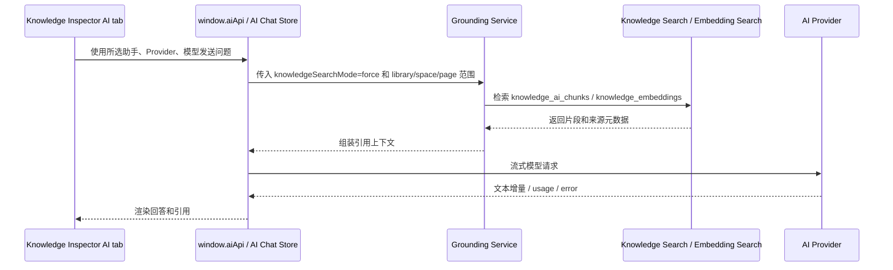

# 知识库 AI 集成设计

> 版本：0.2
> 日期：2026-06-09
> 文档状态：草案

## 1. 原则

- AI 默认关闭。
- AI 只能在用户明确触发后运行。
- AI 输出不能静默覆盖用户内容。
- 所有回答必须带来源引用。
- embedding 可删除、可重建。

## 2. 与现有 AI 模块关系

知识库不单独实现 Provider 管理。AI Provider、模型、Agent 配置沿用 `docs/desktop/AgentFunc/plans/ai-agent-requirements.md` 中的 Chat / Agent 模块。

最终设计中，知识库内 AI 问答复用现有 AI Chat 能力：

- Provider、模型、助手角色从 `features.aiAgent` 和 AI 页面配置读取。
- 模型调用、流式事件、引用、停止生成和错误处理复用 `window.aiApi` / main process AI 服务。
- 知识库只负责提供当前库、当前空间、当前页面或选区上下文，以及知识库检索结果。
- 不在知识库模块内新增一套 Provider、API Key、模型适配器或独立聊天协议。

知识库只提供：

- 上下文检索。
- 页面/块/附件分块。
- 引用来源。
- AI 操作入口。
- AI 操作结果落库。

## 3. 知识库内部问答

### 3.1 定位

知识库内部问答是 V1.3 的轻量入口，用于在不离开知识库页面的情况下完成基础问答：

- 针对当前页面提问。
- 针对当前空间提问。
- 针对选中片段提问。
- 针对搜索命中的资料追问。

它不是完整 AI 工作区。多轮复杂推理、Canvas 工作区、深度研究、Agent 工具调用、长报告生成和跨应用任务编排仍进入 AI 页面。

### 3.2 入口和交互

右侧 Inspector 的 AI tab 提供一个内嵌问答面板：

- 顶部显示当前发送范围：当前页面、当前空间、当前库或选区。
- 提供助手角色选择，默认使用 AI 设置中的默认助手；若助手绑定了 `knowledgeLibraryId` 或 `knowledgeSpaceId`，优先使用助手绑定范围。
- 提供 Provider / 模型选择，默认使用所选助手绑定的 Provider / 模型；未绑定时使用 AI Chat 默认 Provider / 模型。
- 输入框支持基础文本问题、停止生成、重新生成和复制回答。
- 回答下方显示引用来源卡片，可跳转到页面、块、附件或来源文档。
- 面板提供“在 AI 页面继续”动作，把当前问题、回答、引用和上下文范围带到 AI 页面中的同一会话或新会话。

### 3.3 调用流程

### 3.4 边界规则

- 基础问答默认停留在知识库内，不强制跳转 AI 页面。
- 需要复杂上下文配置、长任务、研究报告、Agent 工具或 Canvas 编辑时，知识库只提供跳转入口。
- 知识库内问答必须显示“发送范围”和“所选角色 / Provider / 模型”。
- 知识库来源不足时，回答必须明确说明来源不足；不得把无引用回答标记为可信知识库回答。
- AI 生成内容默认只展示为回答或建议，不自动写入页面正文。

## 4. 数据预留

### 4.1 `knowledge_ai_chunks`

保存 AI 可用的文本分块：

- 来源类型。
- 来源 ID。
- 分块序号。
- 文本内容。
- token 估算。
- metadata。

### 4.2 `knowledge_embeddings`

保存向量：

- chunk ID。
- provider。
- model。
- dimension。
- vector blob。

后续可迁移到 sqlite-vec 或 LanceDB。

## 5. 功能阶段

### 5.1 V1.3 轻量 AI

- 选中文本总结。
- 选中文本改写。
- 选中文本提取 Todo。
- 页面摘要。
- 标签建议。
- 找相似页面。
- 知识库内部问答：
  - 当前页面问答。
  - 当前空间问答。
  - 当前库问答。
  - 选区问答。
  - 使用选定助手角色、Provider 和模型。
  - 基础问答不跳转；复杂交互可带上下文跳转 AI 页面。

### 5.2 V2.0 Agent

- 收集箱整理建议。
- 重复页面合并建议。
- 空间目录生成。
- 从资料生成 Todo 计划。
- 批量打标签建议。

## 6. 操作安全

AI 修改知识库必须遵守：

- 展示计划。
- 展示 diff。
- 用户确认后写入。
- 支持撤销。
- 记录操作日志。

## 7. UI 入口

- 选区浮动工具条。
- 右侧 Inspector AI tab。
- 右侧 Inspector AI tab 内嵌基础问答面板。
- 搜索框语义搜索开关。
- 空间页 AI 操作菜单。
- “在 AI 页面继续”跳转入口。

V0.2 只保留数据表和 UI 占位，不接入模型调用。
