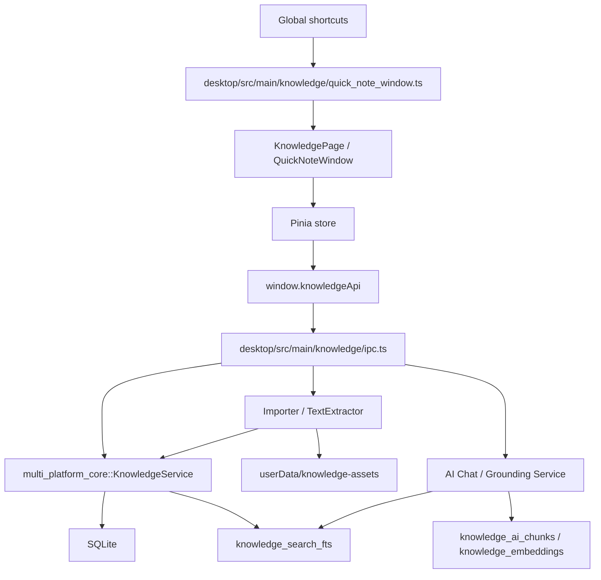

# 知识库架构设计

> 版本：0.1
> 日期：2026-05-27
> 文档状态：草案

## 1. 总体架构



## 2. 分层职责

### 2.1 Renderer

- 展示知识库入口、资料树、编辑区、Inspector 和搜索结果。
- 只调用 `window.knowledgeApi`。
- 不直接访问 Node、Electron、SQLite 或本地文件路径。

### 2.2 Preload

- 暴露 `knowledgeApi`。
- 保持 typed contract。
- 不做业务逻辑。

### 2.3 Main

- 注册 `knowledge:*` IPC。
- 调用 `JsDatabase` 的 NAPI 方法。
- 负责导入资产写入、基础文本抽取、应用内资产协议、快捷键注册和速记窗口生命周期。
- 知识库内部问答复用 AI Chat / Grounding Service；main process 负责把知识库范围转换为检索上下文，但不在知识库模块内新增 Provider 管理。

### 2.4 Rust Core

- 维护 SQLite migration。
- 定义知识库模型。
- 实现事务、查询、移动、归档、收藏和默认数据初始化。
- 暴露 NAPI 给 Electron main。
- 负责导入事务、hash 去重、索引任务、FTS 写入、搜索查询和 AI chunk 预切分。

## 3. 数据边界

### 3.1 SQLite

存储结构化数据：

- library
- space
- node
- page
- asset metadata
- tag
- link
- quick note
- index job
- AI chunk/embedding metadata

### 3.2 文件系统

存储大文件和缓存：

```text
userData/
└─ knowledge/
   ├─ assets/
   ├─ previews/
   ├─ thumbnails/
   └─ exports/
```

V0.2 不写入这些目录，只预留数据结构。

V0.4 起 Markdown 图片和附件写入：

```text
userData/
└─ knowledge-assets/
   └─ <library-id>/
      └─ <hash-prefix>/
```

渲染层不直接加载 `file://`，而是通过主进程注册的 `app://knowledge-assets/...` 受控协议读取。

V0.6 起“导入文件”和“编辑器附件”统一落到 `userData/knowledge-assets/<library-id>/<hash-prefix>/`。SQLite 保存资产绝对路径，renderer 只接触 asset id 和 `app://knowledge-assets/id/...`。

## 4. 默认数据

首次调用知识库 API 时，核心层创建：

- 默认知识库：`library-default`
- 默认空间：`space-default`
- 快速收集箱：`node-inbox`

这样 renderer 不需要先做初始化流程，也便于后续速记直接落入收集箱。

## 5. 事务策略

- 创建页面：同时创建 `knowledge_nodes` 和 `knowledge_pages`，必须在同一事务。
- 移动节点：校验父节点并更新 parent/space/sort，必须在同一事务。
- 更新页面：同时更新 node 标题和 page 内容，必须在同一事务。
- 创建速记：同时创建 `knowledge_nodes.node_type = quick_note` 和 `knowledge_quick_notes`，必须在同一事务。
- 速记转页面：创建 Markdown 页面、回写 `converted_page_id`、写入 `knowledge_links`，必须在同一事务。
- 导入文档：复用或创建 asset、创建 `document` 节点、创建 `external_document` 页面、写入索引任务、写入 FTS 和 AI chunk，必须在同一事务。
- 归档节点：更新 node 状态，后续版本再扩展递归归档。

## 6. 扩展点

- `page_type` 支持 Markdown、block、canvas、external_document。
- V0.8 块页面的 canonical 数据为 `knowledge_pages.content_json` 中的 `guyantools.block-page` v1；`content_text` 用于搜索，`content_markdown` 用于导出快照和兼容预览。
- V1.2 画布页面的 canonical 数据为 `knowledge_pages.content_json` 中的 `guyantools.canvas-page` v1；`content_text` 从画布元素文本、标题、附件名、页面引用和 Todo ID 派生，`content_markdown` 作为导出和搜索兼容快照。
- `node_type` 支持 folder、page、document、quick_note。
- `knowledge_index_jobs` 支持导入、抽取、预览、缩略图、FTS、embedding。
- `knowledge_search_fts` 是 V0.6 的全文搜索入口，搜索 API 同时保留 LIKE 兜底以支持中文连续文本。
- `knowledge_ai_chunks` 与 `knowledge_embeddings` 为 AI/RAG 预留。
- V1.3 知识库内部问答复用 AI Chat 的助手角色、Provider、模型、流式输出和引用事件；知识库只提供 library / space / page / selection 范围和检索来源。
- `knowledge_quick_notes` 保存 Sticky Notes/速记正文、颜色、标签、置顶和转换关系。
- V0.9 `knowledge_tags` / `knowledge_tag_bindings` 成为标签事实源，quick note 的 `tags_json` 仍用于便签轻量展示和向后兼容。
- V0.9 `knowledge_links` 承载 wikilink、来源、Todo 等关系；页面保存时同步 `[[页面名]]`，关系图和反链均从该表读取。
- V0.9 关系图不新增渲染引擎，core 返回节点/边 DTO，renderer 先以 Inspector 数据视图展示，后续可替换为 canvas/SVG 布局。
- V1.0 知识库稳定性配置进入 `AppConfig.features.knowledge`，renderer 不直接决定附件落盘目录、导入上限或索引策略。
- V1.0 `knowledge_index_jobs` 支持 UI 取消和重试；取消是状态写入，不强杀当前同步抽取线程。
- V1.0 预览缓存清理由 main process 负责，启动和缓存相关配置变化时按 `previewCacheTtlDays` 清理受控缓存目录，手动清理会删除全部受控缓存。
- V1.1 Markdown 写作增强只改 renderer 编辑器层：仍以 `content_markdown` 为唯一正文源，不新增数据库字段、IPC 或重型渲染依赖；Callout、数学和 Mermaid 当前走安全预览容器。
- V1.2 画布页面继续复用 `createPage` / `updatePage` / `saveAsset`，不新增 IPC；renderer 只保存结构化 SVG-like 元素模型，图片仍通过受控 `app://knowledge-assets` URL 加载。

## 7. 安全策略

- renderer 不拿真实文件句柄。
- 文档预览当前使用主窗口内受控 `app://knowledge-assets` 资产和抽取 metadata；后续高风险格式或高保真 Office/PDF 预览再升级为隔离窗口或受控 webview。
- HTML/Markdown 渲染需要 sanitize。
- 本地知识库资产必须经过 `app://knowledge-assets` 协议，并限制在 `userData/knowledge-assets` 下。
- 自定义附件目录只由 main process 根据配置使用；renderer 仍只接收受控 `app://knowledge-assets` URL 或 asset ID。
- 预览缓存清理仅删除 main process 管理的缓存目录；TTL 清理也只扫描受控缓存根，不递归删除知识库原始附件目录。
- 画布 PNG/SVG 导出仅在 renderer 内序列化当前 SVG 视图，不暴露本地文件路径写入能力。
- AI 请求必须显示发送范围和引用来源。
- 知识库内基础问答可以停留在 Inspector AI tab；深度研究、Agent 工具调用、Canvas 工作区和长上下文任务必须跳转 AI 页面继续。
