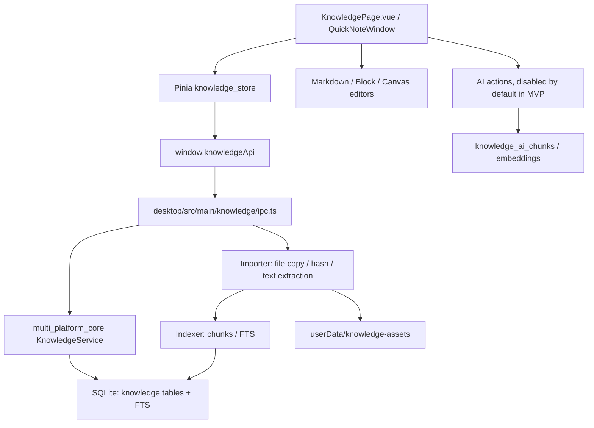

# 知识库桌面端开发文档

> 版本：0.1
> 日期：2026-05-26
> 文档状态：开发规划草案
> 适用范围：`desktop/`、`multi_platform_core/`、`docs/desktop/KnowledgeBase/`

---

## 1. 背景

GuYanTools 当前定位是跨平台工具型桌面应用，桌面端已经具备 Todo、FTP、终端、WebView、脚本编辑器、插件系统、通知、快捷键和本地 SQLite 核心能力。知识库功能不应被设计成孤立的笔记 App，而应成为整个工具集中的“本地资料中枢”：

- 接收多来源内容：本地文件、Markdown、PDF、Word、PPTX、Excel、网页、剪贴板、截图、速记、Todo。
- 承担资料组织能力：库、空间、文件夹、页面、附件、标签、反链、关系图。
- 承担轻量创作能力：Typora 级 Markdown 编辑器、OneNote-like 块笔记和画布笔记。
- 承担未来 AI 上下文层：全文检索、结构化分块、引用片段、embedding、空间问答和整理 Agent。

现有需求文档已经出现三个相关方向：

- `docs/requirement.md`：本地文档库/知识库。
- `docs/requirement.md`：速记功能，支持快捷键唤出、标签、转 Todo。
- `docs/desktop/AgentFunc/plans/ai-agent-requirements.md`：AI Chat / Agent、多 Provider、多模型、工具执行和设置页配置。

本开发文档用于把上述方向合并为一个可分阶段落地的桌面知识库计划。

---

## 2. 总目标

### 2.1 产品目标

1. 建立 GuYanTools 的本地知识库入口，支持用户把项目资料、文档、速记和任务上下文统一保存、搜索和整理。
2. 实现高质量 Markdown 创作体验，逐步达到 Typora 核心体验：Live Preview、源码模式、目录、Focus/Typewriter、图片粘贴、文件树和全局搜索。
3. 支持 OneNote-like 笔记格式：页面、子页面、块、附件、任务块、图片、截图标注，后续扩展自由画布。
4. 对齐 Windows Sticky Notes 的速记体验：快捷键唤出、多便签、搜索、轻格式、颜色、标签、归档、转页面/转 Todo。
5. 为 AI 能力预留数据结构和交互入口，但首版不强依赖 AI，不默认开启全库 embedding。

### 2.2 技术目标

1. 复用现有 Electron + Vue 3 + TypeScript + Pinia 架构。
2. 复用现有 Rust `multi_platform_core` + SQLite + NAPI 数据服务模式。
3. 所有 renderer 能力必须通过 typed contract + preload + main IPC 暴露，不允许 renderer 直接访问 Node、Electron 或数据库。
4. 所有文档导入、文本抽取、缩略图和索引任务必须后台化，避免阻塞主窗口。
5. 数据模型预留 AI 分块、embedding 和引用来源，避免后续 RAG 改造时重做核心表结构。

---

## 3. 非目标

首期不做以下内容：

- 不兼容或导入 Microsoft OneNote `.one` 私有格式。
- 不实现 Word、PPTX、Excel 的完整原格式编辑。
- 不默认打包 LibreOffice，也不默认启动外部服务型向量数据库。
- 不做多人协作、账号同步、云端冲突合并。
- 不做自动全库 AI 索引、后台持续总结或自主 Agent。
- 不把知识库插件权限提前开放给第三方插件写入核心数据。

---

## 4. 当前项目切入点

### 4.1 已有可复用基础

- 路由：`desktop/src/windows/main/routes/router.ts`
  - 已有 `/home`、`/todo`、`/terminal`、`/ftp`、`/webview`、`/script-editor`。
  - 可新增 `/knowledge`，并设置 `keepAlive: true`。
- 底部栏配置：`desktop/src/contracts/app_config.ts`
  - `AppBottomBarTabId` 和 `APP_INTERNAL_FUNCTIONS` 可新增 `knowledge`。
- Preload 和 IPC：
  - `desktop/src/preload.ts` 统一暴露 renderer API。
  - 新增 `knowledgeApi` 时应同步 typed contract、preload 和 main IPC。
- Rust 核心：
  - `multi_platform_core/src/db/migration.rs` 注册 SQL migration。
  - `multi_platform_core/src/models/` 定义数据模型。
  - `multi_platform_core/src/services/` 实现服务。
  - `multi_platform_core/src/bindings/napi.rs` 暴露 NAPI。
- Todo：
  - `multi_platform_core/migrations/006_add_todo.sql` 已有 Todo、steps、reminders。
  - `desktop/src/windows/main/pages/Todo/components/TodoDetail.vue` 已有 Markdown 备注渲染，可作为知识库备注/便签/Todo 联动参考。
- Markdown 能力：
  - `desktop/package.json` 已包含 `@codemirror/lang-markdown` 和 `marked`。
  - `desktop/src/windows/main/pages/Ftp/components/FtpCodeEditor.vue` 已有 CodeMirror 6 编辑器落地经验。
- AI 需求：
  - `docs/desktop/AgentFunc/plans/ai-agent-requirements.md` 已定义 Chat 与 Agent 的边界。

### 4.2 新增模块建议

```text
desktop/src/contracts/knowledge.ts
desktop/src/main/knowledge/ipc.ts
desktop/src/main/knowledge/importer.ts
desktop/src/main/knowledge/indexer.ts
desktop/src/main/knowledge/preview.ts
desktop/src/windows/main/pages/Knowledge/KnowledgePage.vue
desktop/src/windows/main/pages/Knowledge/components/
desktop/src/windows/main/pages/Knowledge/stores/knowledge_store.ts
desktop/src/windows/quick-note/
multi_platform_core/migrations/021_add_knowledge.sql
multi_platform_core/src/models/knowledge.rs
multi_platform_core/src/services/knowledge_service.rs
```

### 4.3 前端 UI 开发指导

- 知识库页面必须优先复用 `desktop/src/windows/main/components/ui/` 下的通用组件，例如 `UiDialog`、`UiButton`、`UiInput`、`UiField`、`UiIconButton`、`UiTabs`、`UiMenu` 和 `IconRenderer`。
- 如果某个交互不是知识库私有能力，并且未来可能被 Todo、终端、FTP、设置页等页面复用，应先沉淀为通用组件或通用 composable，再在知识库中消费；例如文本输入确认应使用全局 `TextPromptDialog`，不得直接使用浏览器 `prompt()`。
- 新增页面样式必须使用应用主题变量，优先使用 `--ui-*`、`--primary-color`、`--background-color`、`--ui-text-*`、`--ui-surface-*`、`--ui-border-*`、`--ui-button-*`、`--ui-input-*`。不要在页面内硬编码深色/浅色主题，也不要新增孤立的 `--color-*` 体系；如确需兼容编辑器子组件，只能在页面根节点把 `--color-*` 映射到现有主题变量。
- 页面根容器必须继承主窗口路由区域高度，使用 `height: 100%`、`min-height: 0`、`overflow: hidden` 等约束，滚动只放在明确的内容区，避免出现页面未占满全局或双滚动条。
- 弹窗、下拉、菜单、日期选择器等浮层遵循项目既有规则：优先复用通用组件；需要页面内新增时，应使用 `Teleport to="body"`、固定定位、边缘翻转、点击外部关闭和足够高的 `z-index`。

---

## 5. 产品信息架构

推荐层级：

```text
Library 知识库
└─ Space 空间
   └─ Folder 文件夹
      └─ Page / Document 页面或文档
         ├─ Block 内容块
         └─ Attachment 附件
```

横向视图：

- 快速收集箱：所有未整理便签、截图、剪贴板内容和临时导入文件。
- 最近编辑：按今天、本周、更早分组。
- 收藏：用户主动置顶的页面、文件或空间。
- 标签：跨文件夹分类，不替代树结构。
- 全文搜索：当前页、当前空间、当前库、全库。
- 反链：当前页面被哪些页面、Todo、附件或便签引用。
- 关系图：空间级或库级可视化，不作为首屏核心入口。

### 5.1 主界面布局

```text
┌──────────────────────────────────────────────────────────────┐
│ 顶部栏：知识库切换 | 全局搜索 | 新建页面 | 导入 | 速记        │
├───────────────┬───────────────────────────────┬──────────────┤
│ 左侧栏        │ 中间编辑/阅读区                │ 右侧 Inspector│
│ - 收集箱      │ - 页面标题                     │ - 目录        │
│ - 最近编辑    │ - 属性条                       │ - 反链        │
│ - 收藏        │ - Markdown / 块 / 文档预览      │ - 附件        │
│ - 库树        │ - 评论式引用/摘录               │ - Todo        │
│ - 标签入口    │                                │ - AI 入口     │
└───────────────┴───────────────────────────────┴──────────────┘
```

### 5.2 速记浮窗

```text
┌────────────────────────────┐
│ 速记                       │
├────────────────────────────┤
│ 输入区：Markdown 轻格式     │
│ 标签：#未整理 #灵感         │
│ 来源：当前应用/剪贴板/截图  │
├────────────────────────────┤
│ 保存 | 转 Todo | 转页面 | 截图│
└────────────────────────────┘
```

### 5.3 OneNote-like 页面

首版不把所有页面都做成自由画布。推荐拆成三类：

- Markdown 页面：以 Markdown 原文为 canonical。
- 块页面：以 ProseMirror/Tiptap JSON 为 canonical。
- 画布页面：以 Excalidraw-like JSON 为 canonical，二期或后续上线。

---

## 6. 总体架构



### 6.1 分层职责

#### Renderer

- 展示页面树、编辑器、搜索结果、预览、右侧 Inspector。
- 只调用 `window.knowledgeApi`。
- 不直接读写本地文件、SQLite 或 Node API。

#### Preload

- 暴露白名单 API。
- 只做轻量参数转发和类型约束。

#### Main

- 处理 IPC。
- 调度导入、预览、索引、缩略图、快捷键、速记窗口。
- 管理后台 job 状态和错误。

#### Rust Core

- 持久化知识库核心数据。
- 处理事务一致性、查询、搜索、树结构移动、标签绑定、反链。
- 暴露 NAPI 方法给主进程。

#### 文件系统

- 原始附件和预览缓存放在 `app.getPath('userData')/knowledge/`。
- SQLite 保存相对路径、hash、mime、原始路径、导入状态和引用关系。

---

## 7. 数据模型设计

### 7.1 核心表

#### `knowledge_libraries`

用途：知识库顶层边界。

| 字段 | 类型 | 说明 |
| --- | --- | --- |
| `id` | TEXT PK | UUID |
| `name` | TEXT | 知识库名称 |
| `description` | TEXT | 描述 |
| `is_default` | INTEGER | 是否默认库 |
| `created_at` | TEXT | 创建时间 |
| `updated_at` | TEXT | 更新时间 |

#### `knowledge_spaces`

用途：项目或主题空间。

| 字段 | 类型 | 说明 |
| --- | --- | --- |
| `id` | TEXT PK | UUID |
| `library_id` | TEXT FK | 所属知识库 |
| `name` | TEXT | 空间名称 |
| `description` | TEXT | 描述 |
| `icon` | TEXT | 图标 |
| `color` | TEXT | 颜色 |
| `sort_order` | INTEGER | 排序 |
| `created_at` | TEXT | 创建时间 |
| `updated_at` | TEXT | 更新时间 |

#### `knowledge_nodes`

用途：统一树节点，承载文件夹、页面、外部文档和收集箱项。

| 字段 | 类型 | 说明 |
| --- | --- | --- |
| `id` | TEXT PK | UUID |
| `library_id` | TEXT FK | 所属库 |
| `space_id` | TEXT FK | 所属空间，可为空 |
| `parent_id` | TEXT FK | 父节点，可为空 |
| `node_type` | TEXT | `folder`、`page`、`document`、`quick_note` |
| `title` | TEXT | 标题 |
| `icon` | TEXT | 图标 |
| `sort_order` | INTEGER | 同级排序 |
| `is_archived` | INTEGER | 是否归档 |
| `is_favorite` | INTEGER | 是否收藏 |
| `created_at` | TEXT | 创建时间 |
| `updated_at` | TEXT | 更新时间 |
| `deleted_at` | TEXT | 软删除时间 |

#### `knowledge_pages`

用途：页面正文元数据。

| 字段 | 类型 | 说明 |
| --- | --- | --- |
| `id` | TEXT PK | 与 `knowledge_nodes.id` 对齐 |
| `page_type` | TEXT | `markdown`、`block`、`canvas`、`external_document` |
| `content_markdown` | TEXT | Markdown canonical 内容 |
| `content_json` | TEXT | block/canvas JSON |
| `content_text` | TEXT | 纯文本索引内容 |
| `properties_json` | TEXT | 页面属性 |
| `source_asset_id` | TEXT | 外部文档来源附件 |
| `created_at` | TEXT | 创建时间 |
| `updated_at` | TEXT | 更新时间 |

#### `knowledge_blocks`

用途：块级索引、引用和 AI 分块基础。Markdown 页面也可按标题/段落生成虚拟块记录。

| 字段 | 类型 | 说明 |
| --- | --- | --- |
| `id` | TEXT PK | UUID |
| `page_id` | TEXT FK | 所属页面 |
| `block_type` | TEXT | `paragraph`、`heading`、`code`、`todo`、`image`、`attachment`、`quote` |
| `block_key` | TEXT | 文档内稳定 ID |
| `content_text` | TEXT | 块纯文本 |
| `content_json` | TEXT | 块结构 |
| `sort_order` | INTEGER | 块顺序 |
| `created_at` | TEXT | 创建时间 |
| `updated_at` | TEXT | 更新时间 |

#### `knowledge_assets`

用途：附件、原始文档、图片、截图、预览文件。

| 字段 | 类型 | 说明 |
| --- | --- | --- |
| `id` | TEXT PK | UUID |
| `library_id` | TEXT FK | 所属库 |
| `hash` | TEXT | 内容 hash，用于去重 |
| `original_name` | TEXT | 原文件名 |
| `mime_type` | TEXT | MIME |
| `extension` | TEXT | 扩展名 |
| `size_bytes` | INTEGER | 文件大小 |
| `storage_path` | TEXT | userData 下相对路径 |
| `original_path` | TEXT | 原始路径，可为空 |
| `preview_path` | TEXT | PDF/图片预览缓存 |
| `thumbnail_path` | TEXT | 缩略图 |
| `extracted_text` | TEXT | 抽取文本 |
| `metadata_json` | TEXT | 页数、sheet 数、作者等 |
| `import_status` | TEXT | `pending`、`ready`、`failed` |
| `created_at` | TEXT | 创建时间 |
| `updated_at` | TEXT | 更新时间 |

#### `knowledge_links`

用途：页面、块、附件、Todo、外链之间的引用关系。

| 字段 | 类型 | 说明 |
| --- | --- | --- |
| `id` | TEXT PK | UUID |
| `source_type` | TEXT | `page`、`block`、`asset`、`todo` |
| `source_id` | TEXT | 来源 ID |
| `target_type` | TEXT | `page`、`block`、`asset`、`todo`、`url` |
| `target_id` | TEXT | 目标 ID，可为空 |
| `target_url` | TEXT | 外链 |
| `link_type` | TEXT | `wiki`、`embed`、`reference`、`source`、`todo` |
| `created_at` | TEXT | 创建时间 |

#### `knowledge_tags`

用途：标签字典。

| 字段 | 类型 | 说明 |
| --- | --- | --- |
| `id` | TEXT PK | UUID |
| `library_id` | TEXT FK | 所属库 |
| `name` | TEXT | 标签名 |
| `color` | TEXT | 标签色 |
| `created_at` | TEXT | 创建时间 |

#### `knowledge_tag_bindings`

用途：标签绑定。

| 字段 | 类型 | 说明 |
| --- | --- | --- |
| `id` | TEXT PK | UUID |
| `tag_id` | TEXT FK | 标签 |
| `target_type` | TEXT | `page`、`asset`、`quick_note`、`todo` |
| `target_id` | TEXT | 目标 ID |
| `created_at` | TEXT | 创建时间 |

### 7.2 搜索和 AI 预留表

#### `knowledge_index_jobs`

用途：后台导入、抽取、预览、索引任务。

| 字段 | 类型 | 说明 |
| --- | --- | --- |
| `id` | TEXT PK | UUID |
| `job_type` | TEXT | `import`、`extract_text`、`preview`、`thumbnail`、`fts`、`embedding` |
| `target_type` | TEXT | `page`、`asset`、`library` |
| `target_id` | TEXT | 目标 ID |
| `status` | TEXT | `pending`、`running`、`succeeded`、`failed`、`cancelled` |
| `progress` | REAL | 0-1 |
| `error_message` | TEXT | 错误信息 |
| `created_at` | TEXT | 创建时间 |
| `updated_at` | TEXT | 更新时间 |

#### `knowledge_search_fts`

用途：SQLite FTS5 虚拟表。

建议索引字段：

- `target_type`
- `target_id`
- `title`
- `body`
- `tags`
- `space_name`

首版先做基础全文检索。中文分词、字段权重、复杂 query 和搜索高亮可逐步增强。

#### `knowledge_ai_chunks`

用途：AI 分块，不等于编辑器块。

| 字段 | 类型 | 说明 |
| --- | --- | --- |
| `id` | TEXT PK | UUID |
| `source_type` | TEXT | `page`、`block`、`asset` |
| `source_id` | TEXT | 来源 ID |
| `chunk_index` | INTEGER | 分块序号 |
| `content_text` | TEXT | 分块文本 |
| `token_count` | INTEGER | token 估算 |
| `metadata_json` | TEXT | 标题路径、页码、sheet、slide 等 |
| `created_at` | TEXT | 创建时间 |

#### `knowledge_embeddings`

用途：向量索引预留。

| 字段 | 类型 | 说明 |
| --- | --- | --- |
| `id` | TEXT PK | UUID |
| `chunk_id` | TEXT FK | 分块 ID |
| `provider` | TEXT | OpenAI、Ollama、自定义等 |
| `model` | TEXT | embedding 模型 |
| `dimension` | INTEGER | 向量维度 |
| `vector_blob` | BLOB | 原始向量，可后续迁移到 sqlite-vec/LanceDB |
| `created_at` | TEXT | 创建时间 |

### 7.3 索引建议

首期 migration 至少增加：

- `idx_knowledge_nodes_parent`
- `idx_knowledge_nodes_space`
- `idx_knowledge_nodes_updated`
- `idx_knowledge_assets_hash`
- `idx_knowledge_links_source`
- `idx_knowledge_links_target`
- `idx_knowledge_tag_bindings_target`
- `idx_knowledge_index_jobs_status`

---

## 8. API 与 IPC 设计

### 8.1 Contract 文件

新增：`desktop/src/contracts/knowledge.ts`

建议类型：

```ts
export type KnowledgeNodeType = 'folder' | 'page' | 'document' | 'quick_note';
export type KnowledgePageType = 'markdown' | 'block' | 'canvas' | 'external_document';
export type KnowledgeJobStatus = 'pending' | 'running' | 'succeeded' | 'failed' | 'cancelled';

export interface KnowledgeApi {
  listLibraries(): Promise<KnowledgeLibrary[]>;
  createLibrary(input: CreateKnowledgeLibraryInput): Promise<KnowledgeLibrary>;
  listSpaces(libraryId: string): Promise<KnowledgeSpace[]>;
  createSpace(input: CreateKnowledgeSpaceInput): Promise<KnowledgeSpace>;
  listTree(input: ListKnowledgeTreeInput): Promise<KnowledgeNode[]>;
  createFolder(input: CreateKnowledgeFolderInput): Promise<KnowledgeNode>;
  createPage(input: CreateKnowledgePageInput): Promise<KnowledgePageDetail>;
  getPage(pageId: string): Promise<KnowledgePageDetail>;
  updatePage(input: UpdateKnowledgePageInput): Promise<KnowledgePageDetail>;
  moveNode(input: MoveKnowledgeNodeInput): Promise<KnowledgeNode>;
  archiveNode(nodeId: string): Promise<void>;
  toggleFavorite(nodeId: string, favorite: boolean): Promise<KnowledgeNode>;
  saveAsset(input: SaveKnowledgeAssetPayload): Promise<KnowledgeAsset>;
  getAsset(assetId: string): Promise<KnowledgeAsset>;
  openAsset(assetId: string): Promise<void>;
  importFiles(input?: ImportKnowledgeFilesPayload): Promise<ImportKnowledgeFilesResult>;
  listIndexJobs(input?: ListKnowledgeIndexJobsPayload): Promise<KnowledgeIndexJob[]>;
  search(input: KnowledgeSearchPayload): Promise<KnowledgeSearchResult[]>;
  listQuickNotes(input?: ListKnowledgeQuickNotesPayload): Promise<KnowledgeQuickNoteDetail[]>;
  createQuickNote(input: CreateKnowledgeQuickNotePayload): Promise<KnowledgeQuickNoteDetail>;
  updateQuickNote(noteId: string, input: UpdateKnowledgeQuickNotePayload): Promise<KnowledgeQuickNoteDetail>;
  archiveQuickNote(noteId: string): Promise<void>;
  convertQuickNoteToPage(noteId: string, input?: ConvertKnowledgeQuickNoteToPagePayload): Promise<KnowledgePageDetail>;
  linkQuickNoteTodo(noteId: string, todoId: string): Promise<KnowledgeQuickNoteDetail>;
}
```

### 8.2 IPC 通道命名

统一使用 `knowledge:*`：

- `knowledge:list-libraries`
- `knowledge:create-library`
- `knowledge:list-spaces`
- `knowledge:create-space`
- `knowledge:list-tree`
- `knowledge:create-folder`
- `knowledge:create-page`
- `knowledge:get-page`
- `knowledge:update-page`
- `knowledge:move-node`
- `knowledge:archive-node`
- `knowledge:toggle-favorite`
- `knowledge:save-asset`
- `knowledge:get-asset`
- `knowledge:open-asset`
- `knowledge:search`
- `knowledge:import-files`
- `knowledge:list-index-jobs`
- `knowledge:create-quick-note`
- `knowledge:list-quick-notes`
- `knowledge:update-quick-note`
- `knowledge:archive-quick-note`
- `knowledge:convert-quick-note-to-page`
- `knowledge:link-quick-note-todo`

### 8.3 Rust NAPI 方法

在 `multi_platform_core/src/bindings/napi.rs` 的 `JsDatabase` 上新增：

- `create_knowledge_library`
- `list_knowledge_libraries`
- `create_knowledge_space`
- `list_knowledge_spaces`
- `create_knowledge_node`
- `list_knowledge_tree`
- `create_knowledge_page`
- `get_knowledge_page`
- `update_knowledge_page`
- `move_knowledge_node`
- `search_knowledge`
- `create_knowledge_asset`
- `upsert_knowledge_fts`
- `create_knowledge_index_job`
- `update_knowledge_index_job`
- `import_knowledge_document`
- `list_knowledge_index_jobs`
- `search_knowledge`
- `list_knowledge_quick_notes`
- `create_knowledge_quick_note`
- `update_knowledge_quick_note`
- `archive_knowledge_quick_note`
- `convert_knowledge_quick_note_to_page`
- `link_knowledge_quick_note_todo`

阻塞型数据库操作继续放入 `tokio::task::spawn_blocking`。

---

## 9. 文件导入与格式支持

### 9.1 格式分级

| 格式 | 首版能力 | 后续能力 | 编辑策略 |
| --- | --- | --- | --- |
| `.md` / `.markdown` | 读取、编辑、索引、预览 | 双链、frontmatter、导出 | 原文可编辑 |
| `.pdf` | 预览、文本抽取、索引 | 摘录、高亮、OCR | 不编辑原文件 |
| `.docx` | 导入、文本抽取、预览 | 摘录、转 Markdown | 不编辑原文件 |
| `.pptx` | 导入、文本抽取、预览 | 按 slide 摘录 | 不编辑原文件 |
| `.xlsx` | 导入、sheet 文本抽取、文档详情 | 单元格引用、表格预览、`.xls` 兼容 | 不编辑原文件 |
| 图片 | 附件、预览、插入页面 | OCR、标注 | 作为附件编辑元数据 |
| 网页 | 保存 URL、标题、摘录 | 网页快照、阅读模式 | 存 HTML/Markdown 快照 |
| 代码片段 | Markdown code block | 语法高亮、复制 | 页面内编辑 |

### 9.2 导入流程

```text
用户选择文件
  -> main 计算 hash
  -> 复制到 userData/knowledge-assets
  -> 写入 knowledge_assets
  -> 创建 document node
  -> 抽取文本
  -> 写入 extracted_text/content_text
  -> 创建 index job
  -> 更新 FTS
```

V0.6 当前实现不生成预览和缩略图；这些能力进入 V0.7。

### 9.3 Office/PDF 策略

推荐：

- V0.6：不新增依赖，采用 main process best-effort 抽取。Markdown/文本直读；DOCX/PPTX/XLSX 读取 OpenXML ZIP XML；PDF 尝试解析文本操作符；图片仅入库和按文件名搜索。
- V0.7+：PDF.js 用于 PDF 阅读和文本层摘录；DOCX 可引入 Mammoth；Office 高保真预览优先检测 LibreOffice headless 转 PDF。

注意：

- 不可信 HTML 必须 sanitize。
- Office 宏不执行。
- 外链资源默认不加载或需要用户确认。
- 预览在隔离窗口或受控 webview 中展示，不启用 Node。

---

## 10. Markdown 编辑器规划

### 10.1 技术路线

首选：

- CodeMirror 6 作为 Markdown 主编辑器。
- Markdown 原文作为 canonical 存储。
- `marked` 或后续 markdown-it/remark 用于预览渲染。
- 后续用 decorations/widgets 增强 Typora-like Live Preview。

暂缓：

- 不用 Tiptap 作为 Markdown 页面唯一编辑核心。
- 不让富文本 JSON 替代 Markdown 原文。

### 10.2 MVP 能力

- Markdown 源码编辑。
- 右侧预览或上下分屏预览。
- 标题目录。
- 图片粘贴保存为知识库附件。
- 拖拽文件插入附件链接。
- GFM 表格、任务列表、代码块、引用、分割线。
- 保存状态、未保存提示、自动保存。
- 页面内搜索。
- 字数统计。

### 10.3 Typora-like 增强

- Live Preview：非焦点块渲染为阅读态，焦点块保留可编辑源码。
- Focus Mode：弱化非当前段落。
- Typewriter Mode：当前行保持垂直居中附近。
- Outline：标题目录跟随滚动，支持折叠。
- Source Mode：完整源码模式，一键切换。
- Theme：跟随 GuYanTools 主题变量。
- Code block：语言选择、复制、折叠。
- Table：可视化插入和简单编辑。
- Math：行内和块级数学公式。
- Callout：兼容 Obsidian 风格 `> [!NOTE]`。
- Frontmatter：属性面板和 YAML 双向同步。

---

## 11. Sticky Notes / 速记功能规划

### 11.1 目标

对齐 Windows Sticky Notes 的核心心智：

- 快速唤出。
- 快速记录。
- 可搜索。
- 可轻量格式化。
- 可保留颜色和状态。
- 可从列表恢复。

GuYanTools 需要在此基础上增加：

- 转知识库页面。
- 转 Todo。
- 转页面块。
- 关联来源应用、剪贴板、截图。

### 11.2 功能清单

- 全局快捷键打开速记窗口。
- 默认保存到 `快速收集箱`。
- 支持标题自动生成。
- 支持颜色：黄、蓝、绿、粉、灰。
- 支持标签。
- 支持 Markdown 轻格式：加粗、列表、任务 checkbox、链接、代码。
- 支持截图粘贴和图片粘贴。
- 支持便签列表、搜索、归档、删除。
- 支持置顶小窗，用户手动开启。
- 支持转 Todo：
  - 标题 -> Todo 标题。
  - checkbox -> Todo steps。
  - 日期文本后续可解析为 due date。
  - 标签可映射到 Todo 列表或标签。
- 支持转页面：
  - 便签内容 -> Markdown 页面。
  - 图片 -> 页面附件。
  - 原便签保留 `source` link。

### 11.3 快捷键配置

建议新增系统快捷键配置：

- `shortcuts.system.toggleQuickNote`：显示/隐藏速记窗口，默认 `CommandOrControl+Alt+N`。
- `shortcuts.system.captureClipboardToQuickNote`：把剪贴板内容带入速记窗口，默认 `CommandOrControl+Alt+Shift+N`。
- 截图转速记保留为后续能力，不纳入 V0.5 交付范围。

---

## 12. OneNote-like 笔记格式规划

### 12.1 设计原则

OneNote-like 不等于兼容 OneNote 文件格式。GuYanTools 应实现类似创作体验：

- Notebook / Section / Page 心智映射为 Library / Space / Page。
- 页面支持子页面。
- 页面内支持文本、图片、文件、链接、任务、代码、表格。
- 后续支持自由画布和截图标注。

### 12.2 页面类型

#### Markdown Page

适合写作、文档、技术笔记、README、脚本说明。

存储：

- `knowledge_pages.content_markdown`
- `knowledge_pages.content_text`

#### Block Page

适合 OneNote-like 笔记、资料整理、任务拆分、AI 生成结构化内容。

存储：

- `knowledge_pages.content_json`
- `knowledge_blocks`
- `knowledge_pages.content_text`

可选技术：

- Tiptap / ProseMirror JSON。

#### Canvas Page

适合白板、流程图、截图拼贴、自由布局。

存储：

- `knowledge_pages.content_json`
- 图片资源在 `knowledge_assets`

可选技术：

- Excalidraw-like scene JSON。

### 12.3 `.gynote` 便携格式

建议后续支持导入/导出 `.gynote`：

```text
example.gynote
├─ manifest.json
├─ content.json
├─ content.md
├─ assets/
│  ├─ image-001.png
│  └─ document-001.pdf
├─ preview/
│  └─ page.pdf
└─ index_text.txt
```

用途：

- 跨设备迁移。
- 用户备份。
- 插件读取。
- AI 离线处理。

---

## 13. 搜索与索引规划

### 13.1 首版搜索

基于 SQLite FTS5：

- 页面标题。
- Markdown 正文。
- 导入文档正文。
- 附件抽取文本。
- 标签。
- 速记标题、正文和标签。

搜索结果必须显示：

- 标题。
- 范围：全库或当前空间。
- 命中片段。
- 命中类型：页面、导入文档、附件、速记。
- 最近更新时间。

### 13.2 后续增强

- 搜索过滤：类型、空间、标签、时间、收藏。
- 高亮命中。
- 保存搜索。
- 中文分词增强。
- 字段权重。
- 语义搜索开关。

### 13.3 AI/RAG 预留

AI 不直接读取全库原始内容，而是通过：

- `knowledge_ai_chunks`
- `knowledge_embeddings`
- `knowledge_links`
- search result snippets

所有 AI 回答都必须能回溯到页面、块、附件页码或 slide/sheet metadata。

---

## 14. AI 功能规划

### 14.1 首版只预留

首版只做 UI 占位和数据结构预留：

- 右侧 Inspector 增加 AI tab，占位显示“配置 AI 后可用”。
- search input 预留语义搜索切换，但默认禁用。
- 数据库预留 chunks/embeddings。
- 不自动调用模型。

### 14.2 轻量 AI 动作

后续按以下顺序增加：

1. 选中文本：总结、改写、提取 Todo、提取标签。
2. 页面级：生成摘要、提取问题、生成目录、找相似页面。
3. 空间级：当前空间问答。
4. 整理类：把收集箱归档到空间、找重复页面、生成任务计划。

### 14.3 Agent 边界

知识库 Agent 必须满足：

- 用户明确触发。
- 展示将要修改的页面和 Todo。
- 修改前可预览 diff。
- 支持撤销。
- 工具权限受控。

---

## 15. 版本开发计划

以下版本按“可交付增量”划分，不等同于最终产品版本号。每个版本都应能独立验证并可合并。

---

### V0.1：需求冻结与架构骨架

#### 目标

把知识库从概念变成可实施模块，完成文档、目录、路由和空状态骨架。

#### 具体任务

- 新增 `docs/desktop/KnowledgeBase/development-plan.md`。
- 明确知识库信息架构：库、空间、文件夹、页面、附件、标签、反链。
- 明确首版非目标：不做 OneNote `.one`、不做 Office 编辑、不默认 AI。
- 新增 `/knowledge` 路由。
- 新增底部栏 `knowledge` tab。
- 新增 `KnowledgePage.vue` 空页面。
- 新增知识库页面基础布局：
  - 顶部工具栏。
  - 左侧树区域。
  - 中间空状态。
  - 右侧 Inspector 占位。

#### 涉及文件

- `desktop/src/contracts/app_config.ts`
- `desktop/src/windows/main/routes/router.ts`
- `desktop/src/windows/main/pages/Knowledge/KnowledgePage.vue`

#### 验收标准

- 应用底部栏可看到“知识库”入口。
- 点击后进入 `/knowledge`。
- 页面有稳定三栏布局，不影响其他路由。
- 刷新和路由切换不报错。

#### 建议验证

- `pnpm --dir desktop run build:renderer`
- 手动启动桌面端检查路由和底部栏。

---

### V0.2：数据库模型与 typed API

#### 目标

建立知识库核心数据模型和跨进程 API，先不做复杂 UI。

#### 具体任务

- 新增 migration：`021_add_knowledge.sql`。
- 新增 Rust model：`knowledge.rs`。
- 新增 Rust service：`knowledge_service.rs`。
- 在 `models/mod.rs` 和 `services/mod.rs` 注册。
- 在 `db/migration.rs` 注册 migration。
- 在 `bindings/napi.rs` 暴露基础方法。
- 新增 `desktop/src/contracts/knowledge.ts`。
- 新增 `desktop/src/main/knowledge/ipc.ts`。
- 在 `desktop/src/preload.ts` 暴露 `knowledgeApi`。
- 在 `desktop/src/main/index.ts` 注册 IPC。

#### 首批 API

- `listLibraries`
- `createLibrary`
- `listSpaces`
- `createSpace`
- `listTree`
- `createFolder`
- `createPage`
- `getPage`
- `updatePage`
- `moveNode`
- `archiveNode`
- `toggleFavorite`

#### 数据能力

- 自动创建默认知识库。
- 自动创建默认空间或收集箱。
- 支持文件夹树。
- 支持 Markdown 页面创建和更新。
- 支持节点移动。
- 支持软删除或归档。

#### 验收标准

- migration 可在新库和旧库上执行。
- Rust 单元测试覆盖创建库、空间、文件夹、页面、移动节点。
- NAPI 方法可从 Electron main 调用。
- renderer 可通过 `knowledgeApi` 获取默认库和树。

#### 建议验证

- `cargo test --manifest-path multi_platform_core/Cargo.toml knowledge`
- `pnpm run native:build:debug`
- `pnpm --dir desktop run build:app`

---

### V0.3：知识库基础 UI 和树操作

#### 目标

让用户可以创建空间、文件夹、Markdown 页面，并在左侧树中浏览。

#### 具体任务

- 实现 Pinia store：`knowledge_store.ts`。
- 实现左侧库树：
  - 快速收集箱。
  - 最近编辑。
  - 收藏。
  - 空间列表。
  - 文件夹/页面树。
- 实现新建菜单：
  - 新建空间。
  - 新建文件夹。
  - 新建 Markdown 页面。
- 实现基础右键菜单：
  - 重命名。
  - 移动。
  - 收藏。
  - 归档。
  - 删除。
- 实现中间区页面标题编辑。
- 实现右侧 Inspector 占位：
  - 目录。
  - 标签。
  - 反链。
  - 附件。
  - Todo。
  - AI。

#### 验收标准

- 新建页面后立即出现在树中。
- 重命名、移动、收藏、归档后 UI 和数据库一致。
- 最近编辑按更新时间更新。
- 空页面、加载中、错误状态完整。
- 不影响 Todo、FTP、Terminal 等 keepAlive 页面。

#### 建议验证

- `pnpm --dir desktop run lint`
- `pnpm --dir desktop run build:renderer`
- 手动执行树操作回归。

---

### V0.4：Markdown MVP 编辑器

#### 目标

完成可用的 Markdown 页面编辑、保存和预览。

#### 具体任务

- 基于 CodeMirror 6 实现 `KnowledgeMarkdownEditor.vue`。
- 支持 Markdown 语法高亮。
- 支持自动保存和手动保存。
- 支持未保存状态提示。
- 支持分屏预览。
- 支持标题目录生成。
- 支持页面内搜索。
- 支持字数统计。
- 支持基础快捷键：
  - `Ctrl+S` 保存。
  - `Ctrl+B` 加粗。
  - `Ctrl+I` 斜体。
  - `Ctrl+K` 插入链接。
- 支持图片粘贴：
  - 保存到 `knowledge_assets`。
  - 插入 Markdown 图片引用。
- 支持拖拽文件插入附件链接。

#### Markdown 支持范围

- 标题。
- 段落。
- 加粗/斜体/删除线。
- 有序/无序列表。
- 任务列表。
- blockquote。
- code block。
- inline code。
- 表格。
- 图片。
- 链接。

#### 验收标准

- Markdown 内容以原文保存。
- 切换页面不会丢内容。
- 大约 1 万字文档编辑不卡顿。
- 粘贴图片后附件可打开，Markdown 引用有效。
- 预览不执行不可信脚本。

#### 建议验证

- 编辑器组件单元测试。
- 手动测试长文档、图片粘贴、保存/恢复。
- `pnpm --dir desktop run build:renderer`

---

### V0.5：Sticky Notes / 速记 MVP

#### 目标

实现快捷键唤出的速记窗口，并与知识库收集箱、Todo 建立联动。

#### 具体任务

- 新增 `desktop/src/windows/quick-note/` 窗口入口。
- 新增快捷键配置：
  - `shortcuts.system.toggleQuickNote`
  - `shortcuts.system.captureClipboardToQuickNote`
- 新增 `knowledge_quick_notes` 或复用 `knowledge_nodes.node_type = quick_note`。
- 实现速记小窗：
  - 输入正文。
  - 标签。
  - 颜色。
  - 保存。
  - 置顶。
  - 转 Todo。
  - 转知识库页面。
- 实现知识库收集箱列表。
- 实现便签搜索。
- 实现便签归档。
- 实现便签与 Todo 互链：
  - 转 Todo 后保存来源 link。
  - Todo 详情可显示来源页面或便签。

#### 对齐 Sticky Notes 的能力

- 快速创建。
- 便签列表。
- 搜索。
- 颜色。
- 轻格式。
- 键盘可操作。

#### 验收标准

- 快捷键能打开速记窗口。
- 保存后可在知识库收集箱看到。
- 便签可转 Markdown 页面。
- 便签可转 Todo。
- 删除和归档不会误删已转换页面或 Todo。

#### 建议验证

- 手动验证快捷键注册、窗口生命周期。
- 手动验证便签转 Todo、转页面。
- `pnpm --dir desktop run build:app`

#### 当前实现对齐

- 新增 `desktop/src/windows/quick-note/` 独立窗口入口和 `desktop/quick_note.html`。
- 新增 `desktop/src/main/knowledge/quick_note_window.ts` 管理速记窗口生命周期、置顶、收起、剪贴板捕获。
- 新增 `shortcuts.system.toggleQuickNote` 和 `shortcuts.system.captureClipboardToQuickNote`，并在设置页快捷键区域可配置。
- 新增 `knowledge_quick_notes` 表，速记同时保留 `knowledge_nodes.node_type = quick_note`，默认落入快速收集箱。
- 新增速记 CRUD/搜索/归档/转页面/Todo 关联 API。
- 知识库侧边栏快速收集箱显示速记列表，支持搜索、查看、归档、转页面和转 Todo。
- V0.5 Todo 反链以 Todo 备注来源信息和 `knowledge_links` 关系为 MVP，不在 Todo 详情页增加独立来源组件。

---

### V0.6：导入、全文索引和搜索

#### 目标

让知识库可以导入多格式文件，并进行基础全文搜索。

#### 具体任务

- 实现文件导入 IPC：
  - 选择文件。
  - 计算 hash。
  - 复制到 userData assets。
  - 创建 asset。
  - 创建 document node。
- 实现 index job schema 和查询：
  - `pending`
  - `running`
  - `succeeded`
  - `failed`
  - `cancelled`
  - V0.6 导入流程落库最终态 `succeeded` / `failed`；真正可观察的 `pending` / `running` 后台队列进入 V0.10。
- 实现 Markdown 文本索引。
- 实现 PDF 文本抽取。
- 实现 DOCX 文本抽取。
- 实现 XLSX sheet 文本抽取。
- 实现 PPTX slide 文本抽取。
- 实现 SQLite FTS5。
- 实现搜索 UI：
  - 全库搜索。
  - 当前空间搜索。
  - 类型过滤。
  - 命中片段。
  - 点击跳转。

#### 首版导入格式

- Markdown。
- PDF。
- DOCX。
- PPTX。
- XLSX。
- 图片作为附件。

#### 验收标准

- 导入重复文件可识别 hash。
- 文件读取和复制不阻塞 renderer UI，后续后台队列继续降低 main process CPU 占用。
- 抽取失败有明确错误状态。
- 搜索能命中文档正文。
- 搜索结果可跳转到页面或文档预览。

#### 建议验证

- Rust service 测试：asset 创建、hash 去重、FTS 写入。
- 手动导入每种格式各 1 个样例。
- 搜索中文、英文、文件名、标签。

#### 当前实现对齐

- 新增 `multi_platform_core/migrations/023_add_knowledge_search_fts.sql`，提供 `knowledge_search_fts` 与 chunk source 索引。
- 新增 Rust models/service/NAPI：
  - `ImportKnowledgeDocumentInput` / `ImportKnowledgeDocumentResult`
  - `KnowledgeIndexJob`
  - `KnowledgeSearchInput` / `KnowledgeSearchResult`
  - `importKnowledgeDocument`
  - `listKnowledgeIndexJobs`
  - `searchKnowledge`
- `KnowledgeService::import_document` 完成 hash 去重、asset 复用、document node 创建、`external_document` 页面创建、索引任务落库、FTS 写入和 AI chunk 预切分。
- `desktop/src/main/knowledge/text_extractor.ts` 实现无新依赖文本抽取：Markdown/文本直读，DOCX/PPTX/XLSX 基于 OpenXML ZIP XML，PDF 为 best-effort 文本流抽取，图片作为附件资产。
- `window.knowledgeApi` 新增：
  - `getAsset`
  - `importFiles`
  - `listIndexJobs`
  - `search`
- 知识库页面新增“导入”按钮、全文搜索结果、类型过滤、导入文档详情页和最近索引任务展示。
- 搜索 UI 支持“全库 / 当前空间”范围切换；默认全库搜索，切到当前空间时传入 `spaceId`。
- V0.6 不实现 V0.7 的分页预览、缩略图、摘录、OCR 和 Office 高保真预览。

---

### V0.7：PDF / Office 阅读和摘录

#### 目标

让用户能在知识库内阅读 PDF、Word、PPTX、Excel，并把内容摘录到页面。

#### 具体任务

- 实现文档预览页：
  - PDF 使用 Chromium 内置 viewer 在知识库内阅读。
  - DOCX 使用 OpenXML 文本/section 预览；高保真 PDF/HTML 转换后续增强。
  - PPTX 使用 slide 文本预览；高保真 PDF/HTML 转换后续增强。
  - Excel sheet 表格预览。
- 实现预览 metadata：
  - `previewKind` 标识文本、PDF、图片、slides、sheets 或 unsupported。
  - DOCX section、PPTX slide、XLSX sheet/row 结构写入 asset metadata。
  - preview PDF 实体缓存和 thumbnail 后续增强。
- 实现摘录：
  - 选中文本 -> 新建摘录页面。
  - 摘录页提供“回到来源”入口。
  - 摘录保留来源 asset、document、预览类型和可获得的 slide、sheet、cell 信息。
  - 选中文本 -> 插入当前页面后续增强。
- 实现附件 Inspector：
  - 文件名。
  - 大小。
  - hash。
  - 导入时间。
  - 索引状态。
  - 打开原文件。
  - 在系统中显示。

#### 验收标准

- PDF 可在内嵌查看器中分页阅读。
- DOCX/PPTX 能打开文本结构预览；高保真转换未启用时文档明确说明。
- Excel 能查看 sheet。
- 摘录页面可回到来源文档。
- 预览 metadata 可随重新导入重建；preview PDF 和 thumbnail 实体缓存后续增强。

#### 当前实现对齐

V0.7 当前实现采用无新依赖 MVP，优先把阅读、附件检查和摘录闭环打通：

- PDF 和图片通过 `app://knowledge-assets/id/<assetId>/<filename>` 在知识库页面内预览，CSP 显式允许 `frame-src` / `object-src` 加载受控 `app:` 资产。
- DOCX 使用 V0.6 OpenXML 文本抽取结果作为正文预览，并在 metadata 中保留 section 结构。
- PPTX 在 metadata 中保留 slide 级文本预览，页面按 slide 卡片展示，可选择文字摘录。
- XLSX 在 metadata 中保留 sheet 名称和前 80 行、24 列的表格预览，页面按 sheet 展示。
- 文档页提供“打开原文件”“在系统中显示”“摘录为页面”动作；renderer 只调用 preload 暴露的受控 IPC，不直接读取本地路径。
- 附件 Inspector 展示文件名、大小、hash、导入时间、索引状态、预览类型，并提供打开与系统定位。
- 摘录会创建新的 Markdown 页面，并在 `propertiesJson` 中保留 `sourceAssetId`、`sourceDocumentId`、来源标题、来源文件名、预览类型、可获得的 slide/sheet/cell 上下文和摘录时间。
- 摘录 Markdown 页面标题区显示来源提示，并提供“回到来源”按钮打开原导入文档。

当前限制：

- PDF 使用 Chromium 内置能力预览，尚未集成 PDF.js 文本层和页码级定位；摘录建议在“已抽取文本”区域选择文字。
- Office 高保真预览、LibreOffice headless 转 PDF、preview PDF 实体缓存、thumbnail 缓存重建和 OCR 尚未实现，进入后续增强版本。
- “插入当前页面”暂未做跨页面选择上下文，V0.7 MVP 先交付“选中文本 -> 新建摘录页面”。

#### 建议验证

- 手动测试含中文、图片、表格的 DOCX。
- 手动测试多 slide PPTX。
- 手动测试多 sheet Excel。
- 验证没有 Node 权限泄漏到预览页面。

---

### V0.8：OneNote-like 块笔记

#### 目标

实现区别于 Markdown 的块页面，支持更接近 OneNote 的资料整理体验。

#### 具体任务

- 引入或评估 Tiptap/ProseMirror：
  - V0.8 当前不新增依赖，先实现自研轻量 block editor MVP。
  - `content_json` 采用 `guyantools.block-page` schema，后续可迁移到 Tiptap/ProseMirror JSON。
- 定义 block page schema：
  - paragraph。
  - heading。
  - bullet list。
  - ordered list。
  - task list。
  - code block。
  - quote。
  - callout。
  - image。
  - attachment。
  - todo reference。
  - page reference。
- 实现 block editor。
- 实现 block -> plain text 索引。
- 实现 block -> Markdown 导出。
- 实现 Markdown -> block 导入，标记可能有损。
- 实现页面内任务块提升为 Todo。
- 实现页面附件块。

#### 验收标准

- 可新建 block 页面。
- 块内容可保存和恢复。
- 块顺序可调整。
- 图片和附件块可打开。
- 页面内 checkbox 可转 Todo。
- 搜索能命中块内容。

#### 建议验证

- 编辑器交互手动回归。
- JSON schema 兼容性测试。
- 导出 Markdown 快照测试。

#### 当前实现对齐

V0.8 当前实现采用无新依赖 MVP：

- 新增 `KnowledgeBlockDocument` / `KnowledgeBlock` 类型，schema 为 `guyantools.block-page` v1。
- 块页 canonical 存储为 `knowledge_pages.content_json`，保存时同步：
  - `content_text`：用于全文搜索。
  - `content_markdown`：作为 Markdown 快照和导出内容。
- 顶部工具栏和文件夹视图支持新建块页面。
- 块编辑器支持 paragraph、heading、bullet list、ordered list、task list、code、quote、callout、image、attachment。
- 块可新增、删除、上移、下移，顺序写回 JSON。
- 图片/附件块通过既有 `saveAsset` 入库，使用 `app://knowledge-assets/id/<assetId>/<filename>` 引用，可打开，也可在系统文件管理器中定位。
- Markdown 导入会转换为块结构，把 `importedFromMarkdown` 写入块页 JSON 并在编辑器显示有损导入状态；Markdown 导出复制块页快照。
- task list 块可创建 Todo，并把 `todoId` 回填到块 JSON。

当前限制：

- 尚未接入 Tiptap/ProseMirror，复杂富文本、嵌套块、协同编辑和 selection-level 操作后续增强。
- `todo_reference`、`page_reference` schema 已预留，V0.8 UI 暂未提供自动补全和反链。
- 任务块转 Todo 当前通过 Todo 备注保留来源页面和块 ID，知识库关系表的深度双向导航进入 V0.9。

---

### V0.9：标签、反链、关系图和 Todo 深度联动

#### 目标

把知识库从“能保存”提升到“能整理和关联”。

#### 具体任务

- 实现标签管理：
  - 创建标签。
  - 标签颜色。
  - 标签绑定页面/附件/便签。
  - 标签过滤。
- 实现双链：
  - `[[页面名]]` 自动补全。
  - 未创建页面提示创建。
  - 反链面板。
- 实现 Todo 联动：
  - 页面块转 Todo。
  - Todo 关联来源页面。
  - Todo 详情显示知识库来源。
- 实现关系图：
  - 页面节点。
  - 附件节点。
  - Todo 节点。
  - 标签过滤。
  - 空间范围过滤。
- 实现孤立页面视图。

#### 验收标准

- 页面 A 链接页面 B 后，页面 B 反链可见。
- Todo 与页面互相可跳转。
- 标签过滤结果正确。
- 关系图能在 200 个节点以内流畅展示。

#### 建议验证

- 构造含页面、附件、Todo、标签的样例库。
- 验证删除/归档页面后反链处理正确。
- `pnpm --dir desktop run build:renderer`

#### 当前实现对齐

V0.9 当前实现采用本地 SQLite 关系数据 MVP：

- 标签管理复用 `knowledge_tags` / `knowledge_tag_bindings`：
  - 支持创建标签、颜色、绑定当前页面/文档/速记/附件。
  - Inspector 标签页支持标签库、当前节点标签、当前附件标签、标签过滤结果。
  - 块页中的图片/附件块可设为当前附件，再在 Inspector 中打标签。
  - 关系图可按选中标签过滤。
- 双链基于 Markdown/块页导出的 `[[页面名]]`：
  - 页面保存时解析 wikilink，写入 `knowledge_links`。
  - 已存在页面写入 `target_type = page` 和目标页面 ID。
  - 未存在页面写入 `target_type = missing_page` 和原始页面名，Inspector 出链区提供创建页面入口。
  - 被引用页面的反链面板可看到来源页面。
- Todo 联动：
  - 块任务转 Todo 后写入 `page -> todo` 和 `todo -> page` 双向关系。
  - Todo 详情页会解析备注中的知识库来源，并提供跳回知识库页面/速记的入口。
- 关系图：
  - API 返回 200 节点以内的页面、导入文档、附件和 Todo 节点，以及 `knowledge_links` 和文档源附件边。
  - Inspector 关系图页展示节点数、关系数和节点清单。
- 孤立页面：
  - API 返回当前库/空间内无标签、无入链、无出链的普通页面。
  - Inspector 孤立页页签可直接跳转页面。

当前限制：

- `[[页面名]]` 自动补全是编辑器工具栏里的轻量搜索插入，不是 CodeMirror 原生 inline completion。
- 关系图当前是可点击数据视图，未引入力导向图或 canvas/SVG 布局引擎。
- 标签删除、批量重命名、速记的独立标签编辑面板后续增强；V0.9 已闭合页面、文档源附件和块附件的基础标签整理能力。

---

### V1.0：稳定版和发布准备

#### 目标

完成首个可长期使用的知识库稳定版本。

#### 具体任务

- 完整错误状态。
- 导入失败重试。
- 索引任务可取消。
- 数据库 migration 回归。
- 页面编辑防丢失。
- 预览缓存清理。
- 大文件保护。
- 设置页增加知识库配置：
  - 默认库。
  - 附件目录策略。
  - LibreOffice 路径。
  - 索引开关。
  - 快捷键。
- 文档补齐：
  - requirements。
  - architecture。
  - verification。
  - user guide。

#### 验收标准

- 用户可日常使用 Markdown 页面、速记、文件导入、搜索、标签和 Todo 联动。
- 不出现已知数据丢失问题。
- 旧数据库升级成功。
- 首次启动能自动创建默认库和收集箱。
- 打包版本可正常启动。

#### 建议验证

- `cargo test --manifest-path multi_platform_core/Cargo.toml`
- `pnpm run native:build:debug`
- `pnpm --dir desktop run lint`
- `pnpm --dir desktop run build:app`
- `pnpm --dir desktop run dist:win`

#### 当前实现对齐

V1.0 当前实现按稳定版 MVP 收口：

- 设置页新增“知识库”配置页：
  - 默认知识库：用于未指定库的导入和粘贴附件。
  - 附件目录策略：支持应用数据目录和自定义目录；自定义目录只影响后续新资产，不自动迁移旧资产。
  - LibreOffice 路径：作为后续高保真 Office 转换预留配置。
  - 全文索引开关：关闭后导入只保存文件和元数据，索引任务标记为 `cancelled`。
  - 单文件导入上限：导入前按 MB 阈值跳过大文件，避免长时间阻塞。
  - 预览缓存保留天数与手动清理入口；保留天数由 main process 在启动和相关配置变化时按缓存文件修改时间清理，`0` 表示只手动清理。
  - 速记快捷键复用设置页“快捷键”区域的 `shortcuts.system.toggleQuickNote` 和 `shortcuts.system.captureClipboardToQuickNote`。
- 导入稳定性：
  - main process 在复制和抽取前读取知识库配置。
  - 导入失败会进入 `skipped` 列表并在 UI 中显示。
  - 失败或取消的索引任务可从 Inspector 最近任务区重试。
  - 运行中或待处理任务可取消，core 侧写入 `cancelled` 状态；当前不强杀已经进入同步抽取的 main process 任务。
- 页面编辑防丢失：
  - Markdown 和块页保留原有延迟自动保存。
  - 页面切换前会保存脏草稿。
  - 窗口关闭和页面隐藏时触发兜底保存；关闭时如仍有脏草稿会触发浏览器级离开保护。
- 预览缓存清理：
  - 通过 `knowledge:clear-preview-cache` 删除受控预览缓存目录，不删除原始附件。
- 回归保护：
  - Rust 测试覆盖默认结构、导入去重、索引任务取消、标签/双链/Todo/孤立页。

当前限制：

- LibreOffice 路径暂未接入 Office 转换器；V1.0 只完成配置和后续能力预留。
- 预览缓存清理只处理受控缓存目录；已有原始附件不会被扫描删除。
- 索引取消是状态层取消，不是可中断 worker 队列；真正的后台进度、排队和中断式取消后续单独演进。
- 整库备份导出未进入 V1.0 任务列表，后续应作为数据安全增强项单独设计。

---

### V1.1：Typora 级编辑增强

#### 目标

把 Markdown 编辑从“可用”推进到“高质量写作体验”。

#### 具体任务

- Live Preview inline rendering。
- Focus Mode。
- Typewriter Mode。
- 表格可视化编辑。
- Callout 可视化。
- 数学公式渲染。
- Mermaid 预览。
- Frontmatter 属性面板。
- 多主题。
- 导出 HTML/PDF/Markdown 包。

#### 验收标准

- 用户可以长期在知识库里写 Markdown，而不需要回到 Typora。
- 源码模式和 Live Preview 互相切换不丢内容。
- 图片、附件、双链引用稳定。

#### 当前实现对齐

V1.1 当前实现按“无新增依赖的 Typora-like MVP”推进：

- Markdown 编辑器继续以 `content_markdown` 为唯一 canonical 数据；源码、分屏即时预览和预览模式之间切换不重置正文。
- 写作模式增强：
  - Focus Mode：弱化非当前 CodeMirror 活动行，帮助长文写作聚焦。
  - Typewriter Mode：当前光标行自动滚动到编辑区中上部，降低长文编辑跳动。
  - 编辑主题：提供系统、纸张、专注三种编辑器局部主题，全部映射到应用主题变量。
- Frontmatter：
  - 识别文档开头 `--- ... ---`。
  - 提供属性面板，可编辑、应用或移除 frontmatter。
  - 预览正文时隐藏 frontmatter，属性摘要在面板中展示。
- Markdown 工具：
  - 表格助手按行/列生成 GFM 表格。
  - 工具栏可插入 Obsidian 风格 callout、数学块和 Mermaid 代码块。
  - 页面引用、图片粘贴、附件拖拽和已有 Markdown 快捷键保持兼容。
- 预览增强：
  - Callout 在预览中转换为主题化提示块。
  - 行内/块级数学公式以安全的公式代码块样式展示。
  - Mermaid 代码块以安全预览容器展示源码，先不执行图形渲染。
- 导出：
  - 支持导出 Markdown。
  - 支持导出包含当前安全预览 HTML 的独立 HTML 文件。
  - 支持打开打印窗口，通过系统打印流程输出 PDF。

当前限制：

- 真正的 CodeMirror inline block widget Live Preview 尚未实现；当前仍以源码编辑 + 即时预览/预览增强为主。
- 数学公式暂未接入 KaTeX/MathJax，Mermaid 暂未接入渲染引擎，避免 V1.1 为单点功能新增重依赖和安全面。
- PDF 导出当前走系统打印，不是 main process 的无头 PDF 生成管线。
- Frontmatter 当前是轻量 `key: value` 属性面板，不是完整 YAML AST 双向同步。
- Markdown 导出当前是单文件下载，不包含附件打包；带附件的 Markdown 包需要后续独立设计。

---

### V1.2：画布页面和截图标注

#### 目标

补齐 OneNote-like 的自由布局能力。

#### 具体任务

- 实现 canvas page。
- 支持文本框、图片、箭头、矩形、自由线条。
- 支持截图插入。
- 支持图片标注。
- 支持导出 PNG/SVG。
- 抽取画布内文本到搜索索引。
- 画布元素可链接页面、附件和 Todo。

#### 验收标准

- 可以用画布整理截图、流程和资料拼贴。
- 画布内容可保存、恢复、导出。
- 画布内文本可被搜索。

#### 当前实现对齐（2026-05-28）

- 新增 `guyantools.canvas-page` v1 canonical JSON，存放在 `knowledge_pages.content_json`。
- `page_type = canvas` 的页面通过 `KnowledgeCanvasEditor` 渲染，独立于 Markdown 和块页面编辑器。
- 支持选择、文本框、图片、矩形标注、箭头和自由线条工具。
- 支持粘贴截图或选择图片；图片统一先写入知识库 asset，再以 `app://knowledge-assets/id/...` 写入画布元素。
- 支持元素拖动、删除、置顶、置底，支持基础位置和尺寸编辑。
- 支持元素标题、页面引用文本、Todo ID 和附件 ID 元数据；页面/Todo 可从元素属性面板跳转，附件可打开或在 Inspector 标记，当前不自动写入 `knowledge_links`。
- 保存画布时同步生成 `content_text` 和 `content_markdown` 快照，全文搜索可命中文本框、标注、附件名、页面引用和 Todo ID。
- 支持 SVG/PNG 导出；PNG 导出依赖浏览器对内嵌 SVG 和受控资产 URL 的支持，复杂图片画布建议保留 SVG 作为兜底。
- core 新增 canvas 页面搜索回归测试，确保 `content_json` 保存和 `content_text` 搜索路径可用。

#### 暂缓项

- 未引入 Excalidraw 或 Konva 等重型画布依赖；V1.2 采用轻量 SVG 编辑面，便于和现有主题、保存和附件能力对齐。
- 未实现多选、缩放平移手势、对齐线、分组、手绘平滑、OCR 和图片裁剪。
- 画布元素的页面/Todo 链接暂未进入关系图；后续版本需要把 canvas metadata 同步到 `knowledge_links`。

---

### V1.3：AI 轻量增强

#### 目标

在不破坏本地优先体验的前提下，引入可控 AI 辅助。

#### 具体任务

- 接入现有 AI Provider 设置。
- 选区动作：
  - 总结。
  - 改写。
  - 翻译。
  - 提取 Todo。
  - 提取标签。
- 页面动作：
  - 生成摘要。
  - 提取问题。
  - 找相似页面。
- 空间动作：
  - 当前空间问答。
- AI 输出预览和手动确认。
- AI 操作日志。

#### 验收标准

- 未配置 AI 时功能不报错。
- AI 结果不会自动覆盖用户内容。
- 所有问答结果展示来源引用。
- 用户可关闭 AI 入口。

---

### V2.0：知识库 Agent

#### 目标

实现用户明确触发的多步整理型 Agent。

#### 具体任务

- 收集箱自动整理建议。
- 重复页面检测和合并建议。
- 资料生成目录。
- 从项目资料生成 Todo 计划。
- 批量打标签建议。
- 孤立页面整理建议。
- Agent 执行动作前展示计划。
- Agent 修改前展示 diff。
- 支持撤销。

#### 验收标准

- Agent 不会静默修改知识库。
- 所有修改可追踪、可撤销。
- 用户可以选择接受部分修改。
- Agent 工具权限与插件权限隔离。

---

## 16. 验证策略

### 16.1 Rust Core

- migration 测试。
- service 单元测试。
- 树结构移动测试。
- 事务回滚测试。
- FTS 写入和查询测试。
- hash 去重测试。

### 16.2 Electron Main

- IPC handler 参数校验。
- 导入任务状态。
- 文件路径安全。
- 快捷键注册和释放。
- 窗口生命周期。

### 16.3 Renderer

- 路由和底部栏。
- 页面树状态。
- 编辑器保存。
- 搜索结果跳转。
- 便签窗口。
- 右侧 Inspector。

### 16.4 手动样例库

建立 `docs/desktop/KnowledgeBase/samples/` 或测试资产目录时应包含：

- 中文 Markdown。
- 大 Markdown。
- 含图片 DOCX。
- 含表格 DOCX。
- 多 slide PPTX。
- 多 sheet XLSX。
- 扫描版 PDF。
- 文本 PDF。
- 图片附件。

不要提交过大的样例文件到仓库；大文件测试资产应放在本地或 release/test fixture 外部来源。

---

## 17. 安全与隐私

- renderer 不直接访问本地文件系统。
- 文档预览禁用 Node。
- HTML 渲染必须 sanitize。
- Office 宏不执行。
- 外链默认不自动加载。
- 导入文件保留本地，不上传。
- AI 默认关闭，需要用户配置 Provider。
- AI 请求前明确显示发送范围。
- embedding 可删除和重建。
- 删除知识库时要区分“从库中移除”和“删除本地附件副本”。

---

## 18. 依赖建议

### 18.1 可以优先复用

- CodeMirror 6：项目已有。
- `marked`：项目已有，用于轻量预览，但需配合 sanitize。
- SQLite/rusqlite：项目已有。
- Electron window/shortcut/preload/IPC 模式：项目已有。

### 18.2 需要单独评估后引入

- Tiptap / ProseMirror：块笔记。
- PDF.js：PDF 阅读。
- Mammoth：DOCX 文本/HTML 抽取。
- Apache Tika：统一抽取服务，需评估 Java runtime 依赖。
- LibreOffice headless：高保真 Office 预览，建议先检测本机路径，不首版打包。
- Tantivy：中文检索增强和字段权重。
- sqlite-vec 或 LanceDB：语义搜索和 RAG。
- Excalidraw：画布页面。

### 18.3 暂缓或谨慎

- tldraw：生产授权和 license key 要先确认。
- SheetJS `xlsx`：安全和维护状态需谨慎，不建议作为不可信文件默认解析核心。
- Qdrant：桌面端内置服务成本较高，不适合首版默认启用。

---

## 19. 风险清单

| 风险 | 影响 | 缓解 |
| --- | --- | --- |
| Typora-like 编辑成本过高 | 版本延期 | 先分屏预览，再逐步 inline Live Preview |
| Office 预览不一致 | 用户误以为文件损坏 | 明确显示转换引擎和失败原因，保留原文件打开入口 |
| 中文全文搜索效果弱 | 搜索体验差 | FTS5 起步，后续 Tantivy/分词增强 |
| 文件导入阻塞 UI | 桌面端卡顿 | 后台 job + 进度 + 可取消 |
| AI 过早引入 | 产品复杂度失控 | 首版仅预留，不默认开启 |
| 自由画布侵入编辑器 | Markdown/导出/搜索复杂化 | 画布作为独立 page type |
| 依赖体积过大 | 打包体积和启动变慢 | LibreOffice/Tika 可选检测，不首版内置 |
| 数据丢失 | 高严重 | 自动保存、事务、软删除、导入前 hash、备份导出 |

---

## 20. 完成定义

知识库 V1.0 完成时，应满足：

- 用户能通过底部栏进入知识库。
- 用户能创建库、空间、文件夹和 Markdown 页面。
- 用户能用 Markdown 编辑器长期写作。
- 用户能用快捷键创建速记。
- 用户能把速记转页面和 Todo。
- 用户能导入 PDF、DOCX、PPTX、XLSX、图片并搜索内容。
- 用户能查看附件预览或得到明确失败原因。
- 用户能使用标签、收藏、最近编辑和基础反链。
- 数据保存在本地 SQLite 和 userData 附件目录。
- AI 功能入口存在但默认不打扰、不上传、不自动索引。
- 通过 Rust 测试、desktop build 和 Windows 打包冒烟验证。

---

## 21. 后续文档拆分建议

当进入实现阶段，建议继续拆分：

- `docs/desktop/KnowledgeBase/requirements.md`
- `docs/desktop/KnowledgeBase/architecture.md`
- `docs/desktop/KnowledgeBase/api-design.md`
- `docs/desktop/KnowledgeBase/ui-design.md`
- `docs/desktop/KnowledgeBase/verification.md`
- `docs/desktop/KnowledgeBase/import-pipeline.md`
- `docs/desktop/KnowledgeBase/ai-integration.md`

本文件作为总开发计划和版本路线图保留。
