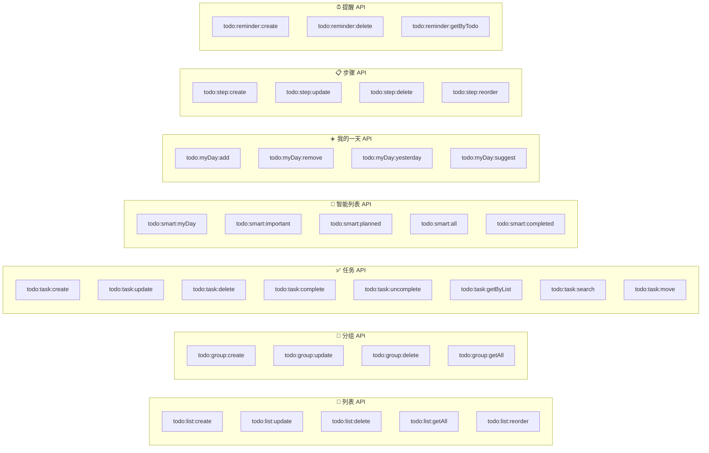

# GuYanTools Todo 功能 API / 数据模型设计文档

> **版本**：1.0
> **日期**：2026-03-23
> **文档状态**：草案

---

## 1. 共享类型定义 (`src/shared/todo.ts`)

### 1.1 列表分组

```typescript
/** 列表分组 DTO */
export interface TodoListGroupDto {
  id: string;
  workspaceId: number;
  name: string;
  sortOrder: number;
  createdAt: string;
  updatedAt: string;
  lists: TodoListDto[];  // 分组下的列表
}

/** 创建列表分组 */
export interface CreateListGroupPayload {
  id: string;
  name: string;
  sortOrder: number;
}

/** 更新列表分组 */
export interface UpdateListGroupPayload {
  name?: string;
  sortOrder?: number;
}
```

### 1.2 列表

```typescript
/** 列表 DTO */
export interface TodoListDto {
  id: string;
  workspaceId: number;
  groupId?: string;
  name: string;
  icon: string;
  themeColor: string;
  sortOrder: number;
  /** 未完成任务数量（前端聚合或查询时顺带返回） */
  incompleteCount: number;
  createdAt: string;
  updatedAt: string;
}

/** 创建列表 */
export interface CreateListPayload {
  id: string;
  name: string;
  icon?: string;
  themeColor?: string;
  groupId?: string;
  sortOrder: number;
}

/** 更新列表 */
export interface UpdateListPayload {
  name?: string;
  icon?: string;
  themeColor?: string;
  groupId?: string;
  sortOrder?: number;
}
```

### 1.3 任务 (Todo)

```typescript
/** 重复规则 */
export interface RepeatRule {
  type: 'daily' | 'weekday' | 'weekly' | 'monthly' | 'yearly' | 'custom';
  /** 自定义间隔数值（仅 type='custom' 时使用） */
  interval?: number;
  /** 自定义间隔单位（仅 type='custom' 时使用） */
  unit?: 'day' | 'week' | 'month';
}

/** 任务 DTO */
export interface TodoDto {
  id: string;
  listId: string;
  /** 所属列表名称（JOIN 查询时附带） */
  listName?: string;
  title: string;
  note: string;
  isCompleted: boolean;
  isImportant: boolean;
  isMyDay: boolean;
  myDayDate?: string;
  dueDate?: string;
  repeatRule?: RepeatRule;
  sortOrder: number;
  completedAt?: string;
  createdAt: string;
  updatedAt: string;
  /** 子步骤列表 */
  steps: TodoStepDto[];
  /** 提醒列表 */
  reminders: TodoReminderDto[];
}

/** 创建任务 */
export interface CreateTodoPayload {
  id: string;
  listId: string;
  title: string;
  note?: string;
  isImportant?: boolean;
  isMyDay?: boolean;
  dueDate?: string;
  repeatRule?: RepeatRule;
  sortOrder?: number;
}

/** 更新任务 */
export interface UpdateTodoPayload {
  listId?: string;
  title?: string;
  note?: string;
  isImportant?: boolean;
  isMyDay?: boolean;
  myDayDate?: string;
  dueDate?: string;
  repeatRule?: RepeatRule;
  sortOrder?: number;
}

/** 完成任务结果 */
export interface CompleteTodoResult {
  /** 被完成的任务 */
  completedTodo: TodoDto;
  /** 如果是重复任务，自动生成的下一周期任务 */
  nextTodo?: TodoDto;
}
```

### 1.4 步骤 (Step)

```typescript
/** 任务步骤 DTO */
export interface TodoStepDto {
  id: string;
  todoId: string;
  title: string;
  isCompleted: boolean;
  sortOrder: number;
  createdAt: string;
  updatedAt: string;
}

/** 创建步骤 */
export interface CreateStepPayload {
  id: string;
  todoId: string;
  title: string;
  sortOrder?: number;
}

/** 更新步骤 */
export interface UpdateStepPayload {
  title?: string;
  isCompleted?: boolean;
  sortOrder?: number;
}
```

### 1.5 提醒 (Reminder)

```typescript
/** 提醒 DTO */
export interface TodoReminderDto {
  id: string;
  todoId: string;
  remindAt: string;
  isSent: boolean;
  createdAt: string;
}

/** 创建提醒 */
export interface CreateReminderPayload {
  id: string;
  todoId: string;
  remindAt: string;
}
```

---

## 2. IPC API 定义

### 2.1 API 总览



### 2.2 列表 API 详细定义

| Channel | 方向 | 参数 | 返回值 | 说明 |
|---------|------|------|--------|------|
| `todo:list:create` | Renderer → Main | `CreateListPayload` | `TodoListDto` | 创建新列表 |
| `todo:list:update` | Renderer → Main | `(id: string, payload: UpdateListPayload)` | `TodoListDto` | 更新列表属性 |
| `todo:list:delete` | Renderer → Main | `(id: string)` | `void` | 删除列表（级联删除任务） |
| `todo:list:getAll` | Renderer → Main | 无 | `TodoListDto[]` | 获取所有列表（含未完成计数） |
| `todo:list:reorder` | Renderer → Main | `(ids: string[])` | `void` | 按传入顺序重新排列列表 |

### 2.3 任务 API 详细定义

| Channel | 方向 | 参数 | 返回值 | 说明 |
|---------|------|------|--------|------|
| `todo:task:create` | Renderer → Main | `CreateTodoPayload` | `TodoDto` | 创建任务 |
| `todo:task:update` | Renderer → Main | `(id: string, payload: UpdateTodoPayload)` | `TodoDto` | 更新任务 |
| `todo:task:delete` | Renderer → Main | `(id: string)` | `void` | 删除任务 |
| `todo:task:complete` | Renderer → Main | `(id: string)` | `CompleteTodoResult` | 标记完成（含重复任务处理） |
| `todo:task:uncomplete` | Renderer → Main | `(id: string)` | `TodoDto` | 取消完成 |
| `todo:task:getByList` | Renderer → Main | `(listId: string, includeCompleted?: boolean)` | `TodoDto[]` | 按列表获取任务 |
| `todo:task:search` | Renderer → Main | `(query: string)` | `TodoDto[]` | 全局搜索 |
| `todo:task:move` | Renderer → Main | `(id: string, targetListId: string)` | `TodoDto` | 移动任务到其他列表 |

### 2.4 智能列表 API 详细定义

| Channel | 方向 | 参数 | 返回值 | 说明 |
|---------|------|------|--------|------|
| `todo:smart:myDay` | Renderer → Main | 无 | `TodoDto[]` | 获取今日"我的一天"任务 |
| `todo:smart:important` | Renderer → Main | 无 | `TodoDto[]` | 获取所有重要任务 |
| `todo:smart:planned` | Renderer → Main | 无 | `TodoDto[]` | 获取有截止日期的任务 |
| `todo:smart:all` | Renderer → Main | 无 | `TodoDto[]` | 获取所有未完成任务 |
| `todo:smart:completed` | Renderer → Main | 无 | `TodoDto[]` | 获取所有已完成任务 |

### 2.5 我的一天 API 详细定义

| Channel | 方向 | 参数 | 返回值 | 说明 |
|---------|------|------|--------|------|
| `todo:myDay:add` | Renderer → Main | `(todoId: string)` | `void` | 添加任务到"我的一天" |
| `todo:myDay:remove` | Renderer → Main | `(todoId: string)` | `void` | 从"我的一天"移除 |
| `todo:myDay:yesterday` | Renderer → Main | 无 | `TodoDto[]` | 获取昨日未完成任务 |
| `todo:myDay:suggest` | Renderer → Main | 无 | `TodoDto[]` | 获取"建议添加"的任务 |

### 2.6 步骤 API 详细定义

| Channel | 方向 | 参数 | 返回值 | 说明 |
|---------|------|------|--------|------|
| `todo:step:create` | Renderer → Main | `CreateStepPayload` | `TodoStepDto` | 创建步骤 |
| `todo:step:update` | Renderer → Main | `(id: string, payload: UpdateStepPayload)` | `TodoStepDto` | 更新步骤 |
| `todo:step:delete` | Renderer → Main | `(id: string)` | `void` | 删除步骤 |
| `todo:step:reorder` | Renderer → Main | `(ids: string[])` | `void` | 步骤排序 |

### 2.7 提醒 API 详细定义

| Channel | 方向 | 参数 | 返回值 | 说明 |
|---------|------|------|--------|------|
| `todo:reminder:create` | Renderer → Main | `CreateReminderPayload` | `TodoReminderDto` | 创建提醒 |
| `todo:reminder:delete` | Renderer → Main | `(id: string)` | `void` | 删除提醒 |
| `todo:reminder:getByTodo` | Renderer → Main | `(todoId: string)` | `TodoReminderDto[]` | 获取任务的提醒列表 |

---

## 3. Preload 桥接

在 `preload.ts` 中暴露 Todo API（遵循现有 `contextBridge` 模式）：

```typescript
// src/preload.ts 新增部分
const todoApi: TodoApi = {
  // 列表
  createList: (payload) => ipcRenderer.invoke('todo:list:create', payload),
  updateList: (id, payload) => ipcRenderer.invoke('todo:list:update', id, payload),
  deleteList: (id) => ipcRenderer.invoke('todo:list:delete', id),
  getAllLists: () => ipcRenderer.invoke('todo:list:getAll'),
  reorderLists: (ids) => ipcRenderer.invoke('todo:list:reorder', ids),

  // 任务
  createTodo: (payload) => ipcRenderer.invoke('todo:task:create', payload),
  updateTodo: (id, payload) => ipcRenderer.invoke('todo:task:update', id, payload),
  deleteTodo: (id) => ipcRenderer.invoke('todo:task:delete', id),
  completeTodo: (id) => ipcRenderer.invoke('todo:task:complete', id),
  uncompleteTodo: (id) => ipcRenderer.invoke('todo:task:uncomplete', id),
  getTodosByList: (listId, includeCompleted) =>
    ipcRenderer.invoke('todo:task:getByList', listId, includeCompleted),
  searchTodos: (query) => ipcRenderer.invoke('todo:task:search', query),
  moveTodo: (id, targetListId) => ipcRenderer.invoke('todo:task:move', id, targetListId),

  // 智能列表
  getMyDayTodos: () => ipcRenderer.invoke('todo:smart:myDay'),
  getImportantTodos: () => ipcRenderer.invoke('todo:smart:important'),
  getPlannedTodos: () => ipcRenderer.invoke('todo:smart:planned'),
  getAllTodos: () => ipcRenderer.invoke('todo:smart:all'),
  getCompletedTodos: () => ipcRenderer.invoke('todo:smart:completed'),

  // 我的一天
  addToMyDay: (todoId) => ipcRenderer.invoke('todo:myDay:add', todoId),
  removeFromMyDay: (todoId) => ipcRenderer.invoke('todo:myDay:remove', todoId),
  getYesterdayIncomplete: () => ipcRenderer.invoke('todo:myDay:yesterday'),
  getMyDaySuggestions: () => ipcRenderer.invoke('todo:myDay:suggest'),

  // 步骤
  createStep: (payload) => ipcRenderer.invoke('todo:step:create', payload),
  updateStep: (id, payload) => ipcRenderer.invoke('todo:step:update', id, payload),
  deleteStep: (id) => ipcRenderer.invoke('todo:step:delete', id),
  reorderSteps: (ids) => ipcRenderer.invoke('todo:step:reorder', ids),

  // 提醒
  createReminder: (payload) => ipcRenderer.invoke('todo:reminder:create', payload),
  deleteReminder: (id) => ipcRenderer.invoke('todo:reminder:delete', id),
  getRemindersByTodo: (todoId) => ipcRenderer.invoke('todo:reminder:getByTodo', todoId),
};

contextBridge.exposeInMainWorld('todoApi', todoApi);
```

### 3.1 TodoApi 类型定义

```typescript
// src/shared/todo.ts 中导出
export interface TodoApi {
  // 列表
  createList: (payload: CreateListPayload) => Promise<TodoListDto>;
  updateList: (id: string, payload: UpdateListPayload) => Promise<TodoListDto>;
  deleteList: (id: string) => Promise<void>;
  getAllLists: () => Promise<TodoListDto[]>;
  reorderLists: (ids: string[]) => Promise<void>;

  // 任务
  createTodo: (payload: CreateTodoPayload) => Promise<TodoDto>;
  updateTodo: (id: string, payload: UpdateTodoPayload) => Promise<TodoDto>;
  deleteTodo: (id: string) => Promise<void>;
  completeTodo: (id: string) => Promise<CompleteTodoResult>;
  uncompleteTodo: (id: string) => Promise<TodoDto>;
  getTodosByList: (listId: string, includeCompleted?: boolean) => Promise<TodoDto[]>;
  searchTodos: (query: string) => Promise<TodoDto[]>;
  moveTodo: (id: string, targetListId: string) => Promise<TodoDto>;

  // 智能列表
  getMyDayTodos: () => Promise<TodoDto[]>;
  getImportantTodos: () => Promise<TodoDto[]>;
  getPlannedTodos: () => Promise<TodoDto[]>;
  getAllTodos: () => Promise<TodoDto[]>;
  getCompletedTodos: () => Promise<TodoDto[]>;

  // 我的一天
  addToMyDay: (todoId: string) => Promise<void>;
  removeFromMyDay: (todoId: string) => Promise<void>;
  getYesterdayIncomplete: () => Promise<TodoDto[]>;
  getMyDaySuggestions: () => Promise<TodoDto[]>;

  // 步骤
  createStep: (payload: CreateStepPayload) => Promise<TodoStepDto>;
  updateStep: (id: string, payload: UpdateStepPayload) => Promise<TodoStepDto>;
  deleteStep: (id: string) => Promise<void>;
  reorderSteps: (ids: string[]) => Promise<void>;

  // 提醒
  createReminder: (payload: CreateReminderPayload) => Promise<TodoReminderDto>;
  deleteReminder: (id: string) => Promise<void>;
  getRemindersByTodo: (todoId: string) => Promise<TodoReminderDto[]>;
}
```

---

## 4. Rust Core 服务接口

### 4.1 Rust 数据模型（`models/todo.rs`）

```rust
use serde::{Deserialize, Serialize};

#[derive(Debug, Clone, Serialize, Deserialize)]
pub struct TodoList {
    pub id: String,
    pub workspace_id: i64,
    pub group_id: Option<String>,
    pub name: String,
    pub icon: String,
    pub theme_color: String,
    pub sort_order: i64,
    pub created_at: String,
    pub updated_at: String,
}

#[derive(Debug, Clone, Serialize, Deserialize)]
pub struct Todo {
    pub id: String,
    pub list_id: String,
    pub title: String,
    pub note: String,
    pub is_completed: bool,
    pub is_important: bool,
    pub is_my_day: bool,
    pub my_day_date: Option<String>,
    pub due_date: Option<String>,
    pub repeat_rule: Option<String>,  // JSON 字符串
    pub sort_order: i64,
    pub completed_at: Option<String>,
    pub created_at: String,
    pub updated_at: String,
}

#[derive(Debug, Clone, Serialize, Deserialize)]
pub struct TodoStep {
    pub id: String,
    pub todo_id: String,
    pub title: String,
    pub is_completed: bool,
    pub sort_order: i64,
    pub created_at: String,
    pub updated_at: String,
}

#[derive(Debug, Clone, Serialize, Deserialize)]
pub struct TodoReminder {
    pub id: String,
    pub todo_id: String,
    pub remind_at: String,
    pub is_sent: bool,
    pub created_at: String,
}

#[derive(Debug, Clone, Serialize, Deserialize)]
pub struct TodoListGroup {
    pub id: String,
    pub workspace_id: i64,
    pub name: String,
    pub sort_order: i64,
    pub created_at: String,
    pub updated_at: String,
}
```

### 4.2 NAPI 绑定接口

Rust Core 通过 NAPI 暴露给 Node.js（遵循 `@guyantools/core` 现有模式）：

```rust
// bindings/todo_bindings.rs

#[napi]
impl JsDatabase {
    // ——— 列表 ———
    #[napi]
    pub fn create_todo_list(&self, input: JsCreateListInput) -> Result<JsTodoList>;
    #[napi]
    pub fn update_todo_list(&self, id: String, input: JsUpdateListInput) -> Result<JsTodoList>;
    #[napi]
    pub fn delete_todo_list(&self, id: String) -> Result<()>;
    #[napi]
    pub fn get_all_todo_lists(&self, workspace_id: i64) -> Result<Vec<JsTodoList>>;
    #[napi]
    pub fn reorder_todo_lists(&self, ids: Vec<String>) -> Result<()>;

    // ——— 任务 ———
    #[napi]
    pub fn create_todo(&self, input: JsCreateTodoInput) -> Result<JsTodo>;
    #[napi]
    pub fn update_todo(&self, id: String, input: JsUpdateTodoInput) -> Result<JsTodo>;
    #[napi]
    pub fn delete_todo(&self, id: String) -> Result<()>;
    #[napi]
    pub fn complete_todo(&self, id: String) -> Result<JsCompleteTodoResult>;
    #[napi]
    pub fn uncomplete_todo(&self, id: String) -> Result<JsTodo>;
    #[napi]
    pub fn get_todos_by_list(&self, list_id: String, include_completed: bool) -> Result<Vec<JsTodo>>;
    #[napi]
    pub fn search_todos(&self, workspace_id: i64, query: String) -> Result<Vec<JsTodo>>;
    #[napi]
    pub fn move_todo(&self, id: String, target_list_id: String) -> Result<JsTodo>;

    // ——— 智能列表查询 ———
    #[napi]
    pub fn get_my_day_todos(&self, workspace_id: i64, date: String) -> Result<Vec<JsTodo>>;
    #[napi]
    pub fn get_important_todos(&self, workspace_id: i64) -> Result<Vec<JsTodo>>;
    #[napi]
    pub fn get_planned_todos(&self, workspace_id: i64) -> Result<Vec<JsTodo>>;
    #[napi]
    pub fn get_all_todos(&self, workspace_id: i64) -> Result<Vec<JsTodo>>;
    #[napi]
    pub fn get_completed_todos(&self, workspace_id: i64) -> Result<Vec<JsTodo>>;

    // ——— 我的一天 ———
    #[napi]
    pub fn add_todo_to_my_day(&self, todo_id: String, date: String) -> Result<()>;
    #[napi]
    pub fn remove_todo_from_my_day(&self, todo_id: String) -> Result<()>;
    #[napi]
    pub fn get_yesterday_incomplete_todos(&self, workspace_id: i64, today: String) -> Result<Vec<JsTodo>>;
    #[napi]
    pub fn get_my_day_suggestions(&self, workspace_id: i64, today: String) -> Result<Vec<JsTodo>>;

    // ——— 步骤 ———
    #[napi]
    pub fn create_todo_step(&self, input: JsCreateStepInput) -> Result<JsTodoStep>;
    #[napi]
    pub fn update_todo_step(&self, id: String, input: JsUpdateStepInput) -> Result<JsTodoStep>;
    #[napi]
    pub fn delete_todo_step(&self, id: String) -> Result<()>;
    #[napi]
    pub fn reorder_todo_steps(&self, ids: Vec<String>) -> Result<()>;
    #[napi]
    pub fn get_steps_by_todo(&self, todo_id: String) -> Result<Vec<JsTodoStep>>;

    // ——— 提醒 ———
    #[napi]
    pub fn create_todo_reminder(&self, input: JsCreateReminderInput) -> Result<JsTodoReminder>;
    #[napi]
    pub fn delete_todo_reminder(&self, id: String) -> Result<()>;
    #[napi]
    pub fn get_reminders_by_todo(&self, todo_id: String) -> Result<Vec<JsTodoReminder>>;
    #[napi]
    pub fn get_pending_reminders(&self, now: String) -> Result<Vec<JsTodoReminder>>;
    #[napi]
    pub fn mark_reminder_sent(&self, id: String) -> Result<()>;
}
```

---

## 5. 错误处理

### 5.1 错误码定义

```typescript
export enum TodoErrorCode {
  /** 列表不存在 */
  LIST_NOT_FOUND = 'TODO_LIST_NOT_FOUND',
  /** 任务不存在 */
  TODO_NOT_FOUND = 'TODO_NOT_FOUND',
  /** 步骤不存在 */
  STEP_NOT_FOUND = 'TODO_STEP_NOT_FOUND',
  /** 提醒不存在 */
  REMINDER_NOT_FOUND = 'TODO_REMINDER_NOT_FOUND',
  /** 数据库错误 */
  DB_ERROR = 'TODO_DB_ERROR',
  /** 无效参数 */
  INVALID_PARAM = 'TODO_INVALID_PARAM',
  /** 重复 ID */
  DUPLICATE_ID = 'TODO_DUPLICATE_ID',
}

export interface TodoError {
  code: TodoErrorCode;
  message: string;
  details?: unknown;
}
```

### 5.2 错误处理策略

| 场景                 | 处理方式                              |
| -------------------- | ------------------------------------- |
| IPC 调用失败         | 捕获异常，UI 显示 toast 错误提示      |
| 数据库写入失败       | 回滚事务，返回具体错误码              |
| 不存在的资源操作     | 返回 `NOT_FOUND` 错误码              |
| 无效的重复规则 JSON  | 校验失败时返回 `INVALID_PARAM`        |
| 提醒发送失败         | 记录日志，不阻塞后续提醒检查          |
