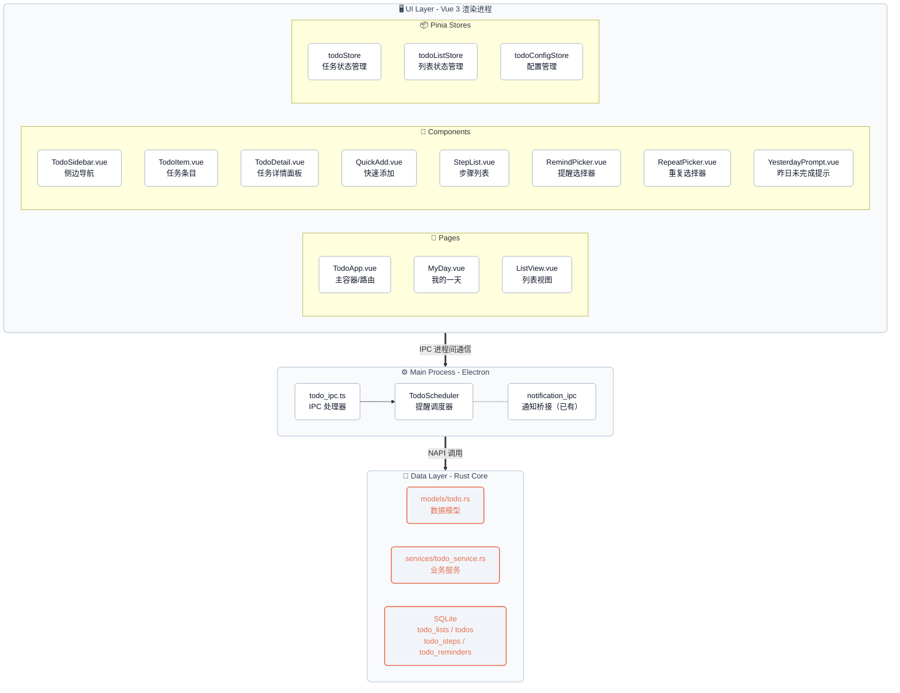
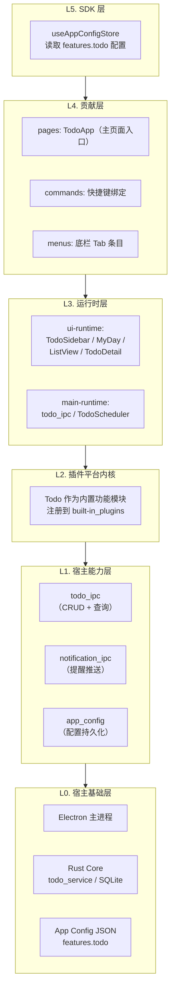
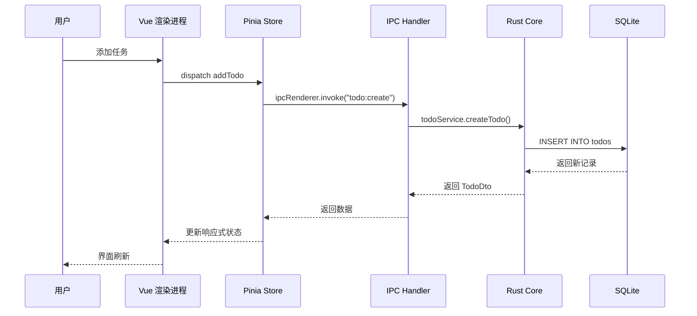
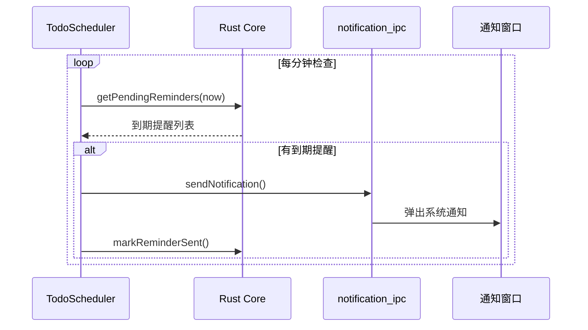
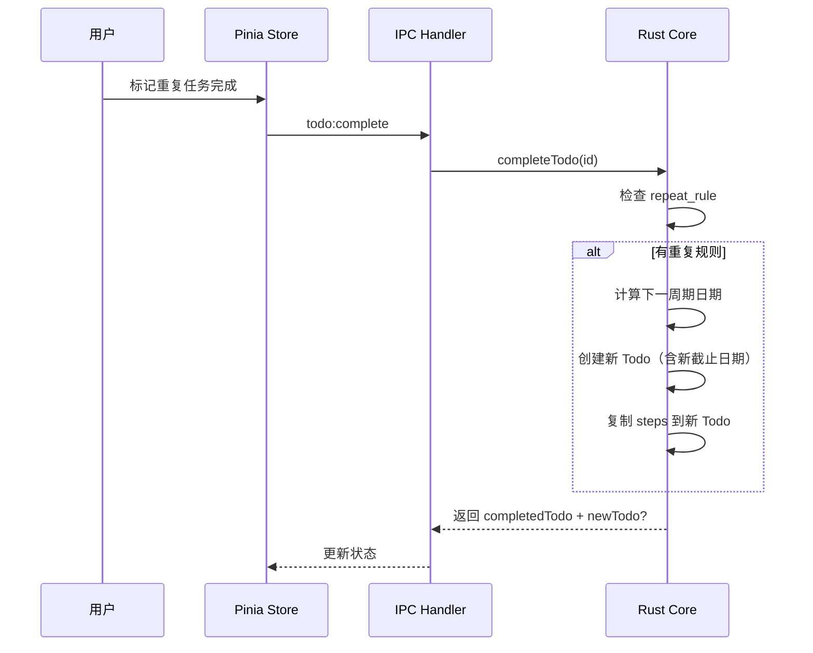
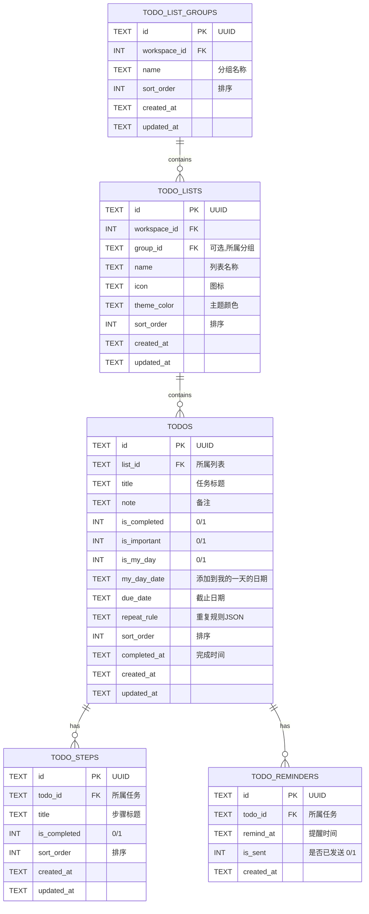

# GuYanTools Todo 功能架构设计文档

> **版本**：1.0
> **日期**：2026-03-23
> **文档状态**：草案

---

## 1. 概述

### 1.1 背景

GuYanTools 桌面端需要集成内置 Todo 功能，提供个人任务管理能力。本文档定义了 Todo 功能的技术架构，遵循现有项目分层架构和技术栈约束。

### 1.2 设计原则

1. **分层解耦**：Rust Core 负责数据持久化，Electron 主进程负责业务逻辑与 IPC，Vue 渲染进程负责 UI
2. **复用现有基础设施**：复用现有数据库管理器（`JsDatabase`）、通知系统（`notification_ipc`）、配置管理（`app_config`）
3. **内置功能模式**：作为 `built-in_plugins` 内置功能，沿用现有插件注册和路由机制
4. **数据本地化**：所有数据存储在本地 SQLite，无网络依赖

### 1.3 技术栈

- **前端**：Vue 3 + TypeScript + Pinia
- **主进程**：Electron 37 + Node.js
- **数据层**：Rust Core（`@guyantools/core`）→ SQLite
- **通知**：复用现有 `notification_ipc` 系统

---

## 2. 系统架构

### 2.1 整体架构图



### 2.2 架构分层（遵循项目 L0-L5 模型）



---

## 3. 数据流设计

### 3.1 核心数据流



### 3.2 提醒调度流程



### 3.3 重复任务生成流程



---

## 4. 模块设计

### 4.1 文件结构概览

```
desktop/src/
├── core/
│   └── built-in_plugins/
│       └── todo/                       # 内置 Todo 模块（主进程侧）
│           ├── todo_ipc.ts             # IPC 处理器注册
│           └── todo_scheduler.ts       # 提醒调度器
├── shared/
│   └── todo.ts                         # Todo 共享类型定义（DTO/Payload）
├── renderer/
│   ├── pages/
│   │   └── Todo/                       # Todo 页面
│   │       ├── TodoApp.vue             # 主容器（侧边栏 + 内容区）
│   │       ├── views/
│   │       │   ├── MyDay.vue           # "我的一天"视图
│   │       │   ├── Important.vue       # "重要"视图
│   │       │   ├── Planned.vue         # "已计划"视图
│   │       │   ├── AllTasks.vue        # "全部"视图
│   │       │   └── ListView.vue        # 自定义列表视图
│   │       └── components/
│   │           ├── TodoSidebar.vue      # 侧边导航栏
│   │           ├── TodoItem.vue         # 单个任务条目
│   │           ├── TodoDetail.vue       # 任务详情侧边面板
│   │           ├── QuickAdd.vue         # 快速添加输入框
│   │           ├── StepList.vue         # 步骤列表组件
│   │           ├── DatePicker.vue       # 日期选择器
│   │           ├── RemindPicker.vue     # 提醒时间选择
│   │           ├── RepeatPicker.vue     # 重复规则选择
│   │           ├── YesterdayPrompt.vue  # 昨日未完成提示
│   │           ├── TodoSearch.vue       # 搜索组件
│   │           └── ListEditor.vue       # 列表编辑弹框
│   ├── stores/
│   │   ├── todo_store.ts               # 任务状态管理
│   │   └── todo_list_store.ts          # 列表状态管理
│   └── composables/
│       ├── useTodo.ts                  # 任务 CRUD composable
│       ├── useTodoList.ts             # 列表 CRUD composable
│       └── useTodoDrag.ts             # 拖拽排序 composable

multi_platform_core/src/
├── models/
│   └── todo.rs                         # Rust 数据模型
├── services/
│   └── todo_service.rs                 # Rust 业务服务
└── db/
    └── migration.rs                    # 新增 Todo 相关数据表迁移
```

### 4.2 Rust Core 模块

#### 4.2.1 数据模型 (`models/todo.rs`)

负责定义与数据库表一一对应的 Rust 结构体，以及从 SQL 行映射到结构体的逻辑。

#### 4.2.2 业务服务 (`services/todo_service.rs`)

提供完整的 CRUD 和查询能力：

| 方法                          | 说明                               |
| ----------------------------- | ---------------------------------- |
| `create_list()`               | 创建列表                           |
| `update_list()`               | 更新列表                           |
| `delete_list()`               | 删除列表（级联删除所有任务）       |
| `get_all_lists()`             | 获取所有列表                       |
| `reorder_lists()`             | 列表排序                           |
| `create_todo()`               | 创建任务                           |
| `update_todo()`               | 更新任务                           |
| `delete_todo()`               | 删除任务                           |
| `complete_todo()`             | 完成任务（含重复任务自动生成）     |
| `get_todos_by_list()`         | 按列表获取任务                     |
| `get_my_day_todos()`          | 获取"我的一天"任务                |
| `get_important_todos()`       | 获取重要任务                       |
| `get_planned_todos()`         | 获取已计划任务                     |
| `get_all_todos()`             | 获取所有任务                       |
| `search_todos()`              | 搜索任务                           |
| `create_step()`               | 创建步骤                           |
| `update_step()`               | 更新步骤                           |
| `delete_step()`               | 删除步骤                           |
| `get_pending_reminders()`     | 获取到期提醒                       |
| `mark_reminder_sent()`        | 标记提醒已发送                     |
| `get_yesterday_incomplete()`  | 获取昨日未完成的"我的一天"任务   |

### 4.3 IPC 通信层

#### 4.3.1 IPC Channel 设计

```typescript
// IPC 频道命名规范：todo:<resource>:<action>
const TODO_CHANNELS = {
  // 列表操作
  'todo:list:create':    (payload: CreateListPayload) => Promise<TodoListDto>,
  'todo:list:update':    (id: string, payload: UpdateListPayload) => Promise<TodoListDto>,
  'todo:list:delete':    (id: string) => Promise<void>,
  'todo:list:getAll':    () => Promise<TodoListDto[]>,
  'todo:list:reorder':   (ids: string[]) => Promise<void>,

  // 任务操作
  'todo:task:create':    (payload: CreateTodoPayload) => Promise<TodoDto>,
  'todo:task:update':    (id: string, payload: UpdateTodoPayload) => Promise<TodoDto>,
  'todo:task:delete':    (id: string) => Promise<void>,
  'todo:task:complete':  (id: string) => Promise<CompleteTodoResult>,
  'todo:task:getByList': (listId: string) => Promise<TodoDto[]>,
  'todo:task:search':    (query: string) => Promise<TodoDto[]>,

  // 智能列表查询
  'todo:smart:myDay':      () => Promise<TodoDto[]>,
  'todo:smart:important':  () => Promise<TodoDto[]>,
  'todo:smart:planned':    () => Promise<TodoDto[]>,
  'todo:smart:all':        () => Promise<TodoDto[]>,
  'todo:smart:completed':  () => Promise<TodoDto[]>,

  // 我的一天
  'todo:myDay:add':        (todoId: string) => Promise<void>,
  'todo:myDay:remove':     (todoId: string) => Promise<void>,
  'todo:myDay:yesterday':  () => Promise<TodoDto[]>,

  // 步骤操作
  'todo:step:create':   (payload: CreateStepPayload) => Promise<TodoStepDto>,
  'todo:step:update':   (id: string, payload: UpdateStepPayload) => Promise<TodoStepDto>,
  'todo:step:delete':   (id: string) => Promise<void>,
  'todo:step:reorder':  (ids: string[]) => Promise<void>,
} as const;
```

### 4.4 Pinia Store 设计

#### todoStore

```typescript
// 核心状态
interface TodoStoreState {
  /** 当前选中的列表/视图 */
  activeView: 'myDay' | 'important' | 'planned' | 'all' | 'completed' | string;
  /** 当前视图的任务列表 */
  todos: TodoDto[];
  /** 当前选中的任务（详情面板展示） */
  selectedTodo: TodoDto | null;
  /** 搜索关键字 */
  searchQuery: string;
  /** 加载状态 */
  loading: boolean;
  /** 昨日未完成的任务 */
  yesterdayIncompleteTodos: TodoDto[];
  /** 是否已显示昨日提示 */
  hasShownYesterdayPrompt: boolean;
}
```

#### todoListStore

```typescript
// 核心状态
interface TodoListStoreState {
  /** 所有用户自定义列表 */
  lists: TodoListDto[];
  /** 列表分组 */
  groups: TodoListGroupDto[];
  /** 加载状态 */
  loading: boolean;
}
```

### 4.5 提醒调度器 (TodoScheduler)

```typescript
/**
 * 在 Electron 主进程中运行的定时调度器
 * 负责检查到期提醒，并通过 notification_ipc 发送系统通知
 */
class TodoScheduler {
  private intervalId: NodeJS.Timeout | null = null;
  private readonly CHECK_INTERVAL = 60_000; // 每分钟检查

  start(db: JsDatabase): void;   // 启动调度
  stop(): void;                   // 停止调度
  private checkReminders(): void; // 检查到期提醒
}
```

---

## 5. 数据库设计

### 5.1 ER 模型



### 5.2 数据表 DDL

```sql
-- 列表分组表
CREATE TABLE IF NOT EXISTS todo_list_groups (
    id TEXT PRIMARY KEY,
    workspace_id INTEGER NOT NULL DEFAULT 1,
    name TEXT NOT NULL,
    sort_order INTEGER NOT NULL DEFAULT 0,
    created_at TEXT NOT NULL DEFAULT (datetime('now')),
    updated_at TEXT NOT NULL DEFAULT (datetime('now'))
);

-- 列表表
CREATE TABLE IF NOT EXISTS todo_lists (
    id TEXT PRIMARY KEY,
    workspace_id INTEGER NOT NULL DEFAULT 1,
    group_id TEXT,
    name TEXT NOT NULL,
    icon TEXT DEFAULT 'list',
    theme_color TEXT DEFAULT '#4A90D9',
    sort_order INTEGER NOT NULL DEFAULT 0,
    created_at TEXT NOT NULL DEFAULT (datetime('now')),
    updated_at TEXT NOT NULL DEFAULT (datetime('now')),
    FOREIGN KEY (group_id) REFERENCES todo_list_groups(id) ON DELETE SET NULL
);

-- 任务表
CREATE TABLE IF NOT EXISTS todos (
    id TEXT PRIMARY KEY,
    list_id TEXT NOT NULL,
    title TEXT NOT NULL,
    note TEXT DEFAULT '',
    is_completed INTEGER NOT NULL DEFAULT 0,
    is_important INTEGER NOT NULL DEFAULT 0,
    is_my_day INTEGER NOT NULL DEFAULT 0,
    my_day_date TEXT,
    due_date TEXT,
    repeat_rule TEXT,
    sort_order INTEGER NOT NULL DEFAULT 0,
    completed_at TEXT,
    created_at TEXT NOT NULL DEFAULT (datetime('now')),
    updated_at TEXT NOT NULL DEFAULT (datetime('now')),
    FOREIGN KEY (list_id) REFERENCES todo_lists(id) ON DELETE CASCADE
);

-- 步骤表
CREATE TABLE IF NOT EXISTS todo_steps (
    id TEXT PRIMARY KEY,
    todo_id TEXT NOT NULL,
    title TEXT NOT NULL,
    is_completed INTEGER NOT NULL DEFAULT 0,
    sort_order INTEGER NOT NULL DEFAULT 0,
    created_at TEXT NOT NULL DEFAULT (datetime('now')),
    updated_at TEXT NOT NULL DEFAULT (datetime('now')),
    FOREIGN KEY (todo_id) REFERENCES todos(id) ON DELETE CASCADE
);

-- 提醒表
CREATE TABLE IF NOT EXISTS todo_reminders (
    id TEXT PRIMARY KEY,
    todo_id TEXT NOT NULL,
    remind_at TEXT NOT NULL,
    is_sent INTEGER NOT NULL DEFAULT 0,
    created_at TEXT NOT NULL DEFAULT (datetime('now')),
    FOREIGN KEY (todo_id) REFERENCES todos(id) ON DELETE CASCADE
);

-- 索引
CREATE INDEX IF NOT EXISTS idx_todos_list_id ON todos(list_id);
CREATE INDEX IF NOT EXISTS idx_todos_is_my_day ON todos(is_my_day, my_day_date);
CREATE INDEX IF NOT EXISTS idx_todos_is_important ON todos(is_important);
CREATE INDEX IF NOT EXISTS idx_todos_due_date ON todos(due_date);
CREATE INDEX IF NOT EXISTS idx_todos_is_completed ON todos(is_completed);
CREATE INDEX IF NOT EXISTS idx_todo_steps_todo_id ON todo_steps(todo_id);
CREATE INDEX IF NOT EXISTS idx_todo_reminders_remind_at ON todo_reminders(remind_at, is_sent);
```

---

## 6. 配置设计

Todo 功能配置存储在 `app_config.json` 的 `features.todo` 节点：

```typescript
// src/shared/app_config.ts 中新增
interface TodoFeatureConfig {
  /** 智能列表可见性 */
  smartListVisibility: {
    myDay: boolean;
    important: boolean;
    planned: boolean;
    all: boolean;
    completed: boolean;
  };
  /** 默认新任务添加到的列表 ID */
  defaultListId?: string;
  /** 完成音效 */
  completionSound: boolean;
  /** 删除时确认 */
  confirmOnDelete: boolean;
  /** 我的一天自动清理策略 */
  myDayResetPolicy: 'keep_incomplete' | 'clear_all';
  /** 排序偏好 */
  sortPreference: 'importance' | 'dueDate' | 'createdDate' | 'alphabetical' | 'custom';
}
```

---

## 7. 关键设计决策

### 7.1 "我的一天" 实现方案

采用**字段标记方案**而非独立关联表：

- 在 `todos` 表中使用 `is_my_day` + `my_day_date` 字段
- `is_my_day = 1` 且 `my_day_date = 今日日期` 表示任务在"我的一天"中
- 每天首次打开时，查询 `is_my_day = 1 AND my_day_date < 今日` 获取昨日未完成任务

**优势**：查询简单，无需额外 JOIN，配合索引性能优秀

### 7.2 重复规则存储

采用 **JSON 字符串** 存储在 `repeat_rule` 字段：

```typescript
interface RepeatRule {
  type: 'daily' | 'weekday' | 'weekly' | 'monthly' | 'yearly' | 'custom';
  interval?: number;     // 自定义间隔值
  unit?: 'day' | 'week' | 'month';  // 自定义间隔单位
}
// 示例：'{"type":"weekly"}' 或 '{"type":"custom","interval":3,"unit":"day"}'
```

**优势**：灵活扩展，无需额外表，解析简单

### 7.3 提醒实现

- **主进程定时器**：通过 `setInterval` 每分钟检查一次到期提醒
- **复用通知系统**：直接调用现有 `notification_ipc` 发送系统通知
- **精度**：最大延迟 1 分钟，对 Todo 提醒场景完全够用

---

## 8. 扩展性考虑

| 未来扩展方向       | 当前架构支持情况                             |
| ------------------ | -------------------------------------------- |
| **多端同步**       | DTO 层已分离，可接入同步服务                 |
| **标签系统**       | 可新增 `todo_tags` 表和多对多关联            |
| **附件**           | 可在 `todos` 表新增 `attachments` JSON 字段  |
| **协作/共享列表**  | 可通过 `user_id` 字段区分所有者              |
| **自定义智能列表** | 可通过 DSL/查询条件构建动态列表              |
