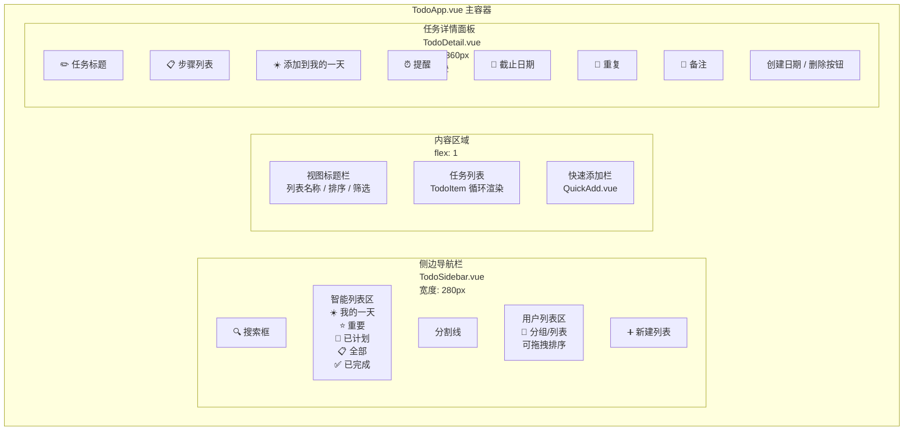
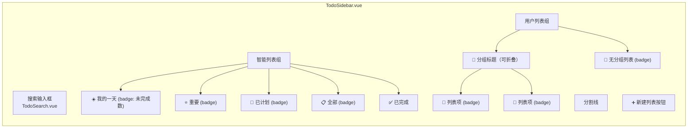
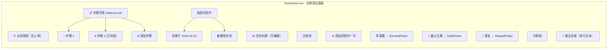
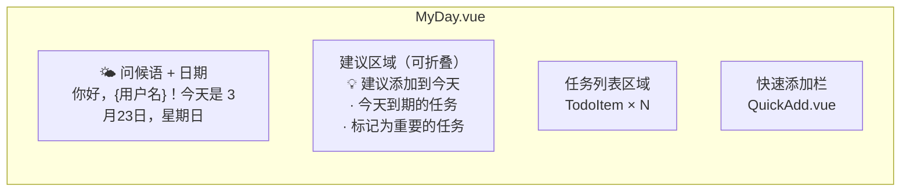
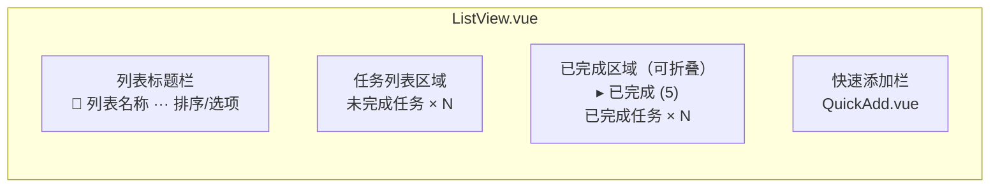
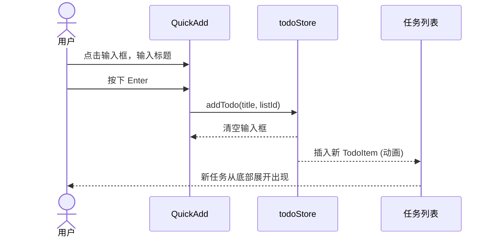
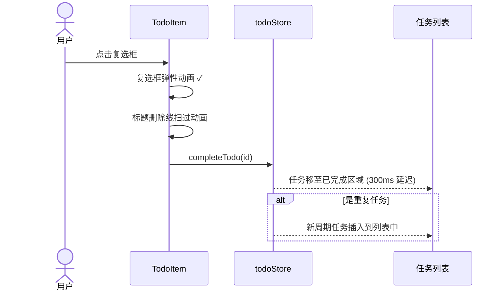
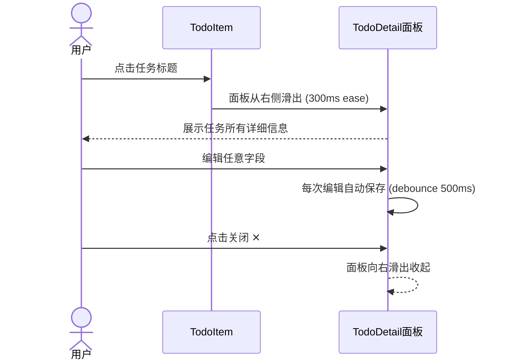

# GuYanTools Todo 功能 UI 设计文档

> **版本**：1.0
> **日期**：2026-03-23
> **文档状态**：草案

---

## 1. 设计原则

### 1.1 视觉风格

- **参考标杆**：Microsoft To Do 的交互和布局模式
- **融入项目风格**：复用 GuYanTools 现有的主题系统、字体配置、圆角/阴影风格
- **暗色/亮色适配**：所有组件适配现有的主题切换系统
- **微交互动画**：任务完成、添加、删除等操作均配有流畅的过渡动画

### 1.2 布局原则

- **左右分栏**：左侧侧边导航 + 右侧内容区
- **详情面板**：点击任务后右侧滑出详情面板（三栏布局）
- **响应式**：窗口缩小时侧边栏可折叠，详情面板自适应

---

## 2. 页面总体布局

### 2.1 布局结构图



### 2.2 布局尺寸规范

| 区域         | 宽度     | 最小宽度 | 最大宽度 | 说明               |
| ------------ | -------- | -------- | -------- | ------------------ |
| TodoSidebar  | 280px    | 240px    | 320px    | 可通过拖拽调整宽度 |
| 内容区       | flex: 1  | 400px    | -        | 自适应填充         |
| 详情面板     | 360px    | 300px    | 420px    | 点击任务时展开     |
| 快速添加栏   | 100%     | -        | -        | 固定在内容区底部   |

---

## 3. 组件详细设计

### 3.1 TodoSidebar（侧边导航栏）



#### 交互细节

| 操作                 | 行为                                              |
| -------------------- | ------------------------------------------------- |
| 点击智能列表项       | 切换右侧内容区到对应视图                         |
| 点击用户列表项       | 切换右侧内容区到该列表视图                       |
| 右键列表项           | 弹出上下文菜单（重命名/删除/移动到分组/颜色设置） |
| 拖拽列表项           | 调整列表排序，可拖入分组                         |
| 点击分组标题         | 折叠/展开分组                                     |
| 点击"新建列表"       | 在底部直接出现输入框，输入名称后创建              |
| 列表名称旁的 badge   | 显示该列表未完成任务数                            |

### 3.2 TodoItem（任务条目）

#### 布局结构

```
┌──────────────────────────────────────────────────────────┐
│ ○  任务标题                            ☆  📅 3/25      │
│    步骤 2/5                                              │
└──────────────────────────────────────────────────────────┘
```

| 元素             | 位置   | 说明                                            |
| ---------------- | ------ | ----------------------------------------------- |
| 完成复选框 `○`   | 左侧   | 圆形，点击切换完成状态，完成后变为 `✓` + 填充色 |
| 任务标题         | 中间   | 完成后添加删除线和降低透明度                     |
| 步骤进度         | 标题下 | 仅在有步骤时显示，如 "步骤 2/5"                 |
| 重要星标 `☆`     | 右侧   | 点击切换重要状态，重要时变为实心 `★`             |
| 截止日期标签     | 右侧   | 过期红色，今日橙色，未来灰色                     |
| 提醒图标 🔔      | 右侧   | 仅在设置了提醒时显示                             |
| 重复图标 🔄      | 右侧   | 仅在设置了重复时显示                             |

#### 交互动画

| 状态       | 动画效果                                |
| ---------- | --------------------------------------- |
| 新增       | 从上方滑入 + 淡入，duration: 300ms      |
| 完成       | 复选框弹性缩放 → 标题删除线从左到右扫过  |
| 删除       | 向右滑出 + 淡出，duration: 250ms        |
| 拖拽排序   | 被拖拽项浮起阴影，目标位置显示插入指示线 |
| hover      | 微微抬起 + 背景色变化                   |

### 3.3 TodoDetail（任务详情面板）

#### 布局结构



#### 各区域交互说明

##### 步骤列表 (StepList.vue)

- 每个步骤左侧有独立的完成复选框
- 支持拖拽排序步骤
- 底部"添加步骤"输入框，回车即添加
- 已完成步骤灰色显示，可选折叠

##### 提醒选择器 (RemindPicker.vue)

```
┌─────────────────────────────┐
│  ⏰ 提醒                    │
│  ├── 今天晚些时候 (18:00)   │
│  ├── 明天上午 (09:00)       │
│  ├── 下周一上午 (09:00)     │
│  ├── 自定义日期和时间...    │
│  └── ✕ 移除提醒            │
└─────────────────────────────┘
```

##### 截止日期选择器 (DatePicker.vue)

```
┌─────────────────────────────┐
│  📅 截止日期                 │
│  ├── 今天                   │
│  ├── 明天                   │
│  ├── 下周                   │
│  ├── 自定义日期...          │
│  │   ┌─────────────────┐   │
│  │   │   日历组件       │   │
│  │   └─────────────────┘   │
│  └── ✕ 移除截止日期        │
└─────────────────────────────┘
```

##### 重复选择器 (RepeatPicker.vue)

```
┌─────────────────────────────┐
│  🔄 重复                    │
│  ├── 每天                   │
│  ├── 每个工作日             │
│  ├── 每周                   │
│  ├── 每月                   │
│  ├── 每年                   │
│  ├── 自定义...              │
│  │   每 [N] [天/周/月]      │
│  └── ✕ 移除重复            │
└─────────────────────────────┘
```

### 3.4 QuickAdd（快速添加栏）

```
┌──────────────────────────────────────────────────────────────┐
│  ➕  添加任务                                         Enter │
└──────────────────────────────────────────────────────────────┘
```

| 功能       | 说明                                          |
| ---------- | --------------------------------------------- |
| 输入框     | placeholder "添加任务"，聚焦时高亮底边框       |
| Enter      | 提交任务，清空输入框，焦点保持                 |
| 快捷按钮   | 输入框右侧可选显示快捷设置（截止日期/提醒）   |
| 动画       | 新任务从输入框位置展开插入到列表中             |

### 3.5 YesterdayPrompt（昨日未完成提示）

#### 弹出时机

打开 Todo 功能，进入"我的一天"视图时，如果存在昨日未完成任务，自动弹出。

#### 布局

```
┌────────────────────────────────────────────────────────┐
│  ✨ 昨天有 3 个任务未完成                              │
│                                                        │
│  ○ 完成项目报告                                        │  [添加到今天]
│  ○ 回复客户邮件                                        │  [添加到今天]
│  ○ 更新文档                                            │  [添加到今天]
│                                                        │
│  [全部添加到今天]              [忽略]                   │
└────────────────────────────────────────────────────────┘
```

---

## 4. 视图页面设计

### 4.1 "我的一天" 视图 (MyDay.vue)



#### 特殊逻辑

- 问候语根据时间段变化（早上好/下午好/晚上好）
- 空状态：展示插画 + "今天还没有任务，添加一些吧！"
- 建议区域默认折叠，点击展开

### 4.2 列表视图 (ListView.vue)



### 4.3 "重要" 视图 (Important.vue)

- 展示所有 `is_important = true` 的未完成任务
- 按所属列表分组展示
- 每个任务条目右侧额外显示所属列表标签

### 4.4 "已计划" 视图 (Planned.vue)

- 按截止日期分组展示：过期 / 今天 / 明天 / 本周 / 以后
- 过期组使用红色组标题
- 今天组使用橙色组标题

---

## 5. 主题与样式

### 5.1 颜色体系

#### 亮色主题

| 用途             | 色值      | 说明                         |
| ---------------- | --------- | ---------------------------- |
| 主色调           | `#4A90D9` | 侧边栏选中态、按钮主色       |
| 完成色           | `#5B9BD5` | 复选框完成态                 |
| 重要色           | `#E8553D` | 星标填充色                   |
| 过期色           | `#D83B01` | 过期日期文字/标签            |
| 今日色           | `#F7A93B` | 今日到期标签                 |
| 背景色           | `#FAFBFC` | 内容区背景                   |
| 侧边栏背景       | `#F0F2F5` | 侧边导航背景                 |
| 分割线           | `#E5E7EB` | 各区域分隔                   |

#### 暗色主题

| 用途             | 色值      | 说明                         |
| ---------------- | --------- | ---------------------------- |
| 主色调           | `#6BA3D6` | 适配暗色对比度               |
| 完成色           | `#5B9BD5` | 保持一致                     |
| 背景色           | `#1E1E1E` | 内容区背景                   |
| 侧边栏背景       | `#252526` | 侧边导航背景                 |
| 分割线           | `#3E3E42` | 各区域分隔                   |

### 5.2 字体

- 标题：基于 `baseSize` 的 1.2x
- 正文 / 任务标题：`baseSize`
- 辅助信息（日期、步骤进度）：`baseSize` 的 0.85x
- 遵循项目的统一字体 (`useAppConfigStore` 中的字体配置)

### 5.3 间距

| 元素间距         | 大小   |
| ---------------- | ------ |
| 任务条目高度     | 52px   |
| 任务条目间距     | 2px    |
| 侧边栏项高度    | 36px   |
| 面板内边距       | 16px   |
| 组标题上方间距   | 24px   |

---

## 6. 关键交互流程

### 6.1 添加任务流程



### 6.2 完成任务流程



### 6.3 打开详情流程



---

## 7. 键盘快捷键

| 快捷键          | 功能                     |
| --------------- | ------------------------ |
| `Enter`         | 快速添加模式下提交任务   |
| `Escape`        | 关闭详情面板 / 退出编辑 |
| `Delete`        | 删除选中的任务           |
| `Ctrl+N`        | 新建任务                 |
| `Ctrl+Shift+N`  | 新建列表                 |
| `Ctrl+F`        | 聚焦搜索框               |
| `↑ / ↓`         | 在任务列表中导航         |
| `Space`         | 切换选中任务的完成状态   |

---

## 8. 空状态设计

| 场景               | 展示内容                                     |
| ------------------ | -------------------------------------------- |
| 我的一天无任务     | 插画 + "今天的任务列表是空的，添加些任务来规划你的一天吧" |
| 列表无任务         | 插画 + "这个列表还没有任务"                  |
| 搜索无结果         | 插画 + "没有找到匹配的任务"                  |
| 全部无任务         | 插画 + "太棒了！你已经完成了所有任务 🎉"     |
| 重要无任务         | 插画 + "标记重要的任务会出现在这里"         |
| 已计划无任务       | 插画 + "设置了截止日期的任务会出现在这里"   |

---

## 9. 无障碍 (Accessibility)

- 所有交互元素支持 Tab 焦点导航
- 复选框、按钮等有 `aria-label` 描述
- 颜色对比度满足 WCAG AA 标准
- 拖拽操作有替代的键盘操作方式
