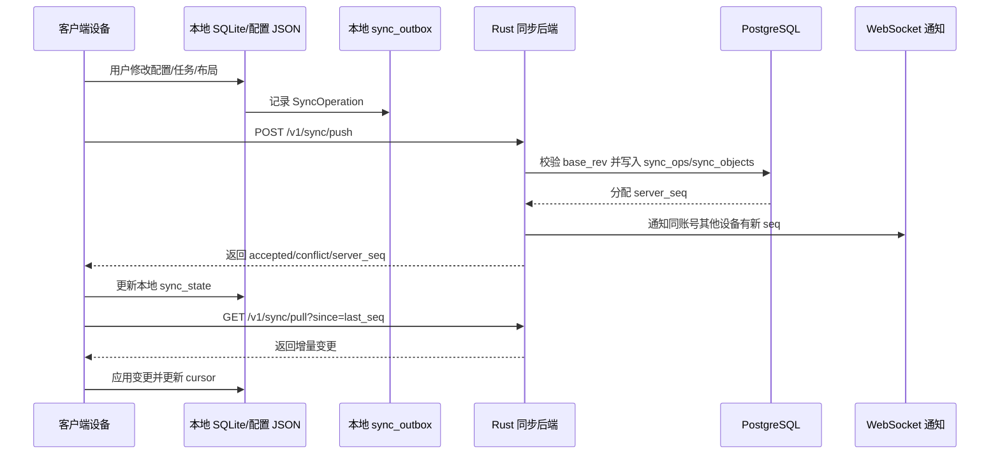

# GuYanTools 公网中转同步后端开发文档

## 1. 背景与概述

GuYanTools 目前已经具备本地优先的数据基础：桌面端使用 Electron/Vue，跨端核心能力沉淀在 `multi_platform_core`，本地数据主要落在 SQLite、统一配置 JSON、移动端 SharedPreferences / Rust bridge 数据中。现有多设备剪贴板已经覆盖局域网 mDNS 同步，但它不解决跨公网、异地设备、离线回放、账号级配置迁移等场景。

本开发文档用于规划一个公网部署的 Rust 中转后端服务，使 GuYanTools 能在多台设备之间同步个性化配置、首页布局、Todo、剪贴板历史、连接配置等数据。服务端不替代本地数据库，而是作为账号、设备、增量变更、冲突合并、资产中转和安全策略的协调层。

核心原则：

- 本地优先：客户端在离线状态下仍然完整可用。
- 增量同步：客户端只上传本地变更，只拉取上次游标之后的服务端变更。
- 数据分级：不同数据采用不同同步策略，凭据和隐私内容默认不上云。
- 安全默认：公网接口默认 HTTPS、账号隔离、设备级令牌、敏感数据端到端加密。
- 可分阶段上线：先同步低风险结构化数据，再扩展剪贴板、大文件和凭据类数据。

## 2. 当前项目数据面

### 2.1 已存在的数据来源

| 数据来源 | 当前载体 | 代表内容 | 同步价值 |
| --- | --- | --- | --- |
| 统一配置 JSON | `guyantools.config.json`，通过 `AppConfig` 管理 | 主题、语言、字体、快捷键、底栏、插件配置、WebView 安全、剪贴板配置 | 高 |
| Rust SQLite settings | `settings` 表 | 早期设置、版本、语言、主题等 | 中，后续应迁移到统一配置或兼容读取 |
| 首页布局 | `home_workspaces`、`home_categories`、`home_widgets`、`mobile_home_widget_layouts` | 工作区、分类、小组件、桌面/移动布局 | 高 |
| Todo | `todo_lists`、`todos`、`todo_steps`、`todo_reminders` | 列表、任务、步骤、提醒、重复规则 | 高 |
| 多设备剪贴板 | `multi_device_clipboard_devices`、`multi_device_clipboard_items` | 设备、剪贴板历史、文本/图片/文件元数据 | 中到高，需用户开启 |
| SSH | `ssh_profiles`、`ssh_profile_folders`、`ssh_credentials`、`ssh_known_hosts`、`ssh_managed_keys`、`ssh_port_forwards` | 连接配置、分组、转发、凭据、已信任主机 | 中，凭据高敏 |
| FTP/SFTP | `ftp_sessions`、`ftp_session_folders`、`ftp_credentials`、`ftp_filter_presets`、`ftp_scheduled_tasks`、`ftp_transfer_history`、`ftp_restore_state` | 连接配置、文件夹、过滤器、计划任务、历史和恢复状态 | 中，部分设备相关 |
| 插件系统 | `plugins` 表 + `AppConfig.plugins` | 插件注册、启用状态、插件 JSON 配置 | 中 |
| WebView 功能 | `AppConfig.web` | 黑白名单、注入脚本、保活域名、Chrome 扩展记录 | 中，存在安全风险 |

### 2.2 数据同步分级

| 级别 | 数据 | 默认策略 | 原因 |
| --- | --- | --- | --- |
| L1 安全结构化配置 | 主题、语言、字体、底栏、设置页个性化、首页布局、Todo | 默认同步 | 对跨设备迁移价值高，隐私风险可控 |
| L2 可选结构化配置 | 插件配置、WebView 白名单、SSH/FTP 元数据、过滤器、计划任务 | 用户开启后同步 | 可能含有工作环境、主机名、路径或脚本 |
| L3 内容与资产 | 剪贴板文本、图片、小文件、Todo 步骤图片、首页背景资源 | 按类型和大小限制同步 | 需要容量、隐私、生命周期和对象存储策略 |
| L4 高敏密钥与凭据 | SSH 密码、私钥 passphrase、FTP 密码、AI API Key、插件密钥 | 默认不同步；仅端到端加密同步 | 服务端不应能解密 |
| L5 强设备本地状态 | 窗口位置、当前 tab、传输历史、恢复状态、系统路径、临时缓存 | 不同步 | 与设备环境绑定，跨设备恢复容易造成误操作 |

## 3. 目标

- 提供一个可公网部署的 Rust 同步后端，支撑账号登录、设备注册、增量同步、资产上传、实时通知和基础运维。
- 让桌面端和移动端在不同网络下共享同一账号的数据。
- 首期完成低风险数据同步，包括 `AppConfig`、首页布局和 Todo。
- 逐步支持剪贴板公网中转、SSH/FTP 元数据、插件和 WebView 配置。
- 为凭据同步预留端到端加密能力，但不在未加密状态下上传敏感内容。
- 建立可测试、可审计、可回滚的同步协议和版本路线。

## 4. 非目标

- 不把服务端设计成远程主数据库；客户端仍以本地数据为主。
- 不在首版实现复杂 CRDT 文档编辑；首版使用变更日志、对象版本和领域合并策略。
- 不在首版同步 SSH/FTP 密码、私钥、AI API Key 等高敏数据。
- 不在首版同步插件二进制包、Chrome 扩展二进制或本地缓存。
- 不在首版实现多人协作、共享工作区或组织管理。
- 不在首版做强一致分布式事务；同步目标是最终一致。

## 5. 用户与角色

| 角色 | 任务 | 权限和限制 |
| --- | --- | --- |
| 普通用户 | 登录账号、绑定多台设备、同步配置和数据 | 只能访问本人账号下的数据 |
| 已信任设备 | 上传本地变更、拉取增量、接收实时通知 | 需要设备令牌；可被用户撤销 |
| 新设备 | 首次登录并导入云端数据 | 需要账号登录，必要时二次确认 |
| 服务端管理员 | 部署、维护、排障、观察容量与错误率 | 不应直接读取端到端加密内容 |
| 客户端同步模块 | 维护本地 outbox、sync cursor、冲突状态 | 不直接绕过 core/service 层改业务表 |

## 6. 总体架构

### 6.1 推荐技术栈

| 层 | 推荐方案 | 说明 |
| --- | --- | --- |
| Web 框架 | `axum` + `tokio` | Rust 异步 HTTP、WebSocket、middleware 生态成熟 |
| 数据库访问 | `sqlx` | 编译期 SQL 检查可后续启用，适合 PostgreSQL |
| 主数据库 | PostgreSQL | 保存用户、设备、同步对象、操作日志、游标 |
| 缓存/限流 | Redis | 登录限流、WebSocket 在线设备、短期通知队列 |
| 对象存储 | S3 / Cloudflare R2 / MinIO | 存剪贴板图片、文件、Todo 图片、背景资源 |
| 鉴权 | JWT access token + refresh token + device token | 用户会话和设备会话分层 |
| 密码存储 | Argon2id | 密码哈希，不保存明文 |
| 部署 | Docker Compose 起步，后续 Kubernetes 可选 | 公网服务器部署和迁移简单 |
| 可观测性 | tracing + OpenTelemetry + Prometheus metrics | 排查同步问题必须可追踪 |

### 6.2 服务划分

建议在仓库中新增独立 Rust 二进制 crate，例如：

```text
sync_server/
├── Cargo.toml
├── migrations/
├── src/
│   ├── main.rs
│   ├── config.rs
│   ├── app_state.rs
│   ├── auth/
│   ├── devices/
│   ├── sync/
│   ├── assets/
│   ├── ws/
│   ├── crypto/
│   ├── rate_limit/
│   └── observability/
└── README.md
```

不要放进 `multi_platform_core`。原因是 `multi_platform_core` 是客户端可复用核心库，面向 SQLite、NAPI 和 Flutter binding；公网服务端需要 PostgreSQL、HTTP、鉴权、对象存储、部署配置和运维依赖，边界不同。

### 6.3 客户端同步层

桌面端建议拆出同步模块：

```text
desktop/src/main/sync/
├── ipc.ts
├── sync_service.ts
├── sync_client.ts
├── sync_outbox.ts
├── sync_mapper.ts
├── conflict_resolver.ts
└── asset_uploader.ts
```

Rust core 建议补充同步元数据表和领域导出函数：

```text
multi_platform_core/migrations/0xx_add_sync_metadata.sql
multi_platform_core/src/sync/
multi_platform_core/src/models/sync.rs
multi_platform_core/src/services/sync_service.rs
```

移动端后续通过 Flutter 层复用同一 HTTP 协议和 Rust core 的同步元数据能力。

### 6.4 同步流程



## 7. 核心同步模型

### 7.1 Collection 设计

服务端用 `collection + object_id` 表示可同步对象：

| Collection | object_id 示例 | payload 类型 | 备注 |
| --- | --- | --- | --- |
| `app.appearance` | `default` | JSON object | 主题、语言、字体、字号 |
| `app.bottom_bar` | `default` | JSON object | 默认可见 tab |
| `app.shortcuts` | `windows` / `macos` / `linux` | JSON object | 平台隔离，避免快捷键冲突 |
| `app.features.terminal` | `default` | JSON object | 终端通用配置，路径字段需过滤 |
| `app.features.clipboard` | `default` | JSON object | 设备名、历史限制、最大同步大小 |
| `app.plugins.config` | `<plugin_id>` | JSON object | 插件宿主配置 |
| `home.workspace` | `<workspace_key>` | JSON object | 工作区 |
| `home.category` | `<category_id>` | JSON object | 分类 |
| `home.widget` | `<widget_id>` | JSON object | 小组件内容 |
| `home.widget_layout` | `<scope>:<widget_id>` | JSON object | 桌面/移动布局 |
| `todo.list` | `<list_id>` | JSON object | Todo 列表 |
| `todo.item` | `<todo_id>` | JSON object | Todo 主体 |
| `todo.step` | `<step_id>` | JSON object | Todo 步骤 |
| `todo.reminder` | `<reminder_id>` | JSON object | Todo 提醒 |
| `clipboard.item` | `<item_id>` | JSON object | 剪贴板历史元数据 |
| `ssh.folder` | `<folder_id>` | JSON object | SSH 分组 |
| `ssh.profile` | `<profile_id>` | JSON object | SSH 元数据，不含凭据 |
| `ssh.port_forward` | `<forward_id>` | JSON object | SSH 端口转发规则 |
| `ftp.folder` | `<folder_id>` | JSON object | FTP 分组 |
| `ftp.profile` | `<profile_id>` | JSON object | FTP 元数据，不含凭据 |
| `ftp.filter_preset` | `<preset_id>` | JSON object | 过滤预设 |
| `ftp.scheduled_task` | `<task_id>` | JSON object | 计划任务，设备路径需标记 |
| `web.security` | `default` | JSON object | 黑白名单 |
| `web.script` | `<script_id>` | JSON object | 注入脚本，用户显式开启 |
| `secret.encrypted_blob` | `<secret_id>` | encrypted payload | V4 后启用 |

### 7.2 操作模型

客户端上传的最小单位是操作，不是整库快照。

```json
{
  "opId": "device-uuid:000000000123",
  "deviceId": "device-uuid",
  "collection": "todo.item",
  "objectId": "todo-123",
  "opKind": "upsert",
  "baseRev": "srv_42",
  "clientRev": "local_1700000000_abc",
  "payload": {
    "title": "准备会议材料",
    "isCompleted": false,
    "updatedAt": 1700000000
  },
  "changedFields": ["title", "isCompleted"],
  "clientCreatedAt": 1700000000
}
```

操作类型：

| opKind | 含义 | 使用场景 |
| --- | --- | --- |
| `upsert` | 新建或整体更新对象 | 配置项、列表、布局、小组件 |
| `patch` | 字段级更新 | Todo 标题、备注、重要程度等 |
| `delete` | 软删除对象 | Todo、布局项、连接配置 |
| `restore` | 从 tombstone 恢复 | 用户撤销删除或冲突恢复 |
| `asset_attach` | 绑定对象存储资产 | 剪贴板图片、Todo 步骤图片、背景资源 |
| `secret_rotate` | 轮换加密密钥或凭据密文 | V4 凭据同步 |

### 7.3 服务端数据表草案

```sql
CREATE TABLE users (
  id UUID PRIMARY KEY,
  email TEXT NOT NULL UNIQUE,
  password_hash TEXT NOT NULL,
  display_name TEXT,
  created_at TIMESTAMPTZ NOT NULL DEFAULT now(),
  updated_at TIMESTAMPTZ NOT NULL DEFAULT now(),
  disabled_at TIMESTAMPTZ
);

CREATE TABLE devices (
  id UUID PRIMARY KEY,
  user_id UUID NOT NULL REFERENCES users(id) ON DELETE CASCADE,
  name TEXT NOT NULL,
  platform TEXT NOT NULL,
  app_version TEXT,
  public_key TEXT,
  trusted BOOLEAN NOT NULL DEFAULT false,
  revoked_at TIMESTAMPTZ,
  last_seen_at TIMESTAMPTZ,
  created_at TIMESTAMPTZ NOT NULL DEFAULT now(),
  updated_at TIMESTAMPTZ NOT NULL DEFAULT now()
);

CREATE TABLE sync_objects (
  user_id UUID NOT NULL REFERENCES users(id) ON DELETE CASCADE,
  collection TEXT NOT NULL,
  object_id TEXT NOT NULL,
  server_rev BIGINT NOT NULL,
  deleted BOOLEAN NOT NULL DEFAULT false,
  payload_json JSONB NOT NULL DEFAULT '{}'::jsonb,
  payload_hash TEXT NOT NULL,
  updated_by_device UUID REFERENCES devices(id),
  updated_at TIMESTAMPTZ NOT NULL DEFAULT now(),
  PRIMARY KEY (user_id, collection, object_id)
);

CREATE TABLE sync_ops (
  user_id UUID NOT NULL REFERENCES users(id) ON DELETE CASCADE,
  seq BIGSERIAL PRIMARY KEY,
  op_id TEXT NOT NULL,
  device_id UUID NOT NULL REFERENCES devices(id),
  collection TEXT NOT NULL,
  object_id TEXT NOT NULL,
  op_kind TEXT NOT NULL,
  base_rev BIGINT,
  resulting_rev BIGINT NOT NULL,
  payload_json JSONB NOT NULL DEFAULT '{}'::jsonb,
  conflict BOOLEAN NOT NULL DEFAULT false,
  created_at TIMESTAMPTZ NOT NULL DEFAULT now(),
  UNIQUE (user_id, device_id, op_id)
);

CREATE TABLE sync_cursors (
  user_id UUID NOT NULL REFERENCES users(id) ON DELETE CASCADE,
  device_id UUID NOT NULL REFERENCES devices(id) ON DELETE CASCADE,
  last_seq BIGINT NOT NULL DEFAULT 0,
  updated_at TIMESTAMPTZ NOT NULL DEFAULT now(),
  PRIMARY KEY (user_id, device_id)
);

CREATE TABLE sync_conflicts (
  id UUID PRIMARY KEY,
  user_id UUID NOT NULL REFERENCES users(id) ON DELETE CASCADE,
  collection TEXT NOT NULL,
  object_id TEXT NOT NULL,
  local_payload_json JSONB NOT NULL,
  server_payload_json JSONB NOT NULL,
  base_rev BIGINT,
  server_rev BIGINT NOT NULL,
  status TEXT NOT NULL DEFAULT 'pending',
  created_at TIMESTAMPTZ NOT NULL DEFAULT now(),
  resolved_at TIMESTAMPTZ
);

CREATE TABLE assets (
  id UUID PRIMARY KEY,
  user_id UUID NOT NULL REFERENCES users(id) ON DELETE CASCADE,
  owner_collection TEXT,
  owner_object_id TEXT,
  sha256 TEXT NOT NULL,
  byte_size BIGINT NOT NULL,
  mime_type TEXT,
  object_key TEXT NOT NULL,
  upload_status TEXT NOT NULL DEFAULT 'pending',
  expires_at TIMESTAMPTZ,
  created_at TIMESTAMPTZ NOT NULL DEFAULT now(),
  UNIQUE (user_id, sha256)
);
```

### 7.4 客户端本地同步元数据草案

```sql
CREATE TABLE sync_state (
  key TEXT PRIMARY KEY,
  value TEXT NOT NULL,
  updated_at TEXT NOT NULL DEFAULT (datetime('now'))
);

CREATE TABLE sync_outbox (
  id TEXT PRIMARY KEY,
  collection TEXT NOT NULL,
  object_id TEXT NOT NULL,
  op_kind TEXT NOT NULL,
  base_rev INTEGER,
  payload_json TEXT NOT NULL,
  changed_fields_json TEXT NOT NULL DEFAULT '[]',
  status TEXT NOT NULL DEFAULT 'pending',
  retry_count INTEGER NOT NULL DEFAULT 0,
  last_error TEXT,
  created_at TEXT NOT NULL DEFAULT (datetime('now')),
  updated_at TEXT NOT NULL DEFAULT (datetime('now'))
);

CREATE TABLE sync_object_state (
  collection TEXT NOT NULL,
  object_id TEXT NOT NULL,
  server_rev INTEGER,
  payload_hash TEXT,
  dirty INTEGER NOT NULL DEFAULT 0,
  deleted INTEGER NOT NULL DEFAULT 0,
  updated_at TEXT NOT NULL DEFAULT (datetime('now')),
  PRIMARY KEY (collection, object_id)
);
```

## 8. API 设计

### 8.1 鉴权与设备

```text
POST /v1/auth/register
POST /v1/auth/login
POST /v1/auth/refresh
POST /v1/auth/logout
GET  /v1/me

POST /v1/devices/register
GET  /v1/devices
PATCH /v1/devices/{device_id}
POST /v1/devices/{device_id}/trust
POST /v1/devices/{device_id}/revoke
```

注册设备请求：

```json
{
  "name": "ThinkPad X1",
  "platform": "windows",
  "appVersion": "0.1.0",
  "publicKey": "base64..."
}
```

设备注册响应：

```json
{
  "deviceId": "uuid",
  "deviceToken": "opaque-token",
  "trusted": true,
  "serverTime": "2026-05-26T12:00:00Z"
}
```

### 8.2 同步接口

```text
POST /v1/sync/bootstrap
POST /v1/sync/push
GET  /v1/sync/pull?since=<seq>&limit=<n>&collections=<csv>
POST /v1/sync/ack
GET  /v1/sync/conflicts
POST /v1/sync/conflicts/{id}/resolve
GET  /v1/sync/ws
```

`POST /v1/sync/push` 请求：

```json
{
  "deviceId": "uuid",
  "lastKnownSeq": 120,
  "ops": [
    {
      "opId": "uuid:121",
      "collection": "app.appearance",
      "objectId": "default",
      "opKind": "patch",
      "baseRev": 9,
      "payload": {
        "theme": "dark"
      },
      "changedFields": ["theme"],
      "clientCreatedAt": 1779782400
    }
  ]
}
```

响应：

```json
{
  "accepted": [
    {
      "opId": "uuid:121",
      "seq": 121,
      "serverRev": 10
    }
  ],
  "conflicts": [],
  "serverSeq": 121
}
```

`GET /v1/sync/pull` 响应：

```json
{
  "fromSeq": 120,
  "toSeq": 125,
  "hasMore": false,
  "changes": [
    {
      "seq": 121,
      "collection": "todo.item",
      "objectId": "todo-123",
      "opKind": "patch",
      "serverRev": 11,
      "deleted": false,
      "payload": {
        "title": "准备会议材料",
        "isCompleted": false
      },
      "updatedByDevice": "uuid",
      "updatedAt": "2026-05-26T12:00:00Z"
    }
  ]
}
```

### 8.3 资产接口

```text
POST /v1/assets/initiate
POST /v1/assets/complete
GET  /v1/assets/{asset_id}/download-url
DELETE /v1/assets/{asset_id}
```

设计规则：

- 小于 256KB 的文本类内容可以内联在同步 payload 中。
- 图片、文件、视频、Todo 步骤图片、首页背景资源走对象存储。
- 大文件使用 multipart upload。
- 客户端先计算 `sha256`，服务端按用户维度去重。
- 服务端返回预签名上传 URL，客户端直传对象存储。
- 同步操作只引用 `assetId`、`sha256`、`mimeType`、`byteSize`。
- 剪贴板资产可以设置 TTL；配置背景、Todo 图片等持久资产不自动过期。

## 9. 冲突处理策略

### 9.1 通用规则

- 每个对象都有 `server_rev`。
- 客户端上传时带 `base_rev`。
- `base_rev == server_rev`：直接应用。
- `base_rev < server_rev`：进入集合专属合并逻辑。
- 可自动合并则服务端合并并返回新 `server_rev`。
- 不可自动合并则写入 `sync_conflicts`，客户端展示冲突解决 UI。
- 删除使用 tombstone，不立即硬删，默认保留 30 到 90 天。

### 9.2 各数据类型策略

| 数据 | 策略 | 说明 |
| --- | --- | --- |
| `app.appearance` | 字段级 Last-Write-Wins | 主题、语言、字体互不影响 |
| `app.shortcuts` | 平台隔离 + 字段级合并 | Windows/macOS/Linux 单独对象 |
| `app.plugins.config` | 插件级合并，冲突保留双版本 | 插件 JSON 任意结构，不能盲目深合并 |
| `home.widget` | 字段级合并 | 名称、图标、动作、背景分开 |
| `home.widget_layout` | 位置冲突保留服务端优先，本地重排后再上传 | 避免两个设备同时拖拽导致重叠 |
| `todo.item` | 字段级合并 + 操作语义 | 完成、取消完成、移动列表要记录操作意图 |
| `todo.step` | 排序键合并 | 删除优先级高于修改 |
| `todo.reminder` | 时间点对象化 | 同一提醒 ID 更新，不同 ID 并存 |
| `clipboard.item` | append-only + hash 去重 | 不做文本内容冲突 |
| `ssh.profile` / `ftp.profile` | 元数据字段级合并 | host/username 改动冲突时保留双版本更安全 |
| `web.script` | 不自动合并脚本内容 | 脚本冲突必须人工确认 |
| `secret.encrypted_blob` | 版本替换，不服务端解密 | 只能按密文版本和设备授权处理 |

## 10. 安全与隐私设计

### 10.1 基础安全

- 全站只允许 HTTPS。
- Access token 短有效期，refresh token 长有效期并可撤销。
- 设备令牌与用户会话分离；用户改密码后可批量撤销设备。
- 登录、注册、刷新、资产上传初始化接口必须限流。
- PostgreSQL 所有业务表都带 `user_id`，查询必须按用户隔离。
- 服务端日志不得记录明文 token、密码、凭据、剪贴板正文或资产下载 URL。
- 所有同步接口支持幂等：`user_id + device_id + op_id` 唯一。

### 10.2 凭据同步规则

默认不同步：

- SSH 密码。
- SSH 私钥 passphrase。
- FTP/FTPS/SFTP 密码。
- AI Provider API Key。
- 插件密钥。
- 本地私钥文件内容。

V4 后可选开启端到端加密同步：

- 每个设备生成设备密钥对。
- 用户生成数据加密密钥 `user_data_key`。
- `user_data_key` 分别用每台可信设备公钥加密。
- 服务端只保存密文、nonce、key_version、授权设备列表。
- 新设备加入时，需要已有可信设备批准并重新包裹数据密钥。
- 设备撤销后，后续密钥轮换，不再为被撤销设备生成新的密钥包。

### 10.3 剪贴板隐私

- 公网剪贴板同步默认关闭。
- 首次开启必须展示隐私说明。
- 用户可以只同步文本，不同步图片/文件。
- 用户可以配置最大同步大小，不能超过 1GB。
- 支持“本机历史”和“云端同步历史”分开清理。
- 超限内容只保留本机历史，payload 中标记 `localOnly=true`。

## 11. 版本路线

### V0：技术准备与协议定稿

目标：在不改变现有业务行为的前提下，完成同步后端和客户端同步层的详细设计、基础工程骨架和可验证原型。

范围：

- 新增 `docs/plans/multi-device-sync-backend-development-plan.md`。
- 决定服务端 crate 位置、部署方式和环境变量规范。
- 定义 collection 命名、payload schema、错误码和 API 版本。
- 设计客户端同步元数据表。
- 梳理现有 `AppConfig`、首页布局、Todo、剪贴板、SSH/FTP 的字段过滤规则。
- 输出最小可跑的 `sync_server` hello health check 原型。

服务端任务：

- 初始化 `sync_server` crate。
- 添加 `axum`、`tokio`、`serde`、`tracing`、`sqlx` 基础依赖。
- 提供：
  - `GET /healthz`
  - `GET /readyz`
  - `GET /version`
- 增加配置读取：
  - `SYNC_DATABASE_URL`
  - `SYNC_REDIS_URL`
  - `SYNC_JWT_SECRET`
  - `SYNC_OBJECT_STORE_ENDPOINT`
  - `SYNC_OBJECT_STORE_BUCKET`
  - `SYNC_PUBLIC_BASE_URL`
- 建立 Dockerfile 和本地 docker compose 草案。

客户端任务：

- 不接入真实同步。
- 新增同步 collection 映射文档或 TypeScript 类型草案。
- 评估 `AppConfig` 哪些字段需要平台隔离。
- 评估首页背景、Todo 步骤图片等资产引用方式。

验收标准：

- `sync_server` 能本地启动并返回健康检查。
- 服务端配置缺失时给出明确错误。
- 文档列出首期所有 collection 和字段过滤规则。
- 不修改现有桌面端和移动端运行行为。

退出条件：

- API 草案冻结到 `v1`。
- 明确 V1 不做哪些内容。
- 确认 PostgreSQL、Redis、对象存储的部署选择。

### V1：账号、设备与同步基础设施

目标：搭建公网同步服务最小闭环，完成账号登录、设备注册、增量 push/pull、WebSocket 通知和客户端 outbox。

范围：

- 用户注册/登录。
- 设备注册、设备令牌、设备撤销。
- 同步基础表：`sync_objects`、`sync_ops`、`sync_cursors`。
- 客户端本地 outbox 和游标。
- 服务端只处理通用 JSON collection，不绑定具体业务 UI。
- 不同步大文件，不做端到端加密，不做复杂冲突 UI。

服务端任务：

- 实现数据库迁移：
  - `users`
  - `refresh_tokens`
  - `devices`
  - `sync_objects`
  - `sync_ops`
  - `sync_cursors`
  - `sync_conflicts`
- 实现 Auth：
  - 注册。
  - 登录。
  - 刷新 token。
  - 登出。
  - 密码哈希使用 Argon2id。
- 实现 Device：
  - 注册设备。
  - 获取设备列表。
  - 修改设备名。
  - 撤销设备。
- 实现 Sync：
  - `POST /v1/sync/push`
  - `GET /v1/sync/pull`
  - `POST /v1/sync/ack`
  - 幂等处理。
  - `limit` 分页。
  - collection 白名单。
- 实现 WebSocket：
  - 登录后连接。
  - 服务端发送 `sync.available` 事件。
  - 客户端断线后可以通过 pull 补齐。
- 实现错误码：
  - `AUTH_INVALID_TOKEN`
  - `AUTH_DEVICE_REVOKED`
  - `SYNC_COLLECTION_NOT_ALLOWED`
  - `SYNC_BASE_REV_CONFLICT`
  - `SYNC_PAYLOAD_TOO_LARGE`
  - `RATE_LIMITED`
  - `INTERNAL_ERROR`
- 增加基础观测：
  - 请求 tracing id。
  - 同步 push/pull 数量。
  - 冲突数量。
  - WebSocket 在线设备数。

桌面端任务：

- 新增登录状态存储，token 放在主进程安全存储或系统凭据容器优先，最低限度也必须避免 renderer 直接持有 refresh token。
- 新增同步设置入口：
  - 登录/登出。
  - 当前设备名。
  - 同步开关。
  - 最近同步时间。
  - 同步错误提示。
- 新增本地同步元数据表。
- 新增 outbox 写入和重试调度。
- 新增 sync client：
  - 自动 push pending outbox。
  - 定时 pull。
  - WebSocket 收到通知后触发 pull。
  - 断线退避重试。
- 新增 IPC contract：
  - `sync:get-status`
  - `sync:login`
  - `sync:logout`
  - `sync:enable`
  - `sync:disable`
  - `sync:trigger-now`
  - `sync:list-conflicts`
- 暂不把具体业务写入 outbox，只验证 `debug.echo` 或内部测试 collection。

移动端任务：

- 先不做 UI。
- 定义 Dart 同步客户端接口草案。
- 验证移动端可访问公网服务 health check。

测试任务：

- 服务端单元测试：
  - 密码哈希和校验。
  - JWT 生成和过期。
  - 设备撤销后拒绝同步。
  - push 幂等。
  - pull 分页。
- 服务端集成测试：
  - 两设备 A/B，同账号同步一条测试对象。
  - A 离线 push 后 B pull 能收到。
  - 重复提交同一 `opId` 不产生重复 `seq`。
- 桌面端测试：
  - 登录状态持久化。
  - outbox 失败重试。
  - 手动触发同步。

验收标准：

- 两个桌面客户端使用同一账号可以同步测试 collection。
- 断开 WebSocket 后仍可通过 pull 补齐。
- 撤销设备后该设备无法继续 push/pull。
- 重复 push 不产生重复数据。

### V2：同步个性化配置、首页布局与 Todo

目标：实现首批真实业务数据同步，覆盖最有价值且风险较低的结构化数据。

范围：

- `AppConfig` 中安全配置。
- 首页工作区、分类、小组件、桌面/移动布局。
- Todo 列表、任务、步骤、提醒。
- 基础冲突检测与自动合并。
- 不同步剪贴板文件资产，不同步 SSH/FTP 凭据。

同步内容：

| 模块 | Collection | 同步字段 | 排除字段 |
| --- | --- | --- | --- |
| 外观 | `app.appearance` | `theme`、`language`、`fontFamily`、`baseFontSize` | 本地字体不可用时客户端回退 |
| 底栏 | `app.bottom_bar` | `defaultVisibleTabIds` | 开发调试 tab 可按环境过滤 |
| 快捷键 | `app.shortcuts.<platform>` | 当前平台快捷键 | 其他平台不覆盖 |
| 设置页个性化 | `app.features.settings` | tab 背景色、图片/视频引用 | 本地绝对路径 |
| 剪贴板配置 | `app.features.clipboard` | `enabled`、`deviceName`、`maxSyncBytes`、`historyLimit` | `networkInterfacePriority` 可本机保留 |
| 首页 | `home.workspace`、`home.category`、`home.widget`、`home.widget_layout` | 结构、排序、布局、可见性、组件配置 | 本地不可访问的背景文件路径 |
| Todo | `todo.list`、`todo.item`、`todo.step`、`todo.reminder` | 完整业务字段 | 本地通知发送状态可本机保留 |

服务端任务：

- 为首批 collection 增加 schema 校验。
- 实现字段级合并：
  - `app.appearance`
  - `app.bottom_bar`
  - `todo.item`
- 实现 tombstone 保留策略。
- 增加 payload 大小限制：
  - 单个 JSON payload 默认不超过 512KB。
  - 超过限制需要资产接口或拆分对象。
- 增加 bootstrap：
  - 新设备首次登录时可拉取完整快照。
  - 已有设备只拉增量。
- 增加服务端 collection 版本：
  - `schemaVersion`
  - `minClientVersion`

桌面端任务：

- AppConfig：
  - 配置更新时写 outbox。
  - 远端配置应用时调用现有 `appConfigApi` 管理逻辑，避免绕过 normalize。
  - 处理平台快捷键隔离。
- 首页布局：
  - 分类新增、修改、删除写 outbox。
  - 小组件新增、修改、拖拽、隐藏写 outbox。
  - 移动端布局对象独立同步。
  - 背景图片/视频先只同步引用元数据，资产 V3 处理。
- Todo：
  - 列表 CRUD 写 outbox。
  - 任务 CRUD、完成、取消完成、移动列表写 outbox。
  - 步骤 CRUD、排序、完成写 outbox。
  - 提醒 CRUD 写 outbox。
  - 本地收到远端 Todo 变更后刷新 Todo store 和提醒 scheduler。
- 冲突 UI：
  - 首期只做同步状态页列出冲突。
  - 提供“保留本机版本”“采用云端版本”。

移动端任务：

- 首页布局：
  - 接入 bootstrap/pull。
  - 应用 `home.*` collection。
- Todo：
  - 若移动端 Todo 功能未完整接入，先只保留数据层，不显示 UI。
- 配置：
  - 同步移动端可用的剪贴板设置和主题设置。

迁移任务：

- 为本地表增加 sync state，不破坏现有数据。
- 首次开启同步时：
  - 扫描本地数据生成初始 outbox。
  - 对默认数据和用户真实数据做区分，避免把默认模板重复上传多次。
  - 新账号首台设备作为云端初始快照来源。
  - 新设备如果本地已有数据，必须提示“合并本机数据”或“使用云端覆盖”。

测试任务：

- 配置同步：
  - A 修改主题，B 自动变更。
  - A 修改字体，B 若字体不存在则回退但不污染云端。
- 首页同步：
  - A 新增小组件，B 出现。
  - A 拖拽位置，B 布局更新。
  - A 删除分类，B 对应小组件按现有业务规则处理。
- Todo 同步：
  - A 创建任务，B 收到。
  - B 完成任务，A 收到完成状态。
  - A/B 同时修改不同字段，自动合并。
  - A/B 同时修改标题，生成冲突。
- 离线同步：
  - A 离线创建 3 个任务，恢复网络后 B 收到 3 个任务。
  - 重复启动客户端不会重复上传初始数据。

验收标准：

- 同账号两台桌面端可以稳定同步配置、首页和 Todo。
- 新设备首次登录可选择拉取云端快照。
- 离线修改恢复网络后可以补齐。
- 冲突不会静默覆盖用户数据。

### V3：公网剪贴板中转与资产同步

目标：在现有局域网剪贴板能力之外，提供公网中转能力，支持跨网络文本、图片和小文件同步。

范围：

- 剪贴板文本同步。
- 剪贴板图片和文件资产上传。
- Todo 步骤图片和首页背景资源可复用资产接口。
- 云端剪贴板历史容量和 TTL。
- 用户可配置是否启用公网剪贴板同步。

同步内容：

| 类型 | 策略 |
| --- | --- |
| 普通文本 | 默认可同步，payload 可内联 |
| URL / Markdown / emoji 文本 | 内联，同步标签 |
| 图片 | 转为资产，payload 保存 `assetId`、预览、尺寸、hash |
| 小文件 | 资产上传，受 `maxSyncBytes` 限制 |
| 视频 | 按文件资产处理，不转码 |
| 超限文件 | 本机保留，云端记录可选 placeholder |
| 敏感剪贴板 | 由用户手动排除或后续规则识别 |

服务端任务：

- 实现资产表和对象存储适配：
  - S3-compatible provider。
  - 预签名上传 URL。
  - multipart upload。
  - sha256 去重。
  - upload complete 校验。
- 实现剪贴板 collection：
  - `clipboard.item`
  - `clipboard.asset_ref`
- 实现容量限制：
  - 单用户总容量。
  - 单资产大小。
  - 每日上传流量。
  - 剪贴板历史条数。
- 实现生命周期：
  - 文本历史保留策略。
  - 文件资产 TTL。
  - 删除剪贴板历史时清理孤儿资产。
- 增加下载 URL：
  - 短有效期。
  - 只允许本人账号。

桌面端任务：

- 设置页新增公网剪贴板选项：
  - 是否启用公网同步。
  - 同步文本。
  - 同步图片。
  - 同步文件。
  - 最大同步大小。
  - 云端保留天数。
- 剪贴板采集时：
  - 根据用户配置决定是否写云同步 outbox。
  - 内容 hash 去重。
  - 超限标记本机可用。
- 资产上传：
  - 先上传资产。
  - 上传完成后 push `clipboard.item`。
  - 失败时保留本地 pending 状态。
- 接收远端剪贴板：
  - 不自动覆盖系统剪贴板，除非用户开启“自动写入”。
  - 历史列表显示来源设备和云端状态。
  - 双击记录时按需下载资产。

移动端任务：

- 复用现有 clipboard controller：
  - 同步公网配置。
  - 手动导入/分享触发上传。
  - 后台限制下不强求自动采集。
- 支持文本同步优先。
- 图片/文件按平台权限逐步接入。

测试任务：

- 文本剪贴板：
  - A 复制文本，B 历史出现。
  - 重复复制相同文本不重复刷屏。
- 图片剪贴板：
  - A 复制图片，上传资产，B 可预览和写回。
- 文件剪贴板：
  - 小文件同步成功。
  - 超限文件只本地保存。
- 隐私：
  - 关闭公网剪贴板后不再上传。
  - 清空云端历史后其他设备不再拉到已删除内容。
- 容量：
  - 超过配额时返回明确错误。
  - 客户端展示可操作提示。

验收标准：

- 不同公网网络下两台设备可同步文本剪贴板。
- 图片和小文件通过对象存储中转，不经过 API 内联大 payload。
- 关闭公网剪贴板后不会继续上传新内容。
- 资产下载 URL 过期后不能继续访问。

### V4：SSH/FTP 元数据同步与端到端加密凭据

目标：同步服务器连接配置和分组，提高跨设备迁移效率；在用户明确开启时支持凭据端到端加密同步。

范围：

- SSH/FTP 分组。
- SSH/FTP 连接元数据。
- SSH 端口转发规则。
- FTP 过滤预设。
- FTP 计划任务。
- 端到端加密凭据框架。
- 不上传本地私钥文件，除非未来单独设计“托管密钥库”。

同步内容：

| 模块 | 默认同步 | 可选同步 | 不同步 |
| --- | --- | --- | --- |
| SSH Profile | label、host、port、username、authType、jumpHost、autoReconnect、color、tags、folderId | 加密后的密码/passphrase 引用 | known_hosts session trust、本地私钥文件内容 |
| SSH Port Forward | local/remote/dynamic 转发规则 | 无 | 当前运行状态 |
| FTP Profile | label、protocol、host、port、username、sshProfileId、默认路径、并发数、folderId | 加密后的密码/passphrase 引用 | 当前连接状态 |
| FTP Filter Preset | label、rulesJson | 无 | 无 |
| FTP Scheduled Task | label、direction、路径、cron、策略 | 按设备启用/禁用 | 最近运行结果、传输历史 |

服务端任务：

- 增加 `ssh.*`、`ftp.*` collection schema。
- 增加端到端加密密钥表：
  - `device_public_keys`
  - `user_key_envelopes`
  - `encrypted_secrets`
  - `secret_access_grants`
- 实现密钥流程：
  - 设备上传公钥。
  - 首台设备创建用户数据密钥。
  - 新设备请求加入。
  - 已信任设备批准并为新设备生成 key envelope。
  - 设备撤销后触发 key rotation 提醒。
- 凭据密文 payload：
  - `secretId`
  - `ciphertext`
  - `nonce`
  - `algorithm`
  - `keyVersion`
  - `allowedDeviceIds`
- 服务端不提供解密接口。

桌面端任务：

- SSH/FTP store 写入 outbox：
  - 创建/更新/删除连接配置。
  - 创建/更新/删除分组。
  - 拖拽排序。
  - 创建/更新/删除端口转发。
  - 创建/更新/删除 FTP 过滤预设和计划任务。
- 字段过滤：
  - 本地绝对路径标记为设备本地字段。
  - 凭据字段默认跳过。
  - 用户开启凭据同步后写密文 blob。
- UI：
  - 同步设置页增加“连接配置同步”。
  - 单独提供“同步连接凭据”开关。
  - 开启凭据同步前展示风险说明。
  - 新设备加入需要确认。

移动端任务：

- 如果移动端未支持 SSH/FTP，只保存数据但不展示。
- 后续移动端支持时再读取同一 collection。

测试任务：

- SSH/FTP 元数据：
  - A 新建 SSH Profile，B 出现但无明文密码。
  - A 修改分组，B 树结构更新。
  - A 删除 Profile，B 删除并清理关联分组映射。
- 凭据加密：
  - 服务端数据库只看到密文。
  - 未授权设备无法解密。
  - 撤销设备后不能获取新的 key envelope。
- 路径处理：
  - Windows 本地路径不会污染 macOS/Linux 设备。
  - FTP 计划任务中的本地路径在新设备上标记为需确认。

验收标准：

- 连接配置可跨设备恢复基础信息。
- 默认情况下不上传任何明文凭据。
- 开启凭据同步后服务端仍不可解密。
- 新设备没有授权时不能读取旧凭据。

### V5：插件、WebView、AI 配置与高级运维

目标：扩展到更高风险、更复杂的配置同步，并补齐生产运维能力。

范围：

- 插件配置。
- 插件启用状态。
- WebView 黑白名单。
- WebView 注入脚本。
- AI Provider 配置。
- 生产监控、审计、数据导出、账号删除。

同步内容：

| 模块 | 策略 |
| --- | --- |
| 插件配置 | 按 pluginId 分对象；不自动合并复杂 JSON |
| 插件启用状态 | 只同步启用/禁用和配置，不同步插件包 |
| WebView 黑白名单 | 默认可选同步 |
| WebView 注入脚本 | 高风险，用户明确开启；冲突需人工确认 |
| Chrome 扩展记录 | 只同步元数据，不同步扩展目录 |
| AI Provider | Provider 名称、baseUrl、模型列表可同步；API Key 走端到端加密 |

服务端任务：

- 增加 collection：
  - `app.plugins.config`
  - `app.plugins.state`
  - `web.security`
  - `web.script`
  - `ai.provider`
  - `ai.model_config`
- 增加审计日志：
  - 登录。
  - 设备注册/撤销。
  - 凭据同步开启/关闭。
  - 大批量删除。
  - 数据导出。
- 增加账号操作：
  - 导出全部云端数据。
  - 删除账号。
  - 删除指定 collection。
  - 清空剪贴板云端历史。
- 增加后台任务：
  - 清理过期 tombstone。
  - 清理孤儿资产。
  - 统计用户容量。
  - 刷新物化统计。

客户端任务：

- 插件配置同步：
  - `AppConfig.plugins.items[pluginId]` 写 outbox。
  - 插件不存在时保留配置但标记“未安装”。
- WebView 配置同步：
  - 黑白名单同步。
  - 脚本同步需要风险提示。
  - 远端脚本变更默认不立即注入，需用户确认或信任策略。
- AI 配置同步：
  - Provider 元数据同步。
  - API Key 使用 V4 密钥能力。
- 同步管理页增强：
  - 每个 collection 独立开关。
  - 最近同步记录。
  - 冲突列表。
  - 容量使用。
  - 清理云端数据。

测试任务：

- 插件配置：
  - A 修改插件 JSON 配置，B 收到。
  - B 未安装该插件时不报错。
- WebView：
  - 黑名单同步后立即生效。
  - 注入脚本冲突进入人工确认。
- AI：
  - Provider 元数据同步。
  - API Key 不以明文出现在服务端日志和数据库。
- 运维：
  - 删除账号后数据和资产进入删除队列。
  - tombstone 到期后被清理。
  - 用户可导出云端 JSON。

验收标准：

- 用户能细粒度控制每类数据是否同步。
- 高风险脚本和密钥类数据不会静默同步。
- 服务端具备生产排障所需的审计和指标。

## 12. 客户端实现细节

### 12.1 本地变更捕获

不要在 UI 组件里直接拼同步 payload。应在 service/store 边界捕获业务操作：

- `AppConfigManager.updateConfig` 成功后生成配置 operation。
- `HomeLayoutService` CRUD 成功后生成 home operation。
- `TodoService` CRUD 成功后生成 todo operation。
- SSH/FTP profile service 成功后生成 profile operation。
- 剪贴板服务采集新内容后生成 clipboard operation。

这样可以避免同一业务在多个 UI 入口被遗漏。

### 12.2 远端变更应用

远端变更必须走现有业务 service 或专门的 import/apply 方法，不应直接写底层表：

- 可以复用已有 normalize 和数据校验。
- 可以触发现有 store 刷新。
- 可以保持迁移和默认值一致。
- 可以避免绕过业务级副作用，例如 Todo 提醒 scheduler。

### 12.3 初次开启同步

需要明确处理三种情况：

1. 云端为空，本机有数据：本机作为初始快照来源。
2. 云端有数据，本机为空：拉取云端快照。
3. 云端和本机都有数据：用户选择“合并”或“使用云端覆盖本机”。

合并时建议：

- 对有稳定 ID 的对象按 ID 合并。
- 对默认模板数据避免重复创建。
- 对标题相同但 ID 不同的 Todo 不自动合并，避免误删用户数据。
- 首页小组件冲突时保留双份或进入冲突列表。

### 12.4 同步状态 UI

至少展示：

- 当前账号。
- 当前设备名。
- 同步总开关。
- 每类数据同步开关。
- 最近成功同步时间。
- 当前 pending outbox 数量。
- 最近错误。
- 冲突数量。
- 云端容量使用。
- 手动同步按钮。

状态建议：

| 状态 | 含义 |
| --- | --- |
| `disabled` | 用户未开启同步 |
| `signed_out` | 未登录 |
| `idle` | 已同步，无待处理 |
| `syncing` | 正在 push/pull |
| `offline` | 网络不可达，等待重试 |
| `conflict` | 存在需要处理的冲突 |
| `error` | 最近同步失败 |
| `device_revoked` | 当前设备被撤销 |

## 13. 服务端实现细节

### 13.1 事务边界

`POST /v1/sync/push` 每批操作应在事务中处理，但不能因为单个冲突回滚整个批次。

建议策略：

- 校验整批请求格式。
- 对每个 op 逐条处理。
- 已接受操作写入 `sync_ops`。
- 冲突操作写入 `sync_conflicts`。
- 同一事务提交 accepted/conflict 结果。
- 响应中分别返回 accepted、conflicts、rejected。

### 13.2 幂等

幂等键：

```text
user_id + device_id + op_id
```

重复请求：

- 如果之前已 accepted，返回原来的 `seq` 和 `serverRev`。
- 如果之前产生 conflict，返回原 conflict。
- 如果 payload hash 不一致，返回 `SYNC_IDEMPOTENCY_PAYLOAD_MISMATCH`。

### 13.3 分页与回放

Pull 接口必须支持：

- `since`：客户端已确认的最大 seq。
- `limit`：默认 500，最大 2000。
- `collections`：按 collection 过滤。
- `excludeDeviceId`：可选排除自己设备的回声，默认仍建议返回统一流，客户端可去重。

如果 `since` 太旧，服务端已清理对应操作：

- 返回 `SYNC_CURSOR_EXPIRED`。
- 客户端执行 bootstrap 或 collection 级重新拉取。

### 13.4 删除策略

- 业务删除先变成 tombstone。
- tombstone 保留期默认 90 天。
- 客户端 pull 到 tombstone 后删除本地对象或标记删除。
- tombstone 到期后服务端可硬删，但需要记录最低兼容 seq。

### 13.5 限流和配额

建议首期限制：

| 项 | 默认值 |
| --- | --- |
| 登录尝试 | 每 IP 每 10 分钟 20 次 |
| 注册 | 每 IP 每小时 5 次 |
| push ops | 每设备每分钟 3000 条 |
| 单 payload | 512KB |
| 单用户对象数 | 首期 100000 |
| 单文件资产 | 用户配置值，硬上限 1GB |
| 单用户云资产 | 初始 5GB，可配置 |
| WebSocket 连接 | 每设备 1 条活跃连接 |

## 14. 部署与运维

### 14.1 环境变量

```text
SYNC_ENV=production
SYNC_BIND_ADDR=0.0.0.0:8080
SYNC_PUBLIC_BASE_URL=https://sync.example.com
SYNC_DATABASE_URL=postgres://...
SYNC_REDIS_URL=redis://...
SYNC_JWT_SECRET=...
SYNC_REFRESH_TOKEN_SECRET=...
SYNC_ARGON2_MEMORY_COST=...
SYNC_OBJECT_STORE_ENDPOINT=...
SYNC_OBJECT_STORE_REGION=...
SYNC_OBJECT_STORE_BUCKET=...
SYNC_OBJECT_STORE_ACCESS_KEY=...
SYNC_OBJECT_STORE_SECRET_KEY=...
SYNC_CORS_ALLOWED_ORIGINS=...
SYNC_LOG_LEVEL=info
```

### 14.2 健康检查

| 接口 | 用途 |
| --- | --- |
| `GET /healthz` | 进程存活 |
| `GET /readyz` | 数据库、Redis、对象存储可用 |
| `GET /metrics` | Prometheus 指标 |
| `GET /version` | 服务端版本和 git commit |

### 14.3 指标

至少采集：

- HTTP 请求数、耗时、错误率。
- push ops 数量。
- pull changes 数量。
- conflict 数量。
- WebSocket 在线设备数。
- asset 上传成功/失败数量。
- 对象存储容量。
- 每用户容量排名。
- token refresh 次数。
- 设备撤销次数。

### 14.4 日志

日志必须包含：

- request id。
- user id hash。
- device id hash。
- endpoint。
- status code。
- duration。
- sync batch size。
- error code。

日志不得包含：

- 密码。
- refresh token。
- device token。
- 明文凭据。
- 剪贴板正文。
- 预签名下载 URL。
- 对象存储密钥。

## 15. 测试策略

### 15.1 服务端测试

| 类型 | 内容 |
| --- | --- |
| 单元测试 | 合并策略、payload 校验、token、密码哈希、限流 key |
| 集成测试 | PostgreSQL 迁移、push/pull、设备撤销、冲突、分页 |
| 安全测试 | 未授权访问、跨用户访问、token 过期、设备撤销 |
| 压力测试 | 大批量 Todo、连续 outbox、WebSocket 通知 |
| 资产测试 | 预签名上传、complete 校验、下载 URL 过期、孤儿清理 |

### 15.2 客户端测试

| 类型 | 内容 |
| --- | --- |
| Rust core 测试 | sync metadata、outbox、collection mapper |
| Electron main 测试 | sync service、token 存储、IPC、重试调度 |
| Renderer 测试 | 设置页状态、冲突处理、手动同步 |
| 端到端测试 | 两个本地 profile 模拟两台设备 |
| 离线测试 | 断网修改、恢复网络、游标补齐 |

### 15.3 回归场景

- 老版本客户端不认识新 collection 时必须跳过而不是崩溃。
- 服务端返回 `SYNC_CURSOR_EXPIRED` 时客户端能重新 bootstrap。
- 设备撤销后客户端显示明确状态并停止上传。
- 用户登出后本地数据保留，但云同步停止。
- token 刷新失败后不丢 outbox。
- 同一对象连续修改 100 次后最终状态正确。

## 16. 数据迁移与兼容

### 16.1 本地迁移

新增迁移只增加同步元数据，不改变现有业务表含义：

- `sync_state`
- `sync_outbox`
- `sync_object_state`
- `sync_conflict_cache`

业务表如需增加字段，优先增加：

- `sync_rev`
- `sync_dirty`
- `deleted_at`

但首期可以通过单独 `sync_object_state` 避免大范围改业务表。

### 16.2 服务端 schema 兼容

- 每个 payload 带 `schemaVersion`。
- 服务端接受当前版本和前一个兼容版本。
- 客户端遇到未知字段保留或忽略，不应删除。
- 删除字段需要两阶段：
  - 第一阶段停止写入。
  - 第二阶段服务端迁移清理。

### 16.3 客户端版本兼容

- 服务端可以按 `appVersion` 返回 `minClientVersion`。
- 老客户端不支持的 collection 不下发，或下发时标记可忽略。
- 客户端升级后可以执行 collection bootstrap。

## 17. 风险与缓解

| 风险 | 影响 | 缓解 |
| --- | --- | --- |
| 冲突策略过于粗糙导致数据覆盖 | 用户数据丢失 | tombstone、冲突列表、字段级合并、可导出备份 |
| 凭据误上传 | 严重安全问题 | 默认不同步、字段白名单、测试断言、端到端加密 |
| 剪贴板隐私泄露 | 严重信任问题 | 默认关闭、明确开关、内容类型选择、日志脱敏 |
| 资产成本失控 | 服务器费用上升 | 配额、TTL、去重、对象生命周期清理 |
| 多端默认数据重复 | 首页/Todo 混乱 | 首次同步区分默认模板和用户数据 |
| WebSocket 不稳定 | 实时性下降 | WebSocket 只做通知，pull 才是权威 |
| 本地路径跨平台不可用 | 功能异常 | 本地路径字段设备隔离，新设备标记需确认 |
| 老版本客户端破坏新数据 | 兼容问题 | collection schemaVersion、minClientVersion |

## 18. 验收总清单

### V1 验收

- 用户可以注册、登录、刷新 token、登出。
- 用户可以注册和撤销设备。
- 两台设备可以同步测试 collection。
- push 幂等、pull 分页、WebSocket 通知可用。
- 被撤销设备不能继续同步。

### V2 验收

- 主题、语言、字体、底栏配置可同步。
- 首页分类、小组件、布局可同步。
- Todo 列表、任务、步骤、提醒可同步。
- 离线修改恢复后可补齐。
- 同字段冲突不会静默覆盖。

### V3 验收

- 公网文本剪贴板可同步。
- 图片和小文件走对象存储。
- 超限内容保留本地并清晰提示。
- 云端剪贴板可清理。
- 关闭公网剪贴板后停止上传。

### V4 验收

- SSH/FTP 元数据可同步。
- 凭据默认不上云。
- 开启凭据同步后服务端只保存密文。
- 新设备必须被授权才能解密凭据。

### V5 验收

- 插件配置和 WebView 安全配置可按开关同步。
- WebView 注入脚本冲突必须人工确认。
- AI Provider API Key 走端到端加密。
- 账号删除、数据导出、云端容量统计可用。

## 19. 待确认问题

- 同步服务是否作为当前仓库的 `sync_server/` crate 维护，还是拆到独立仓库。
- 首期是否必须支持移动端 UI，还是只保证协议和数据层兼容。
- 公网服务是否只面向个人自部署，还是未来提供多用户 SaaS。
- 对象存储选择 S3、R2、MinIO 还是服务器本地磁盘。
- 账号系统是否需要第三方登录。
- 是否需要“端到端加密所有云端数据”，还是只加密凭据和剪贴板内容。
- 剪贴板云端历史默认保留多久。
- 免费/自用场景下每用户容量和设备数量限制是多少。

## 20. 建议的下一步

1. 确认服务端代码位置和部署目标。
2. 确认 V1 是否只做桌面端，移动端是否延后到 V2/V3。
3. 冻结 V1 API 和数据表。
4. 创建 `sync_server` crate 和 PostgreSQL 迁移。
5. 在桌面端实现同步设置页和测试 collection。
6. 使用两个本地用户数据目录模拟两台设备做端到端验证。
