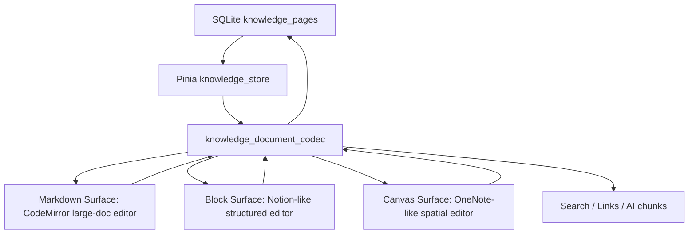
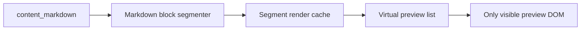

# 知识库编辑器架构设计：Markdown WYSIWYG、块编辑与画布编辑

日期：2026-05-30

## 1. 背景与目标

GuYanTools 知识库当前已经具备三类页面：`markdown`、`block`、`canvas`。数据库层的 `knowledge_pages` 同时保存 `content_markdown`、`content_json`、`content_text`，这说明当前系统已经不是单纯的 Markdown 编辑器，而是一个可以承载多种文档表面的知识库文档系统。

本设计要解决四个目标：

1. Markdown 页面提供类似 Typora 的所见即所得体验。
2. Markdown 页面支持几万行到十万行级别文档的编辑和渲染。
3. 块页面提供类似 Notion 的结构化格式编辑体验。
4. 画布页面提供类似 OneNote 的自由排版、截图批注、手写/图形组织体验。

关键约束：

1. 现有桌面端是 Electron + Vite + Vue 3 + TypeScript + Pinia + SCSS。
2. 当前 Markdown 编辑基于 CodeMirror 6，已经接入 `@codemirror/lang-markdown`、`@codemirror/view`、`@codemirror/state` 等包。
3. 当前项目已有 `KnowledgeMarkdownEditor.vue`、`KnowledgeBlockEditor.vue`、`KnowledgeCanvasEditor.vue` 三个编辑表面。
4. 不应为了一个目标牺牲另一个目标：Typora-like、大文档、Notion-like、OneNote-like 不适合强行压进同一个编辑器内核。

## 2. 当前实现判断

当前 Markdown 编辑器的核心在 `desktop/src/windows/main/pages/Knowledge/components/KnowledgeMarkdownEditor.vue`：

- 使用 CodeMirror 6 创建编辑器视图。
- 支持 `edit`、`split`、`preview` 三种模式。
- 使用 `marked.parse()` 生成预览 HTML。
- 使用 `v-html` 挂载完整预览。
- 支持基础插入工具、frontmatter、wiki link、callout、math、mermaid 占位渲染、导出。

当前块编辑器的核心在 `desktop/src/windows/main/pages/Knowledge/components/KnowledgeBlockEditor.vue`：

- 使用 Vue 表单控件直接渲染块。
- 文档结构由 `KnowledgeBlockDocument` 承载。
- 支持 heading、paragraph、list、task、code、quote、callout、image、attachment。
- `knowledge_blocks.ts` 已提供 Markdown 导入导出、plain text 派生和 JSON 序列化。

当前画布编辑器的核心在 `desktop/src/windows/main/pages/Knowledge/components/KnowledgeCanvasEditor.vue`：

- 使用 SVG 作为画布。
- 支持 text、image、rect、arrow、path。
- 文档结构由 `KnowledgeCanvasDocument` 承载。
- `knowledge_canvas.ts` 已提供 Markdown 摘要导出、plain text 派生和 JSON 序列化。

当前 store 的核心在 `desktop/src/windows/main/stores/knowledge_store.ts`：

- Markdown 页面以 `content_markdown` 为主。
- Block 页面以 `content_json` 为主，同时派生 `content_markdown` 和 `content_text`。
- Canvas 页面以 `content_json` 为主，同时派生 `content_markdown` 和 `content_text`。

这说明推荐方向不是“换掉 CodeMirror”，而是把当前三个编辑器演进成明确分层的文档系统。

## 3. 总体架构

推荐架构是“三编辑表面 + 统一文档协议 + 派生内容管线”。



三种页面的主存储策略：

| 页面类型 | 主存储 | 派生 Markdown | 派生 Text | 适合场景 |
| --- | --- | --- | --- | --- |
| `markdown` | `content_markdown` | 原文 | Markdown 去格式文本 | 长文、技术文档、源码友好笔记 |
| `block` | `content_json` | 有损/半有损导出 | 可搜索纯文本 | Notion-like 结构化知识页 |
| `canvas` | `content_json` | 摘要导出 | 可搜索纯文本 | OneNote-like 自由画布 |

核心原则：

1. Markdown 页面追求“大、快、原文保真”。
2. Block 页面追求“结构化编辑效率和可编程块操作”。
3. Canvas 页面追求“空间组织、视觉批注和多媒体排版”。
4. `content_text` 是搜索、AI chunk、预览摘要的统一入口。
5. `content_markdown` 是导出、跨工具互通、AI 上下文的统一入口，但不是 block/canvas 的无损主存储。
6. `content_json` 是复杂编辑器的无损主存储。

## 4. 技术选型

### 4.1 Markdown 大文档底座：CodeMirror 6

结论：继续使用 CodeMirror 6。

理由：

1. CodeMirror 官方文档说明，它为了支持大文档，只会把可见代码和边缘缓冲绘制到 DOM；`EditorView.viewport` 和 `EditorView.visibleRanges` 可用于只处理可见范围。
2. CodeMirror 的 extension、ViewPlugin、Decoration、WidgetType、StateField 可以支持渐进式 Typora-like 显示。
3. 当前项目已经依赖 CodeMirror 6，迁移成本最低。
4. CodeMirror 的文本模型适合 Markdown 原文保真、十万行滚动、搜索、源码模式、键盘操作。

官方依据：

- CodeMirror reference: https://codemirror.net/docs/ref/
- CodeMirror system guide: https://codemirror.net/docs/guide/
- CodeMirror decoration example: https://codemirror.net/examples/decoration/

要使用的 CodeMirror 技术点：

1. `EditorView.visibleRanges`
   - 只在真实可见范围内计算 Markdown 装饰。
   - 避免每次输入、滚动都遍历全文。

2. `ViewPlugin`
   - 维护 Typora-like inline preview decorations。
   - 在 `docChanged`、`viewportChanged`、Markdown syntax tree 变化时增量更新。

3. `Decoration.mark`
   - 用于标题、粗体、斜体、删除线、inline code 的样式化。
   - 不改变文档结构，不影响大文档性能。

4. `Decoration.replace`
   - 用于隐藏 Markdown 语法标记，例如 `**bold**` 中的 `**`。
   - 只在光标不在对应语法节点中时启用。
   - 光标进入后恢复 Markdown 原文，避免编辑困难。

5. `Decoration.widget`
   - 用于图片预览、链接卡片、任务复选框、callout 标签、数学公式占位、mermaid 占位。
   - 块级 widget 必须谨慎使用，因为官方文档明确提到会显著改变垂直布局的 decorations 需要直接提供，且会影响 viewport 计算。

6. `EditorView.atomicRanges`
   - 对图片、wiki link chip、任务复选框等替换范围提供原子移动行为。
   - 避免用户用方向键进入不可见 Markdown token 中间造成体验断裂。

7. `syntaxTree` from `@codemirror/language`
   - 基于 Lezer Markdown parse tree 定位标题、列表、链接、代码块等。
   - 避免使用复杂正则扫描全文。

8. `Compartment`
   - 动态切换 `source`、`split`、`preview`、`wysiwyg`、`focus`、`typewriter` 等模式。
   - 避免销毁重建 EditorView。

9. `StateField`
   - 保存编辑器级状态，例如折叠块、渲染缓存 key、当前 hover block、当前 active syntax node。

10. `requestIdleCallback` / chunked scheduler
   - 用于非关键路径的全文 outline、字数统计、链接扫描。
   - 输入路径只做可见范围和必要状态更新。

不做的事：

1. 不在 Markdown 页面中引入完整 ProseMirror 文档模型作为主编辑模型。
2. 不在每次输入时对全文 `marked.parse()`。
3. 不在 DOM 中渲染十万行预览。
4. 不把 Typora-like 模式做成真正富文本存储；存储仍是 Markdown 原文。

### 4.2 Markdown 预览渲染：分块 Markdown 渲染管线

当前 `previewHtml = marked.parse(fullDocument)` 是大文档性能瓶颈。推荐改为分块管线：



技术点：

1. 分块器 `markdown_segmenter`
   - 按 block boundary 切分 Markdown：heading、paragraph、list、blockquote、code fence、table、math block、html block。
   - 每个 segment 有稳定 id、startLine、endLine、startOffset、endOffset、type、hash。
   - code fence、table、blockquote 不跨 segment 错切。

2. 渲染缓存 `markdown_render_cache`
   - key 使用 `segment.hash + rendererVersion + themeKey`。
   - 文档局部编辑时只重渲染受影响 segment。
   - 大文档初次加载按 viewport 优先，后台逐步补足。

3. 虚拟列表
   - 渲染预览时只挂载 viewport 附近的 segment。
   - 可以先用自研轻量 virtual scroller，不立刻加新依赖。
   - 每个 segment 初始高度估算，实际渲染后测量并更新。

4. 双向定位
   - CodeMirror offset/line 映射到 segment id。
   - 预览滚动映射回 CodeMirror line。
   - split 模式同步滚动不按百分比，而按 segment anchor。

5. 安全渲染
   - 保留现有 HTML sanitize 逻辑。
   - 对链接、图片、附件协议继续使用 `app://knowledge-assets/...` 白名单。
   - 禁止 script、iframe、event handler、危险 data URL。

推荐继续使用 `marked` 作为初期 Markdown renderer，因为当前项目已经依赖。后续如果要更强 AST 处理，可引入 unified/remark/rehype，但这属于新增依赖，应在单独阶段评估。

### 4.3 Typora-like 所见即所得模式

Typora-like 模式不是单独文档格式，而是 Markdown 页面的第四种显示模式：`source`、`split`、`preview`、`wysiwyg`。

核心交互：

1. 光标所在块显示 Markdown 原文。
2. 非光标块显示接近最终渲染的视觉形态。
3. 常见 Markdown 标记在非编辑状态隐藏或弱化。
4. 所有保存内容仍是 `content_markdown`。
5. 所有编辑命令仍通过 CodeMirror transaction 修改 Markdown 文本。

首批支持范围：

1. Heading
   - `#` token 在非 active line 隐藏。
   - 行文本按 H1-H6 样式显示。
   - active line 恢复源码。

2. Emphasis
   - `**bold**`、`*italic*`、`~~delete~~` 隐藏边界 token。
   - 内部文字使用 mark decoration。

3. Inline code
   - 隐藏反引号。
   - 内容显示 code chip 样式。

4. Link
   - `[text](url)` 非 active 状态显示为可点击 link chip。
   - active 状态恢复源码。
   - Ctrl/Meta click 打开链接。

5. Wiki link
   - `[[Page]]` 非 active 状态显示页面引用 chip。
   - 支持缺失页状态、点击创建页面。

6. Task list
   - `- [ ]`、`- [x]` 显示为 checkbox。
   - 点击 checkbox 通过 transaction 修改 Markdown 原文。

7. Image
   - `` 非 active 状态显示图片缩略图 widget。
   - 缩略图使用 lazy loading 和最大高度限制。
   - active 状态显示源码。

8. Code fence
   - 非 active 状态显示语言标签、代码块样式、复制按钮。
   - 大代码块默认只渲染可见部分或折叠。

9. Callout
   - `> [!NOTE]` 等显示为 callout 组件。
   - active 状态仍能编辑原文。

10. Math / Mermaid
   - 第一阶段显示占位块。
   - 后续可接 KaTeX/Mermaid，但这是新增依赖，需单独评估。

不首批支持：

1. Markdown 表格的完整 WYSIWYG 单元格编辑。
2. HTML block 的富编辑。
3. 跨段落复杂嵌套结构的无源码编辑。
4. 对 Markdown 原文进行自动重排。

### 4.4 Notion-like 块编辑：Tiptap/ProseMirror 作为中长期底座

结论：短期演进现有 `KnowledgeBlockDocument`；中长期推荐引入 Tiptap/ProseMirror 作为块编辑内核，而不是直接引入 BlockNote。

依据：

- Tiptap 官方说明它是 headless rich-text editor，基于 ProseMirror，文档可通过 JSON 获取，适合自定义产品 UI：https://tiptap.dev/docs/editor/getting-started/overview
- Tiptap concepts 说明其核心是 Schema、Node、Mark、Transaction、Extension：https://tiptap.dev/docs/editor/core-concepts/introduction
- BlockNote 官方说明它是 React-first 的 block editor，基于 ProseMirror 和 Tiptap，提供 Notion/Coda 类体验：https://www.blocknotejs.org/docs

为什么不直接使用 BlockNote：

1. 当前项目是 Vue 3，不是 React。
2. BlockNote 自带 UI 与现有设计系统融合成本高。
3. 当前知识库已有自己的 `KnowledgeBlockDocument`、资产、标签、Todo、双链关系。
4. BlockNote 的 Markdown 互通官方明确存在 lossy 场景，不适合作为所有页面的唯一格式。

为什么考虑 Tiptap：

1. Tiptap 是 headless，能接入 Vue。
2. ProseMirror schema 能表达严格文档结构。
3. extension 能实现自定义 block：page reference、todo reference、asset block、callout、document excerpt。
4. JSON 文档适合存入 `content_json`。
5. Markdown 导出可作为派生格式，不要求无损。

块编辑技术点：

1. Document schema
   - `doc -> block+`
   - block 包括 paragraph、heading、bulletList、orderedList、taskList、codeBlock、blockquote、callout、table、image、attachment、pageReference、todoReference、divider。
   - inline marks 包括 bold、italic、strike、code、link、textColor、backgroundColor。

2. Slash menu
   - 输入 `/` 后打开命令菜单。
   - 菜单项包括标题、列表、任务、代码、引用、提示、表格、图片、附件、页面引用、Todo 引用。
   - 菜单使用项目现有浮层规范：Teleport to body + fixed positioning + 边缘翻转。

3. Block handle
   - 每个块左侧显示拖拽柄和加号。
   - 支持拖拽重排。
   - 支持复制、删除、转换类型、移入/移出层级。

4. Nested blocks
   - 支持列表和 toggle/callout 内部块。
   - 文档 JSON 必须保留 parent/children 或 ProseMirror tree。

5. Table
   - 支持基础表格。
   - 单元格内支持 inline marks。
   - 第一阶段不支持复杂合并单元格；如后续使用 Tiptap Table extension 再扩展。

6. Asset block
   - 图片、附件、文档摘录统一用 asset block。
   - block attrs 保存 assetId、assetName、mimeType、caption、displayMode。
   - 上传仍走现有 `knowledgeApi.saveAsset`。

7. Todo block
   - 可直接转 Todo。
   - block attrs 保存 todoId。
   - 与现有 `linkTodoSource` 关系同步。

8. Page reference block / inline mention
   - 支持 `[[页面]]` 或 `@页面`。
   - 保存 page id 时优先保存稳定 id，同时保留 title snapshot。
   - 缺失页使用 `targetType = missing_page` 关系。

9. Markdown interop
   - Markdown -> Block JSON：只保证常见 Markdown 结构。
   - Block JSON -> Markdown：用于导出、AI、搜索，不保证所有视觉属性无损。
   - properties 中标记 `markdownLossiness` 或 `derivedFrom`.

### 4.5 OneNote-like 画布编辑：保留自研 SVG/HTML 混合画布，谨慎评估 tldraw

结论：短中期保留当前自研 canvas，不直接引入 tldraw；长期如果要完整白板能力，再评估 tldraw。

依据：

- tldraw 官方定位是 React infinite canvas SDK，核心是 `Editor` class 和 JSON-serializable records：https://tldraw.dev/releases/v2.0.0
- tldraw 自带 UI、shape 系统、事件系统、React 组件，能力强但接入 Vue/Electron 需要隔离层。

当前自研画布适合继续演进，因为：

1. 已经与知识库资产、页面链接、Todo 链接打通。
2. 当前需求更接近 OneNote 的笔记画布，不一定需要完整白板套件。
3. SVG + foreignObject 足够支撑第一阶段文本框、图片、矩形、箭头、自由线条。
4. 保持 JSON schema 可控，便于搜索和 AI 摘要。

画布技术点：

1. 渲染层
   - 初期继续 SVG。
   - text 使用 foreignObject 渲染 HTML 文本。
   - path 使用 polyline/path。
   - image 使用 app asset URL。

2. 交互层
   - pointer events 统一处理选择、拖拽、绘制、框选。
   - 支持 pan/zoom。
   - 支持 multi-select、group、align、distribute。

3. 文本框
   - 当前文本框是只读展示 + 右侧属性编辑。
   - 应升级为 canvas 内双击编辑。
   - 简单版本使用 contenteditable div。
   - 富文本版本可嵌入轻量 inline editor 或复用 block/rich-text marks。

4. 手写/批注
   - path 元素保存 points、stroke、strokeWidth、pressure 可选。
   - 支持橡皮擦、颜色、粗细。
   - 截图粘贴生成 image element。

5. OneNote-like container
   - 文本、图片、附件、页面卡片都可以作为独立对象。
   - 对象没有严格流式排版。
   - 支持无限或大尺寸画布，保存 viewport。

6. 搜索/索引
   - `canvasDocumentToPlainText` 提取所有文本、标题、caption、页面引用、Todo 引用。
   - 图片 OCR 不在本阶段处理，依赖后续文档抽取能力。

7. 导出
   - SVG/PNG 保留。
   - Markdown 只导出摘要和资源链接。
   - PDF 后续可基于 Electron print 或 canvas rasterization。

### 4.6 可选技术对比

| 技术 | 适合点 | 不适合点 | 推荐用途 |
| --- | --- | --- | --- |
| CodeMirror 6 | 超大文本、Markdown 源码保真、viewport 渲染 | 完整富文本结构编辑 | Markdown 主编辑器 |
| marked | 已有依赖、快速 Markdown -> HTML | 全文渲染大文档会卡，AST 管线有限 | 分块渲染初期继续用 |
| Tiptap | Vue 可接、headless、ProseMirror schema、扩展强 | 不是 Markdown-first，大文档源码编辑不如 CM | Block 编辑中长期底座 |
| ProseMirror | 文档模型严谨、事务、schema、插件生态 | 直接使用开发成本高 | 通过 Tiptap/Milkdown 间接使用 |
| Milkdown | WYSIWYG Markdown、Remark <-> ProseMirror | 大文档虚拟化风险，接入现有三模式成本高 | 参考 Typora-like 转换思路或小文档实验 |
| MDXEditor | Markdown 持久化、Lexical AST、MDAST 双向转换 | React 组件，不契合 Vue | 参考 Markdown AST 双向设计 |
| BlockNote | Notion-like 体验完整 | React-first，自带 UI，Markdown 互通有损 | 参考块模型和 UX，不直接接入 |
| tldraw | 完整 infinite canvas SDK | React-first，体量大，和知识库关系层需重接 | 长期画布升级候选 |

## 5. 文档模型设计

### 5.1 统一页面协议

新增前端内部协议 `KnowledgeDocumentEnvelope`，不一定直接落库为新表，先作为 TypeScript 层和 codec 层抽象。

```ts
type KnowledgeDocumentEnvelope =
  | KnowledgeMarkdownEnvelope
  | KnowledgeBlockEnvelope
  | KnowledgeCanvasEnvelope;

interface KnowledgeDocumentBase {
  pageId: string;
  pageType: 'markdown' | 'block' | 'canvas';
  title: string;
  schemaVersion: number;
  updatedAt: string;
  properties: Record<string, unknown>;
}

interface KnowledgeMarkdownEnvelope extends KnowledgeDocumentBase {
  pageType: 'markdown';
  markdown: string;
}

interface KnowledgeBlockEnvelope extends KnowledgeDocumentBase {
  pageType: 'block';
  document: KnowledgeBlockDocumentV2;
  derivedMarkdown: string;
  derivedText: string;
}

interface KnowledgeCanvasEnvelope extends KnowledgeDocumentBase {
  pageType: 'canvas';
  document: KnowledgeCanvasDocumentV2;
  derivedMarkdown: string;
  derivedText: string;
}
```

### 5.2 `KnowledgeBlockDocumentV2`

目标：支持 Notion-like 块结构，并为未来迁移 Tiptap/ProseMirror 留出空间。

```ts
interface KnowledgeBlockDocumentV2 {
  type: 'guyantools.block-page';
  version: 2;
  blocks: KnowledgeBlockV2[];
  selection?: KnowledgeBlockSelectionSnapshot;
  updatedAt: string;
}

interface KnowledgeBlockV2 {
  id: string;
  type:
    | 'paragraph'
    | 'heading'
    | 'bullet_list'
    | 'ordered_list'
    | 'task_list'
    | 'toggle'
    | 'code'
    | 'quote'
    | 'callout'
    | 'table'
    | 'image'
    | 'attachment'
    | 'page_reference'
    | 'todo_reference'
    | 'divider';
  parentId?: string;
  children?: KnowledgeBlockV2[];
  content?: KnowledgeInlineContent[];
  attrs?: Record<string, unknown>;
  createdAt: string;
  updatedAt: string;
}

type KnowledgeInlineContent =
  | { type: 'text'; text: string; marks?: KnowledgeInlineMark[] }
  | { type: 'link'; text: string; href: string }
  | { type: 'page_mention'; pageId?: string; title: string }
  | { type: 'todo_mention'; todoId: string; title: string };
```

兼容策略：

1. 读取旧 version 1 时通过 `normalizeBlockDocument` 升级到 V2。
2. 保存时写 V2 JSON。
3. `content_markdown` 由 V2 派生。
4. 若引入 Tiptap，可把 Tiptap JSON 作为 V3 或在 V2 attrs 中明确 `engine: tiptap`，但不混用两种无标记结构。

### 5.3 `KnowledgeCanvasDocumentV2`

目标：支持 OneNote-like 空间对象。

```ts
interface KnowledgeCanvasDocumentV2 {
  type: 'guyantools.canvas-page';
  version: 2;
  width: number;
  height: number;
  viewport?: {
    x: number;
    y: number;
    zoom: number;
  };
  elements: KnowledgeCanvasElementV2[];
  updatedAt: string;
}

interface KnowledgeCanvasElementV2 {
  id: string;
  type:
    | 'text'
    | 'rich_text'
    | 'image'
    | 'file'
    | 'rect'
    | 'arrow'
    | 'path'
    | 'group'
    | 'page_card'
    | 'todo_card';
  x: number;
  y: number;
  width: number;
  height: number;
  rotation?: number;
  zIndex: number;
  locked?: boolean;
  style?: KnowledgeCanvasElementStyle;
  content?: unknown;
  refs?: KnowledgeCanvasElementRefs;
  createdAt: string;
  updatedAt: string;
}
```

兼容策略：

1. 旧 text 元素升级为 V2 `text`。
2. 旧 image 元素升级为 V2 `image`，asset 信息放入 `refs.assetId`。
3. path points 保留，增加未来 pressure/curve 字段。
4. `content_text` 提取 `text/rich_text/page_card/todo_card/file caption`。

## 6. 模块拆分

建议新增/重组以下模块：

```text
desktop/src/windows/main/pages/Knowledge/
  components/
    KnowledgeMarkdownEditor.vue
    KnowledgeBlockEditor.vue
    KnowledgeCanvasEditor.vue
    markdown/
      MarkdownEditorSurface.vue
      MarkdownPreviewVirtualList.vue
      MarkdownModeToolbar.vue
    block/
      BlockEditorSurface.vue
      BlockSlashMenu.vue
      BlockHandle.vue
      BlockRenderer.vue
    canvas/
      CanvasStage.vue
      CanvasToolbar.vue
      CanvasInspector.vue
      CanvasElementRenderer.vue
  composables/
    useMarkdownLargeDocument.ts
    useMarkdownWysiwygDecorations.ts
    useMarkdownSegmentedPreview.ts
    useKnowledgeAutosave.ts
    useKnowledgeAssetInsertion.ts
  utils/
    knowledge_document_codec.ts
    markdown_segmenter.ts
    markdown_render_cache.ts
    markdown_sanitize.ts
    knowledge_blocks_v2.ts
    knowledge_canvas_v2.ts
```

职责：

1. `knowledge_document_codec.ts`
   - 页面详情 <-> envelope。
   - envelope <-> save payload。
   - content_json/content_markdown/content_text 的派生规则。

2. `markdown_segmenter.ts`
   - Markdown 分块。
   - 提供 offset/line/segment 映射。
   - 保证 fenced block/table/list/callout 不被错误切分。

3. `markdown_render_cache.ts`
   - segment HTML 缓存。
   - renderer version 管理。
   - 缓存失效和局部重渲染。

4. `useMarkdownWysiwygDecorations.ts`
   - CodeMirror ViewPlugin/Decoration 集合。
   - 根据 visible ranges 和 active selection 计算装饰。
   - 提供 checkbox、wiki link、image 等交互事件。

5. `useMarkdownSegmentedPreview.ts`
   - 预览虚拟列表数据源。
   - segment height 测量。
   - 编辑器和预览同步滚动。

6. `knowledge_blocks_v2.ts`
   - V1 -> V2 migration。
   - V2 normalize。
   - V2 -> plain text。
   - V2 -> Markdown。
   - Markdown -> V2 best-effort import。

7. `knowledge_canvas_v2.ts`
   - V1 -> V2 migration。
   - V2 normalize。
   - V2 -> plain text。
   - V2 -> Markdown summary。
   - canvas element operations。

## 7. 阶段实施计划

### 阶段 0：基准、测试夹具与风险收敛

目标：在不改变用户体验的前提下，先量化当前性能问题，锁定回归测试。

改动范围：

1. 新增大 Markdown fixture 生成脚本。
   - 1 万行：普通长文。
   - 5 万行：标题、列表、代码块、表格混合。
   - 10 万行：模拟真实知识库导入文档。
   - 包含图片链接、wiki link、callout、math、mermaid fenced block。

2. 新增性能测量工具。
   - 首次打开页面耗时。
   - 输入一个字符到 UI 响应耗时。
   - 滚动 5000 行耗时。
   - split 预览切换耗时。
   - 内存峰值。

3. 为现有 codec 行为加单元测试。
   - `blockDocumentToMarkdown`
   - `markdownToBlockDocument`
   - `canvasDocumentToMarkdown`
   - `content_text` 派生。

4. 明确性能目标。
   - 1 万行打开 < 1s 可交互。
   - 5 万行打开 < 2.5s 可交互。
   - 10 万行打开 < 5s 可交互。
   - 普通输入 p95 < 50ms。
   - 滚动不出现秒级卡顿。

交付物：

1. `desktop/src/windows/main/utils/__fixtures__/large_markdown.ts`
2. `desktop/src/windows/main/utils/knowledge_blocks.test.ts`
3. `desktop/src/windows/main/utils/knowledge_canvas.test.ts`
4. 性能记录文档或脚本输出。

验证：

1. `pnpm --dir desktop run lint`
2. 相关单元测试命令，如当前测试体系缺失，则先补最小 Vitest 配置需要另行评估。
3. 手动打开 1 万/5 万/10 万行文档记录性能。

风险：

1. 当前项目未看到完整前端测试体系，可能需要先补测试基础设施。
2. Electron 环境性能和浏览器环境不同，最终必须在桌面应用中验证。

### 阶段 1：Markdown 预览虚拟化与分块渲染

目标：解决十万行 Markdown 预览一次性 `marked.parse()` 和 `v-html` 全量挂载问题。

改动范围：

1. 实现 `markdown_segmenter.ts`。
   - 输入 Markdown 字符串。
   - 输出 segments。
   - 每个 segment 包含 `id`、`type`、`startLine`、`endLine`、`startOffset`、`endOffset`、`hash`、`source`。
   - 支持 code fence 不被中途切开。
   - 支持 table 连续行归为一个 segment。
   - 支持 blockquote/callout 连续行归为一个 segment。
   - 支持 heading 作为独立 segment。

2. 实现 `markdown_render_cache.ts`。
   - `renderSegment(segment)`。
   - `invalidate(changedRanges)`。
   - `getRenderedSegment(id)`。
   - rendererVersion 变化时清空缓存。

3. 新增 `MarkdownPreviewVirtualList.vue`。
   - 仅渲染可见 segments。
   - 初始高度估算。
   - 渲染后 ResizeObserver 测量高度。
   - overscan 默认 6-12 个 segment。

4. 改造 `KnowledgeMarkdownEditor.vue` preview pane。
   - preview 模式和 split 模式改用 virtual list。
   - 小文档仍可走同一管线，不保留双路径。
   - 保留现有 sanitize、asset URL normalize、callout decorate 能力，但移动到独立工具。

5. 优化 outline/stat/search。
   - outline 不再每次 computed 全文 split。
   - 字数统计通过 debounce 或 idle 计算。
   - 页面内搜索继续使用 CodeMirror search 或分块搜索，不在 computed 中同步扫描全文。

交付物：

1. 虚拟化预览可用。
2. split/preview 模式在十万行文档下不全量挂 DOM。
3. 原有导出 Markdown/HTML/PDF 行为保留。

验收标准：

1. 十万行 Markdown 切换 preview 不导致长时间白屏。
2. 滚动预览时 DOM 节点数量稳定在可控范围。
3. 图片、链接、callout、code fence、table 渲染和当前表现一致或更稳定。
4. split 模式编辑和预览不会互相拖慢。

风险：

1. Markdown 分块可能造成跨块语义不完整，例如列表嵌套、HTML block。
2. 初期允许“预览渲染尽可能正确”，但源码保存必须不受影响。

### 阶段 2：Typora-like WYSIWYG 模式

目标：在 CodeMirror 中新增 `wysiwyg` 模式，实现 Markdown 原文保真下的所见即所得体验。

改动范围：

1. 新增 `EditorMode = 'source' | 'split' | 'preview' | 'wysiwyg'`。
   - 兼容旧 `edit` 命名，UI 文案可显示“源码”。
   - 默认可保持 split，避免打断用户习惯。

2. 实现 `useMarkdownWysiwygDecorations.ts`。
   - 用 `ViewPlugin.fromClass` 管理 DecorationSet。
   - 在 `docChanged`、`viewportChanged`、`selectionSet` 时更新。
   - 只遍历 `visibleRanges`。
   - active block 不隐藏 Markdown token。

3. 实现基础 inline preview。
   - heading token 隐藏 + 标题字号。
   - bold/italic/strike token 隐藏 + 样式。
   - inline code token 隐藏 + code 样式。
   - link 显示为 chip/link。
   - wiki link 显示为页面 chip。

4. 实现 block preview。
   - task checkbox widget。
   - image thumbnail widget。
   - callout block style。
   - code fence header + copy button。
   - math/mermaid placeholder。

5. 实现交互命令。
   - 点击 checkbox 修改 `[ ]` / `[x]`。
   - 点击 wiki link 打开页面或创建缺失页。
   - 点击 asset image 打开或定位附件。
   - 快捷键保持 CodeMirror 原行为。

6. 光标和选区策略。
   - 光标进入 decorated block 后恢复源码。
   - selection 跨多个 decorated block 时临时恢复相关源码。
   - 粘贴始终插入 Markdown。

7. 性能策略。
   - 图片 thumbnail lazy load。
   - 大 code fence 默认折叠或限制高度。
   - widget 不在不可见范围创建。

交付物：

1. Markdown 页面新增 WYSIWYG 模式。
2. 用户可在类似 Typora 的视觉状态下编辑常见 Markdown。
3. 源码模式仍完整可用。

验收标准：

1. 修改 WYSIWYG 中的 checkbox 后 Markdown 原文正确变化。
2. 编辑标题/加粗/链接不会丢 Markdown token。
3. 十万行文档滚动时 decoration 更新不扫全文。
4. 切换 source/split/preview/wysiwyg 不丢选区、不丢撤销栈。

风险：

1. CodeMirror decoration 无法做到完整富文本编辑器体验；这是有意限制。
2. 表格 WYSIWYG 是复杂功能，应推迟。
3. 块级 widget 改变高度会影响 viewport，必须逐项做性能验证。

### 阶段 3：统一文档 codec 与派生内容管线

目标：把 Markdown、Block、Canvas 的保存/读取/派生逻辑从 store 中抽出来，形成可测试的协议层。

改动范围：

1. 新增 `knowledge_document_codec.ts`。
   - `pageDetailToEnvelope(page)`
   - `envelopeToUpdatePayload(envelope)`
   - `deriveMarkdown(envelope)`
   - `deriveText(envelope)`
   - `normalizePropertiesJson(value)`

2. store 改造。
   - `syncMarkdownDraft`、`syncBlockDraft`、`syncCanvasDraft` 只调用 codec。
   - `blockDraftSavePayload`、`canvasDraftSavePayload` 移到 codec。
   - 保存逻辑变薄，减少页面类型分支散落。

3. properties 规范化。
   - Markdown page properties 可记录 `editorModeDefault`、`markdownFlavor`。
   - Block page properties 记录 `editor`、`schema`、`schemaVersion`、`markdownLossiness`。
   - Canvas page properties 记录 `editor`、`schema`、`schemaVersion`、`exportMode`。

4. 搜索/链接同步。
   - 页面保存后统一从派生 Markdown/Text 更新关系。
   - wiki link、URL、Todo link 的抽取由同一管线处理。

交付物：

1. codec 单元测试覆盖三类页面。
2. store 中页面类型分支减少。
3. 后续升级 block/canvas schema 不需要改散落逻辑。

验收标准：

1. 三类页面创建、加载、保存、重命名行为不回归。
2. 搜索结果仍能覆盖 Markdown、block、canvas 内容。
3. 标签、附件、双链、Todo 关系不丢。

风险：

1. 当前 store 逻辑较多，抽取时容易引入行为差异。
2. 必须先加回归测试或至少做手动矩阵验证。

### 阶段 4：Block Editor V2，向 Notion-like 演进

目标：把当前表单式块编辑器升级为结构化块编辑器。

改动范围：

1. Schema 升级。
   - 引入 `KnowledgeBlockDocumentV2`。
   - 支持 nested blocks。
   - 支持 inline marks。
   - 支持 table、divider、toggle、page mention、todo mention。

2. V1 -> V2 migration。
   - heading/text/code/list/task/callout/image/attachment 逐项升级。
   - V1 的 `text` 转为 V2 inline content。
   - asset 字段转为 attrs/refs。

3. Editor UI。
   - 每个 block 使用统一 `BlockRenderer`。
   - 左侧 block handle。
   - slash menu。
   - floating inline toolbar。
   - drag reorder。
   - block type conversion。

4. 输入体验。
   - Enter 新建同类型或 paragraph。
   - Backspace 空块合并/删除。
   - Tab/Shift+Tab 调整层级。
   - Markdown shortcuts：`# `、`- `、`1. `、`> `、```。

5. 数据互通。
   - V2 -> Markdown。
   - Markdown -> V2。
   - V2 -> plain text。
   - V2 links extraction。

6. Tiptap 评估点。
   - 如果自研 contenteditable 成本过高，引入 Tiptap。
   - Tiptap 引入前必须做 spike：Vue 接入、schema 自定义、JSON 保存、Markdown 导出、中文输入法、表格、粘贴。
   - 不能直接在正式功能中一次性大规模替换。

交付物：

1. Block 页面具备 Notion-like 基础编辑体验。
2. 旧 block 页面自动升级。
3. Markdown 导入导出清晰标注有损范围。

验收标准：

1. slash menu 可插入所有基础块。
2. 拖拽排序、上下移动、删除、转换类型可用。
3. 任务块仍可转 Todo。
4. 图片/附件仍走知识库资产。
5. 保存后搜索和双链仍更新。

风险：

1. 自研块编辑会遇到选区、输入法、撤销栈复杂度。
2. Tiptap 引入会增加依赖和 schema 迁移成本。
3. Markdown 无损互通不现实，必须在 UI 和 properties 中明确。

### 阶段 5：Canvas Editor V2，向 OneNote-like 演进

目标：把当前 SVG 画布升级为可用于自由笔记、截图批注、视觉组织的画布编辑器。

改动范围：

1. Schema 升级。
   - 引入 `KnowledgeCanvasDocumentV2`。
   - element 增加 zIndex、rotation、locked、style、refs。
   - 支持 rich_text、file、page_card、todo_card、group。

2. 画布交互。
   - 空格/中键拖动画布。
   - 滚轮缩放。
   - 框选。
   - 多选移动。
   - 对齐/分布。
   - 复制/粘贴元素。
   - Delete 删除。

3. 文本框编辑。
   - 双击进入文本编辑。
   - Escape/blur 退出编辑。
   - 支持基础 inline 样式。
   - 文本框自动高度或固定高度两种模式。

4. 图片和截图。
   - 粘贴图片直接创建 image element。
   - 支持 caption。
   - 支持缩放裁切模式：contain/cover/original。

5. 手写批注。
   - path 工具支持颜色、粗细。
   - 可选平滑算法。
   - 橡皮擦删除 path。

6. 卡片元素。
   - page_card 显示页面标题、摘要、图标。
   - todo_card 显示 Todo 标题、状态、截止日期。
   - file card 显示资产名、类型、大小。

7. 导出和索引。
   - SVG/PNG 导出保留。
   - Markdown summary 导出包括元素列表。
   - plain text 包括所有文本与卡片标题。

交付物：

1. 画布可用于 OneNote-like 自由记录。
2. 截图、手写、文本框、页面卡片可组合。
3. 保存和搜索稳定。

验收标准：

1. 多选/拖拽/缩放不丢元素。
2. 粘贴截图生成资产并显示。
3. 画布重开后 viewport 和元素位置保持。
4. 导出 PNG/SVG 正常。

风险：

1. SVG foreignObject 在不同平台渲染可能有差异。
2. 大量 path/image 时性能可能下降。
3. 如果未来转 tldraw，需要准备 schema adapter。

### 阶段 6：跨模式转换与用户工作流

目标：让三种编辑表面互通，但不承诺所有格式无损。

改动范围：

1. Markdown -> Block。
   - heading/list/task/code/quote/callout/table/image/link 转为 block。
   - HTML/math/mermaid 标记为 unsupported/custom block。
   - 转换前弹出说明。

2. Block -> Markdown。
   - 常见结构导出为 Markdown。
   - 颜色、对齐、复杂表格、嵌套属性可能有损。
   - 导出时保留原 block JSON。

3. Markdown/Block -> Canvas。
   - 以卡片形式导入。
   - heading 生成标题卡片。
   - image 生成图片元素。
   - task 生成 Todo/card。

4. Canvas -> Markdown/Block。
   - 只生成摘要和元素清单。
   - 不做空间布局无损转换。

5. UI 策略。
   - 页面类型不是随意切换，而是“转换为副本”。
   - 原页面保留，生成新页面。
   - properties 记录来源页面和转换时间。

交付物：

1. 用户可从 Markdown 生成块页面副本。
2. 用户可从页面生成画布卡片。
3. 转换有明确风险提示。

验收标准：

1. 转换不会覆盖原页面。
2. 转换后的页面可搜索。
3. 转换后关系图能显示来源链接。

风险：

1. 用户可能期待无损转换，UI 必须说明边界。
2. 多次转换可能产生重复页面，需要来源标记和去重提示。

### 阶段 7：高级能力与长期演进

目标：在核心体验稳定后，再考虑协作、版本、AI、外部格式。

候选能力：

1. 文档版本历史。
   - 每次保存生成 lightweight revision。
   - 大文档保存 diff，不保存全量。

2. AI chunk 优化。
   - Markdown 按 heading chunk。
   - Block 按 block tree chunk。
   - Canvas 按元素和空间邻近关系 chunk。

3. 评论/批注。
   - Markdown 使用 offset anchors。
   - Block 使用 blockId anchors。
   - Canvas 使用 elementId anchors。

4. 协作。
   - Tiptap/ProseMirror/Milkdown/BlockNote 均有 Y.js 生态线索。
   - 但本地优先应用不应早期引入协作复杂度。

5. 外部导入。
   - Markdown、HTML、DOCX、PDF 摘录。
   - OneNote 原生格式导入不作为近期目标。

## 8. 验证矩阵

### 8.1 Markdown 性能验证

| 场景 | 1 万行 | 5 万行 | 10 万行 |
| --- | --- | --- | --- |
| 打开页面 | 必测 | 必测 | 必测 |
| 输入字符 | 必测 | 必测 | 必测 |
| 滚动到底部 | 必测 | 必测 | 必测 |
| source -> preview | 必测 | 必测 | 必测 |
| source -> wysiwyg | 必测 | 必测 | 必测 |
| 搜索关键词 | 必测 | 必测 | 必测 |
| 插入图片 | 必测 | 可选 | 可选 |

### 8.2 Markdown 正确性验证

1. 标题层级。
2. 粗体/斜体/删除线。
3. inline code。
4. fenced code。
5. nested list。
6. task list。
7. table。
8. blockquote。
9. callout。
10. wiki link。
11. normal link。
12. image asset link。
13. unsafe HTML sanitize。

### 8.3 Block 验证

1. 新建 block 页面。
2. 旧 V1 页面迁移。
3. 插入所有 block 类型。
4. slash menu。
5. block reorder。
6. nested list。
7. task -> Todo。
8. image/attachment asset。
9. page reference。
10. Markdown 导入导出。
11. 搜索。
12. 双链。

### 8.4 Canvas 验证

1. 新建 canvas 页面。
2. 旧 V1 页面迁移。
3. 插入 text/image/rect/arrow/path。
4. 粘贴截图。
5. pan/zoom。
6. 多选。
7. zIndex。
8. page_card/todo_card。
9. SVG/PNG 导出。
10. 搜索。
11. 关闭重开保持位置。

## 9. 主要风险与对策

### 风险 1：把 Typora-like 做成完整富文本会拖垮大文档

对策：

1. Markdown 页面坚持 CodeMirror 文本模型。
2. WYSIWYG 只做可见范围 decoration。
3. 表格等复杂块先保持源码编辑。
4. 大文档性能指标作为阶段门禁。

### 风险 2：Notion-like 和 Markdown 保真目标冲突

对策：

1. Notion-like 只作用于 block 页面。
2. Block 主存储为 JSON。
3. Markdown 是派生导出，不承诺无损。
4. 转换为副本，不覆盖原文。

### 风险 3：OneNote-like 画布和搜索/AI 不兼容

对策：

1. Canvas 保存结构化 JSON。
2. 每个元素都有 text/caption/title/ref。
3. `content_text` 统一派生。
4. AI chunk 读取元素语义和空间关系。

### 风险 4：新增依赖过早

对策：

1. 阶段 1-3 不新增编辑器依赖。
2. Tiptap 只在 Block V2 spike 后决定。
3. tldraw 只在自研画布无法满足需求时评估。
4. 每个新增依赖必须说明替代方案和迁移成本。

### 风险 5：当前工作区变更大，容易误伤

对策：

1. 实施时按阶段拆小 PR/commit。
2. 每阶段只修改对应模块。
3. 先加测试/fixture，再做行为变更。
4. 不重排无关文件。

## 10. 推荐结论

最终推荐：

1. Markdown：继续 CodeMirror 6，先做预览虚拟化，再做 Typora-like decoration 模式。
2. Block：短期升级现有 `KnowledgeBlockDocument`，中长期用 Tiptap/ProseMirror 承载真正 Notion-like 编辑。
3. Canvas：短中期保留自研 SVG/HTML 画布，升级 schema 和交互；长期视需求评估 tldraw。
4. 数据：保留当前 `content_markdown`、`content_json`、`content_text` 三字段策略，但新增 codec 层统一派生。
5. 迁移：按性能底座、WYSIWYG、codec、Block V2、Canvas V2、跨模式转换的顺序推进。

这个方案的关键价值是避免单一编辑器内核承担互相冲突的目标。CodeMirror 负责大文档和 Markdown 保真，Block editor 负责结构化知识，Canvas editor 负责自由视觉组织，统一 codec 负责搜索、导出、AI 和关系图。
