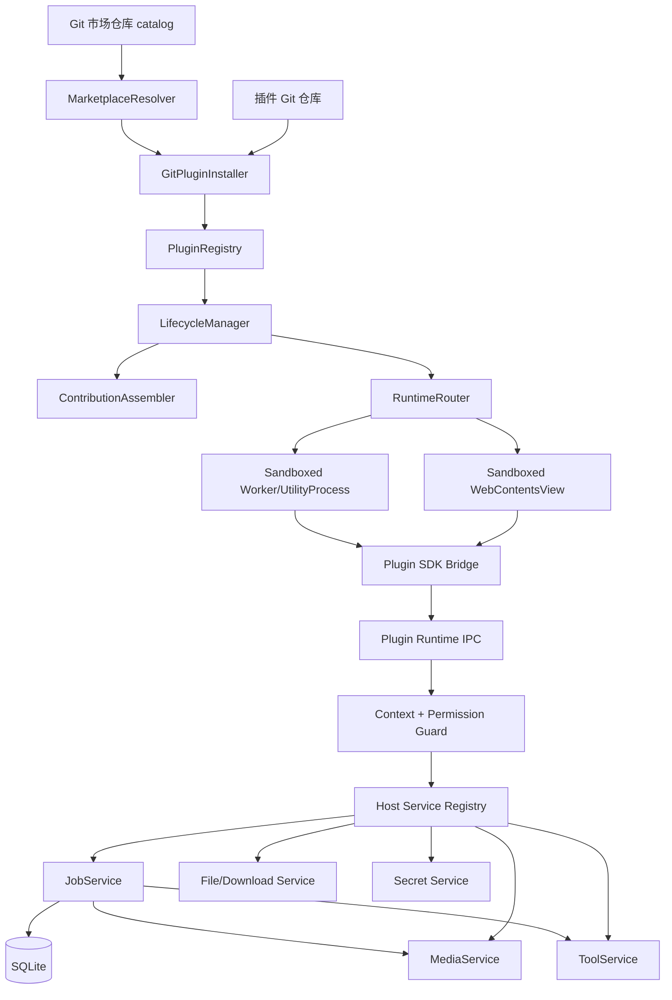

# GuYanTools 插件平台与媒体能力设计

日期：2026-07-22
状态：设计已确认，待实施

## 1. 背景与目标

GuYanTools 当前已经有 `plugin-host` 的注册、manifest 解析、权限校验、生命周期和 `WebContentsView` 挂载骨架，但安装分发仍以 npm/本地路径为中心，插件运行时也只有薄的页面 API。目标是把插件系统建设为一个可以承载第三方市场插件的平台，并以 B 站媒体插件验证完整闭环。

本设计采用方案 B：

- 插件市场和插件本体都通过 Git 分发。
- 市场仓库只维护可审核的插件索引，不把插件代码复制进宿主仓库。
- 第三方插件始终运行在 sandboxed UI/worker 环境中，不能直接访问 Node、Electron、数据库或任意子进程。
- 文件访问、通用网络传输、任务队列、FFmpeg、元数据写入和密钥存储由宿主提供受控原语。
- B 站 URL 解析、站点协议适配、流选择和下载编排属于 B 站插件自身；宿主不内置或识别 B 站业务。
- 插件必须在 manifest 中声明自己提供的业务能力及其匹配范围；宿主只负责校验、展示、发现和授权这些声明，不执行其中的业务语义。

## 2. 范围

### 2.1 本期目标

1. 固化插件 manifest、安装源、市场索引、生命周期和权限协议。
2. 支持 Git URL + branch/tag/commit 安装、更新、回滚、卸载和本地缓存。
3. 支持多个 Git 市场源，完成索引拉取、缓存、搜索、查看详情和安装。
4. 建立 sandboxed 插件的 `workspace/storage/navigation/commands/system/logger` SDK，并补齐 `files/downloads/jobs/tools/media/secrets/events`。
5. 建立宿主 JobService：持久化任务、进度、取消、重试、错误、并发限制和应用重启恢复。
6. 将 FFmpeg/FFprobe 和通用 HTTP 传输作为宿主管理的 allowlist 工具，不向插件暴露任意命令执行或站点解析器。
7. 提供通用媒体信息读取、音视频处理、封面和歌词写入能力，由 B 站插件组合这些原语完成视频下载、音频抽取、预览播放和 Tag 补全。
8. 在插件管理 UI 中展示来源、版本、权限、已批准权限、能力声明、状态、错误和市场信息。

### 2.2 非目标

- 本期不允许市场插件取得 `trusted` 或 `host` runtime。
- 不实现任意 shell、任意 npm script、任意原生模块加载。
- 不在插件中复制一套 FFmpeg/通用传输实现；站点解析和站点协议适配可以由插件自行实现或随插件发布。
- 不承诺绕过平台访问限制，不处理未经授权的内容分发。
- 不把用户的成品媒体写入插件私有目录；插件私有目录只保存状态和缓存。
- 不先设计跨 Flutter 的插件执行协议；先完成 Electron 桌面端闭环。

## 3. 总体架构



### 3.1 分层职责

- **分发层**：Git clone/fetch/checkout、市场索引、版本和 commit 固定、校验、回滚。
- **插件平台内核**：注册、manifest 解析、权限判定、生命周期、贡献点装配和运行时路由。
- **运行时层**：UI 页面和后台 worker 隔离；所有 IPC 请求带插件上下文。
- **宿主能力层**：文件、下载、任务、工具、媒体、密钥、通知和观测服务。
- **SDK 层**：插件唯一公开入口，负责类型、参数校验、错误码和事件订阅。

### 3.2 平台中立性约束

- 宿主能力层只提供与站点无关的原语：授权文件读写、HTTP(S) 请求、直接 URL 传输、任务调度、媒体处理和标签写入。
- 宿主服务、数据库模型、错误码和 SDK 类型中不得出现 B 站/BV 号、站点专属 API、站点 Cookie 字段或站点解析分支。站点专属逻辑必须位于插件代码及其 worker 内。
- 插件的业务能力与宿主权限是两套独立声明：`permissions` 表示插件要调用的宿主原语，`capabilities` 表示插件对外提供的业务能力。宿主不得从业务能力反推或隐式授予权限。
- 新增站点插件只应新增插件仓库和 manifest；不应修改平台服务、迁移或宿主路由。若必须修改宿主，必须证明是通用原语缺失，并补充与具体站点无关的 API 设计。

## 4. 插件包与 Git 分发

### 4.1 插件仓库约定

插件仓库根目录必须包含 `guyantools.plugin.json`，入口文件位于仓库目录内。可选 `package.json` 只用于构建插件，不作为运行时权限来源。

```text
plugin-repository/
  guyantools.plugin.json
  dist/
    index.html
    assets/
  README.md
  LICENSE
  package.json
```

宿主只加载构建产物和 manifest 指定的入口。安装时不执行插件的 `postinstall`、`prepare` 等生命周期脚本。

### 4.2 安装源

```ts
type PluginInstallSource =
  | { type: 'git'; url: string; ref?: string; refType?: 'branch' | 'tag' | 'commit'; resolvedCommit: string }
  | { type: 'marketplace'; marketplaceId: string; pluginId: string; url: string; ref?: string; resolvedCommit: string }
  | { type: 'local'; value: string }
  | { type: 'builtin'; value: string };
```

约束：

- `url` 仅允许 HTTPS Git URL，SSH URL 默认拒绝，避免读取用户 SSH agent 和私钥。
- ref 未指定时使用市场条目的固定默认 tag；不能直接跟随任意默认分支作为已安装版本。
- 安装记录必须保存最终 `resolvedCommit`，更新前后都可复现。
- 同一 `manifest.id` 只允许一个有效安装记录；安装新版本使用临时目录，校验通过后原子切换。
- 插件代码目录和插件数据目录分离：

```text
<userData>/guyantools-plugins/
  packages/<pluginId>/<resolvedCommit>/
  current/<pluginId> -> packages/<pluginId>/<resolvedCommit>
  data/<pluginId>/
  cache/<pluginId>/
  logs/<pluginId>/
  registry.json
```

### 4.3 Git 安装流程

1. 规范化 URL，检查协议和目标目录。
2. 创建临时目录并执行受控 `git clone --depth 1`；指定 commit 时 fetch 对应对象。
3. checkout 指定 ref，解析 `guyantools.plugin.json`。
4. 校验 manifest、入口、插件 ID、版本、API 兼容性和权限。
5. 计算源码/构建目录摘要，保存 commit 和摘要。
6. 写入注册表为 `installed`/`resolved`，不自动启用。
7. 用户确认权限后切换为 enabled；失败时删除临时目录，不影响当前版本。

Git 命令只由宿主内部 `GitInstaller` 调用，参数使用数组传入 `spawn`，禁止拼接 shell 命令。Git 不可用时应明确显示安装前置条件和错误输出。

### 4.4 市场仓库协议

市场仓库是普通 Git 仓库，根目录包含 `catalog.json`：

```json
{
  "schemaVersion": "1.0.0",
  "marketplace": {
    "id": "official",
    "displayName": "GuYanTools Official Marketplace",
    "maintainer": "GuYanTools",
    "updatedAt": "2026-07-22T00:00:00.000Z"
  },
  "plugins": [
    {
      "id": "guyantools.bilibili-media",
      "displayName": "Bilibili Media",
      "description": "Download and process authorized Bilibili media locally.",
      "repository": "https://example.com/guyantools-bilibili-media.git",
      "ref": "v1.0.0",
      "refType": "tag",
      "latestVersion": "1.0.0",
      "pluginApiVersion": "1.0.0",
      "hostVersionRange": ">=1.0.0",
      "trustLevel": "sandboxed",
      "permissions": ["network.fetch", "downloads.manage", "jobs.manage", "tools.ffmpeg", "media.tag"],
      "capabilities": [
        {
          "id": "guyantools.bilibili-media.source",
          "kind": "media-source",
          "operations": ["resolve", "download"],
          "match": { "hosts": ["bilibili.com", "b23.tv"] }
        }
      ],
      "artifacts": { "manifestPath": "guyantools.plugin.json" },
      "homepage": "https://example.com/guyantools-bilibili-media",
      "license": "MIT"
    }
  ]
}
```

市场条目是展示和安装提示来源，不是安全授权来源。宿主必须再次读取插件仓库 manifest，并以宿主的权限策略为准。市场条目声明 `trusted` 或超出允许权限时应标记为不可安装，而不是自动提权。市场中的 `permissions`/`capabilities` 只能作为索引摘要，最终以插件 manifest 为准，二者不一致时安装失败并提示差异。

市场配置至少支持：默认官方市场、用户添加市场、启用/禁用、刷新、缓存过期时间和移除。市场缓存损坏或网络失败时继续使用上次有效索引，并显示更新时间。

## 5. Manifest 设计

```ts
interface PluginManifestV1 {
  schemaVersion: '1.0';
  id: string;                 // 反向域名或组织前缀，稳定且不可变
  name: string;
  displayName: string;
  version: string;            // semver
  description: string;
  author: { name: string; homepage?: string };
  license?: string;
  icon?: string;
  pluginApiVersion: string;
  hostVersionRange: string;
  trustLevel: 'sandboxed';
  runtime: 'ui' | 'worker' | 'hybrid';
  entry: { ui?: string; worker?: string };
  activationEvents?: string[];
  permissions: PluginPermission[];
  capabilities: PluginCapabilityDeclaration[];
  contributes: PluginContributes;
  settings?: Record<string, PluginSettingSchema>;
}

interface PluginCapabilityDeclaration {
  id: string; // 在插件内稳定且唯一；宿主展示时加上 pluginId 命名空间
  kind: 'media-source' | 'metadata-provider' | 'transformer' | 'importer';
  operations: string[]; // 由插件 runtime 实现，宿主只做声明校验和路由
  match?: {
    hosts?: string[];
    schemes?: string[];
    mimeTypes?: string[];
  };
}
```

`guyantools.plugin.json` 必须携带同一份能力声明，不能只在市场 `catalog.json` 中声明。例如 B 站插件至少声明自己的媒体源能力：

```json
{
  "permissions": ["network.fetch", "downloads.manage", "jobs.manage", "tools.ffmpeg", "media.tag"],
  "capabilities": [
    {
      "id": "guyantools.bilibili-media.source",
      "kind": "media-source",
      "operations": ["resolve", "download"],
      "match": { "hosts": ["bilibili.com", "b23.tv"] }
    }
  ]
}
```

校验规则：

- `id`、`version`、入口、权限和 `capabilities` 必须存在；ID 只能包含小写字母、数字、`.`、`-`。
- `trustLevel` 对市场插件固定为 `sandboxed`；manifest 中出现 `trusted` 直接拒绝。
- `runtime=worker` 必须声明 worker 入口，UI 页面必须声明 UI 入口。
- 贡献点 ID 在插件内唯一，并由宿主加上 `pluginId` 命名空间。
- `capabilities` 必须存在且 ID 在插件内唯一；`kind`、`operations` 和 `match` 只能使用 schema 允许的值。
- capability 的 `operations` 不会生成宿主 API，也不会扩大权限；插件调用宿主原语仍必须逐项通过 `permissions` 校验。
- `hostVersionRange` 和 `pluginApiVersion` 在安装与启动时都校验。
- manifest 不允许通过任意字段声明 Node、Electron、子进程或路径白名单以外的能力。

## 6. 权限模型

### 6.1 原则

1. 默认拒绝：没有声明、没有批准的能力一律拒绝。
2. 能力最小化：权限对应具体 API，不按“媒体插件”这种大类授权。
3. 上下文绑定：每次 IPC 从 `webContentsId` 取得插件上下文，不能由插件传入 pluginId 冒充。
4. UI 与 worker 共用权限集合，但每个调用都记录 runtime 和调用结果。
5. sandboxed 插件不能通过 `nodeIntegration`、`webSecurity=false`、`webviewTag` 或 preload 参数绕过权限。
6. 高风险权限安装时明确展示，允许用户单独拒绝；权限变更需要重新确认。

### 6.2 权限清单

| 权限 | API 范围 | 默认 | 约束 |
|---|---|---:|---|
| `workspace.read` | 读取当前工作区摘要 | 允许 | 不返回宿主内部路径和密钥 |
| `data.user.read` | 读取必要用户公开资料 | 拒绝 | 仅返回脱敏字段 |
| `data.project.read` | 读取项目摘要 | 拒绝 | 不返回任意数据库连接 |
| `data.project.write` | 修改项目数据 | 禁止第三方 | 后续由明确用户动作授权 |
| `data.settings.read` | 读取插件允许的宿主设置 | 拒绝 | 按 key allowlist |
| `data.settings.write` | 修改宿主设置 | 禁止第三方 | 不纳入本期 |
| `storage.self` | 插件私有 KV | 允许 | 限制大小、key 格式和配额 |
| `files.read` | 读取用户选定文件 | 拒绝 | 必须经文件选择器或授权目录 |
| `files.write` | 写入用户选定目录 | 拒绝 | 路径必须在授权目录内，禁止覆盖默认敏感文件 |
| `downloads.manage` | 创建/控制宿主下载任务 | 拒绝 | URL、目标目录、并发和大小受策略限制 |
| `network.fetch` | HTTP(S) 元数据请求 | 拒绝 | 禁止 file/data/javascript 协议；超时和响应大小限制 |
| `jobs.manage` | 创建、查询、取消、重试自己的任务 | 拒绝 | 只能访问自身 job |
| `tools.ffmpeg` | 调用宿主 FFmpeg/FFprobe 操作 | 拒绝 | 只能使用结构化 media API，不传任意参数 |
| `media.preview` | 获取本地媒体预览授权和信息 | 拒绝 | 只能访问授权文件 |
| `media.transcode` | 音视频抽取、合并、转码 | 拒绝 | 格式、编码器和资源上限由宿主校验 |
| `media.tag` | 读取/写入媒体标签和封面/歌词 | 拒绝 | 仅处理授权输入和用户指定输出 |
| `secrets.self` | 插件私有密钥存取 | 拒绝 | 使用 Electron safeStorage，禁止导出明文 |
| `system.dialog` | 打开文件/目录选择器 | 拒绝 | 结果转换为授权 token |
| `system.notifications` | 显示应用通知 | 拒绝 | 限速、长度限制 |
| `system.clipboard` | 读写剪贴板 | 拒绝 | 读操作必须用户动作触发 |
| `system.shortcuts` | 注册插件快捷键 | 拒绝 | 冲突检测和可撤销 |
| `ui.contribute` | 注册页面、widget、命令等 | 允许 | 贡献点需符合 manifest schema |
| `observability.logs` | 写入插件日志 | 允许 | 分级、大小和保留期限制 |

本期第三方允许的高风险媒体权限由用户在安装时确认，默认不授予。权限确认结果写入注册表，不能由插件自身修改。

### 6.3 路径与网络限制

- 文件权限使用一次性或可撤销的 `FileGrant` token，不向插件暴露宿主任意绝对路径。
- `FileGrant` 绑定 pluginId、用途、读写模式、根目录、过期时间和最大文件大小。
- 下载任务使用 URL allowlist/denylist、重定向限制、超时、最大响应体和取消信号。
- 不允许插件访问 `userData`、插件代码目录、数据库文件、SSH 密钥、系统目录和其他插件 data。
- 宿主返回媒体文件预览 token/本地服务 URL，不把任意路径拼接到 `file://`。

## 7. Host API 设计

### 7.1 Files 与 Dialog

```ts
files.pickDirectory(): Promise<FileGrant | null>
files.pickFile(options): Promise<FileGrant | null>
files.stat(grant): Promise<MediaFileInfo>
files.deleteTemp(grant): Promise<void>
```

插件只能使用 grant 访问文件；宿主负责目录边界检查、文件名规范化、覆盖确认和临时文件清理。

### 7.2 Network

```ts
network.fetch(input: {
  url: string;
  method?: 'GET' | 'HEAD' | 'POST';
  headers?: Record<string, string>; // 仅允许宿主批准的 header
  body?: string;
  responseType?: 'json' | 'text' | 'bytes';
}): Promise<NetworkResponse>
```

`network.fetch` 只提供受限 HTTP(S) 请求，执行 URL 协议、域名、重定向、超时、响应体大小和敏感 header 校验。它不理解任何站点业务协议；插件负责解析响应并将站点结果转换为自己的 capability 数据。

### 7.3 Downloads

```ts
downloads.create(input: {
  sources: Array<{ url: string; headers?: Record<string, string>; checksum?: string }>;
  destination: FileGrant;
  fileName?: string;
  merge?: 'none' | 'concat';
}): Promise<JobHandle>
downloads.pause(jobId): Promise<void>
downloads.resume(jobId): Promise<void>
downloads.cancel(jobId): Promise<void>
```

下载服务只处理插件已经解析出的一个或多个直接 HTTP(S) 资源，负责分片、断点、重试、限速和进度。它不解析站点 URL、不识别站点协议，也不维护站点 Cookie/签名规则。插件可使用 `network.fetch` 实现自己的站点解析，再把结果转换为 `downloads.create` 的直接资源输入。

### 7.4 Jobs

```ts
jobs.create(input: {
  kind: 'download' | 'media' | 'metadata' | 'pipeline';
  title: string;
  steps: JobStep[];
  priority?: 'normal' | 'low';
}): Promise<JobHandle>
jobs.get(jobId): Promise<JobRecord | null>
jobs.list(): Promise<JobRecord[]>
jobs.cancel(jobId): Promise<void>
jobs.retry(jobId): Promise<JobHandle>
jobs.onEvent(listener): Unsubscribe
```

Job 记录包含 `id/pluginId/kind/status/progress/currentStep/input/output/error/createdAt/updatedAt`。插件只能读取和控制自己创建的 job。任务状态持久化到 SQLite，应用重启后可将运行中任务恢复为 `paused`，由用户或插件明确恢复。

### 7.5 Tools

不开放 `execute(command, args)`。使用固定适配器：

```ts
tools.ffmpeg.probe(input: FileGrant): Promise<MediaProbe>
tools.ffmpeg.transcode(input: FileGrant, output: FileGrant, options: TranscodeOptions): Promise<JobHandle>
tools.ffmpeg.extractAudio(input: FileGrant, output: FileGrant, options): Promise<JobHandle>
tools.ffmpeg.mux(video: FileGrant, audio: FileGrant, output: FileGrant): Promise<JobHandle>
```

宿主统一检测工具版本、路径、平台差异和退出码。工具不可用时返回稳定错误码，例如 `TOOL_UNAVAILABLE`、`TOOL_FAILED`、`TOOL_TIMEOUT`。宿主不提供按站点命名的工具适配器；站点适配器由插件实现。

### 7.6 Media Tag 与 Preview

```ts
media.readTags(input: FileGrant): Promise<MediaTags>
media.writeTags(input: FileGrant, tags: MediaTags, options?: TagWriteOptions): Promise<JobHandle>
media.writeCover(input: FileGrant, cover: FileGrant, options?): Promise<JobHandle>
media.preview.create(input: FileGrant): Promise<PreviewGrant>
media.preview.revoke(previewId: string): Promise<void>
```

`MediaTags` 至少支持：`title`、`artist`、`album`、`albumArtist`、`track`、`disc`、`date`、`genre`、`comment`、`lyrics`、`coverMime`。写 Tag 时保留未知标签，输出临时文件通过原子替换生成；失败不破坏原文件。

### 7.7 Secrets

```ts
secrets.get(key: string): Promise<string | null>
secrets.set(key: string, value: string): Promise<void>
secrets.delete(key: string): Promise<void>
```

`secrets.self` 只允许插件私有命名空间，使用 `safeStorage` 加密后写入宿主数据库。日志、错误和事件中必须自动脱敏 Cookie、Authorization、SESSDATA 等敏感字段。

### 7.8 Events

事件订阅必须由宿主建立并按 pluginId 清理：

- `job.updated`
- `download.progress`
- `media.progress`
- `plugin.lifecycle`
- `system.networkChanged`

事件 payload 不包含任意文件路径和密钥。插件禁用、卸载、页面销毁时自动取消订阅。

## 8. B 站媒体插件业务流

1. UI 粘贴 B 站 URL/BV 号，由插件自己的 resolver/worker 解析标题、分辨率、音轨、封面和直接媒体资源；宿主只执行受权限保护的 `network.fetch` 和后续通用原语。
2. 用户选择视频或音频、质量、输出目录和是否写 Tag；宿主弹出授权目录选择器。
3. 插件创建 `pipeline` job，步骤为插件侧 resolve、宿主 `downloads.create`、mux 或 extractAudio、插件侧 fetch metadata、write cover/tags、完成通知。
4. JobService 逐步报告进度；UI 通过 `job.updated` 渲染队列，可取消和重试。
5. 元数据来源由插件编排，宿主只负责网络请求、文件授权和写入；歌词可写入内嵌 `LYRICS`，同时可按用户设置输出 `.lrc`。
6. 预览通过 `media.preview.create` 返回短期 token，插件使用受控媒体 URL 播放，关闭页面或过期时回收。
7. 成品写入用户授权目录，临时分片进入插件 cache/job temp，并在成功、取消、失败后按策略清理。

## 9. 生命周期、更新和故障恢复

状态保留 `discovered/installed/resolved/enabled/disabled/errored/incompatible`，增加安装操作状态 `installing/updating/uninstalling` 仅作为 UI transient state。

- 启动：读取注册表，重新校验 manifest 和当前目录；不满足兼容性则 `incompatible`。
- 启用：重新确认必要权限，注册贡献点和 worker；失败进入 `errored`，不影响宿主启动。
- 禁用：停止新任务，取消事件订阅，卸载页面和快捷键；已有任务进入暂停或由用户确认取消。
- 更新：新 commit 临时安装、验证和迁移后原子切换；启动失败自动回滚上一 commit。
- 卸载：先禁用并停止任务，再移除代码；插件 data/cache/logs 默认保留并给出删除选项。
- 崩溃：记录错误、runtime、调用和最后任务；连续启动失败达到阈值自动禁用。

## 10. 数据与持久化

新增/扩展 SQLite 表：

- `plugin_marketplaces`：市场 URL、分支、缓存摘要、更新时间、启用状态。
- `plugin_installations`：插件 manifest 摘要、来源、ref、resolved commit、权限批准、能力声明、当前目录和上一个版本。
- `plugin_jobs`：任务状态、进度、步骤、错误、输入输出 grant 引用。
- `plugin_file_grants`：grant 所属插件、目录、模式、过期时间和撤销状态。
- `plugin_secrets`：加密后的插件私有密钥。

数据库迁移按现有连续编号规则新增，写入和状态变更使用 transaction。注册表 JSON 可作为兼容导入/导出缓存，但 SQLite 是运行时事实来源。

## 11. 安全边界

- sandboxed WebContentsView 使用 `contextIsolation=true`、`nodeIntegration=false`、`sandbox=true`、`webSecurity=true`、`webviewTag=false`。
- preload 只暴露 typed SDK，不暴露 `ipcRenderer`、Node 模块或宿主对象。
- 每个 IPC handler 通过 `webContentsId -> PluginRuntimeContext -> PermissionManager` 校验，不接受 renderer 传入的 pluginId 作为身份。
- 插件仓库代码不执行安装脚本；依赖应在插件发布前构建，市场审核检查依赖和产物。
- 市场索引与插件 commit 支持 SHA-256 摘要；官方市场后续增加签名。未校验摘要的第三方市场只能显示警告。
- 网络和工具任务设置超时、最大并发、最大文件、最大 CPU/磁盘占用；资源额度超限返回 `QUOTA_EXCEEDED`。
- 禁止把 B 站 Cookie、下载 URL 中的敏感 query、授权 token 写入普通日志。

## 12. 错误模型与观测

SDK 使用结构化错误：

```ts
interface PluginApiError {
  code:
    | 'PERMISSION_DENIED'
    | 'INVALID_INPUT'
    | 'INCOMPATIBLE_HOST'
    | 'FILE_NOT_GRANTED'
    | 'NETWORK_FAILED'
    | 'TOOL_UNAVAILABLE'
    | 'TOOL_FAILED'
    | 'JOB_NOT_FOUND'
    | 'JOB_CANCELLED'
    | 'QUOTA_EXCEEDED'
    | 'PLUGIN_DISABLED';
  message: string;
  retryable: boolean;
  details?: unknown;
}
```

宿主按插件写隔离日志，管理 UI 展示最近错误、任务错误和安装错误。错误消息对用户可读，details 中不能泄露 secrets 或任意本地路径。

## 13. 分阶段验收

### Phase 1：分发与安全基础

- Git 插件可以固定 commit 安装、更新、回滚和卸载。
- 市场可以拉取 catalog、搜索条目并跳转安装。
- 第三方插件无法取得 trusted、Node 或任意命令执行。
- manifest、来源、权限批准和状态可在管理 UI 查看。

### Phase 2：Job/Tools/Files

- 插件可创建下载/媒体任务，看到进度，取消、重试和重启恢复。
- 文件 grant 能限制目录和读写范围。
- FFmpeg/FFprobe/通用下载传输只能走结构化 API，平台没有 B 站或其他站点的解析分支。

### Phase 3：Media 与官方示例插件

- B 站视频可下载并预览播放。
- 可抽取音频、转码、合并音视频。
- 歌手、封面、歌词等 Tag 可写入并保留原有未知标签。
- 失败、取消和磁盘不足不会损坏原文件。

## 14. 测试策略

- TypeScript 单测：manifest 校验、权限矩阵、Git ref 解析、market catalog 校验、路径 grant、错误映射。
- Rust 单测：migration、job 状态转换、任务持久化和 transaction 一致性。
- 集成测试：安装一个本地 Git fixture，启动 sandboxed UI，验证 IPC 权限和 pluginId 隔离。
- 媒体 fixture：短 mp4/mp3、封面和 LRC，验证 probe、extract、transcode、tag round-trip；另用一个非 B 站的 fixture 插件验证平台没有站点分支。
- 安全回归：尝试 Node 访问、任意路径、任意协议、任意命令、跨插件 job/grant 访问，全部必须失败。
- 插件协议回归：manifest 缺少 `capabilities`、声明未知 capability、市场摘要与 manifest 不一致、插件请求未声明 permission 时，安装或调用必须失败。
- 最小验证命令：`pnpm --dir desktop run lint`、`pnpm --dir desktop run build:app`、`cargo test --manifest-path multi_platform_core/Cargo.toml`，并补充插件专用 verify 脚本。
