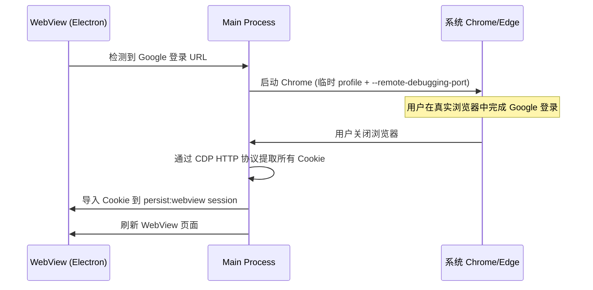

# 系统浏览器 Google 登录 + Cookie 同步方案

## 背景

Google 会检测 Electron 嵌入式 WebView 并阻止 OAuth 登录，反检测脚本方案不可靠。改为直接使用系统真实浏览器完成 Google 登录，然后将 Cookie 同步回 Electron。

## 方案设计

### 核心流程

### 关键技术点

1. **查找系统浏览器** — 在 Windows 常见路径查找 Chrome / Edge
2. **临时 Profile** — 使用 `--user-data-dir=<temp>` 避免影响用户的浏览器数据
3. **CDP 提取 Cookie** — 使用 `--remote-debugging-port` 启动浏览器，通过 HTTP + WebSocket 提取 Cookie（Electron 37 自带 Node.js 20+ 有 `fetch` 可用）
4. **导入 Cookie** — 使用 `session.cookies.set()` 导入到 `persist:webview` 分区

## Proposed Changes

### [MODIFY] [webview_manager.ts](file:///d:/LaityHCode/DesktopProjects/GuYanTools/desktop/src/main/webview_manager.ts)

重写 [openAuthWindow](file:///d:/LaityHCode/DesktopProjects/GuYanTools/desktop/src/main/webview_manager.ts#263-361) 方法：

1. **添加 `findBrowserPath()`** — 在 Windows 常见路径查找 Chrome 或 Edge 可执行文件
2. **重写 [openAuthWindow()](file:///d:/LaityHCode/DesktopProjects/GuYanTools/desktop/src/main/webview_manager.ts#263-361)**：
   - 启动系统浏览器，使用临时 `--user-data-dir` 和 `--remote-debugging-port=0`
   - 读取 `DevToolsActivePort` 文件获取实际调试端口
   - 等待浏览器进程退出（用户登录完成后关闭浏览器）
   - 通过 CDP HTTP API 获取 page WebSocket URL
   - 通过 CDP WebSocket 发送 `Network.getAllCookies` 提取 Cookie
   - 将 Cookie 导入 `session.fromPartition('persist:webview')`
   - 清理临时目录
3. **删除反检测脚本常量** — 不再需要 `ANTI_DETECT_SCRIPT` 和 preload 文件方案

### [MODIFY] [WebViewPage.vue](file:///d:/LaityHCode/DesktopProjects/GuYanTools/desktop/src/renderer/pages/WebViewPage.vue)

更新认证完成后的处理逻辑：[openAuthWindow](file:///d:/LaityHCode/DesktopProjects/GuYanTools/desktop/src/main/webview_manager.ts#263-361) 返回后自动刷新 webview。

## Verification Plan

### Manual Verification
1. 启动应用，打开 ChatGPT 页面
2. 点击"使用 Google 登录"
3. 确认系统浏览器（Chrome 或 Edge）弹出并显示 Google 登录页
4. 在系统浏览器中完成 Google 登录
5. 关闭浏览器窗口
6. 确认 WebView 自动刷新且已登录
