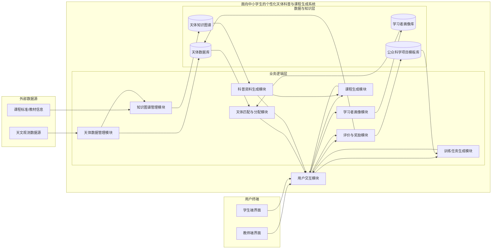

```mermaid
flowchart LR
    %% 外部数据源
    subgraph ext[外部数据源]
        astro[天文观测数据源]
        curriculum[课程标准/教材信息]
    end

    %% 用户
    subgraph client[用户终端]
        teacher[教师端界面]
        student[学生端界面]
    end

    %% 后端系统
    subgraph backend[面向中小学生的个性化天体科普与课程生成系统]
        subgraph dataLayer[数据与知识层]
            astroDB[(天体数据库)]
            learnerDB[(学习者画像库)]
            kg[(天体知识图谱)]
            projTpl[(公众科学项目模板库)]
        end

        subgraph logicLayer[业务逻辑层]
            dm[天体数据管理模块]
            lp[学习者画像模块]
            match[天体匹配与分配模块]
            kgm[知识图谱管理模块]
            genInfo[科普资料生成模块]
            genCourse[课程生成模块]
            genTask[训练任务生成模块]
            eval[评价与奖励模块]
        end

        ui[用户交互模块]
    end

    %% 连接关系
    astro --> dm
    dm --> astroDB

    curriculum --> kgm
    dm --> kgm
    kgm --> kg

    teacher --> ui
    student --> ui
    ui --> genCourse
    ui --> genTask
    ui --> eval
    ui --> lp

    lp --> learnerDB
    learnerDB --> match
    astroDB --> match
    match --> ui

    kg --> genInfo
    genInfo --> genCourse
    genInfo --> ui

    genCourse --> ui
    projTpl --> genTask
    genTask --> ui

    ui --> eval
    eval --> projTpl
    eval --> astroDB

```
